# Miracle OS: Sovereign Enterprise Solution & Complete Zone Catalog
**Authoritative Sales Blueprint and C-Suite Technical Guide**  
*Document Version: V7.5-PROD | Target Audience: Global Conglomerates, GMs, CIOs, and CDOs*

---

## Executive Overview: The Single-Kernel Enterprise Paradigm

In the modern enterprise ecosystem, large conglomerates (managing hospitality resorts, retail chains, aviation fleets, medical centers, and real estate portfolios) are crippled by **data fragmentation**. Operating separate platforms—such as Opera PMS for hotels, Micros POS for food and beverage, Salesforce for CRM, Workday for HR, SAP for accounting, and Jira/Slack for team communication—creates massive integration costs, sync delays, API breakages, and security vulnerabilities. 

**Miracle OS** resolves these issues by executing all business operations within a **single database kernel** (PostgreSQL/MySQL/SQLite). Data is not synchronized across applications via APIs; it is written natively by different modules to shared tables in real time. A transaction rung up on a retail POS instantly updates the inventory stock levels, logs a double-entry posting in the general ledger, adjusts the guest's folio, and recalculated therapist commissions.

This catalog details each of the **27 Sovereign Zones** of Miracle OS. It explains how each zone functions, details the C-Suite pitch, specifies the technical processes, identifies the industries covered, and provides a structural UI wireframe alongside image references.

---

## Zone 0: Z-LOGIN — Sales Onboarding & Lead Capture Portal
**Path:** `/` | **Access:** PUBLIC (Unauthenticated)

### 1. The C-Suite Pitch
The Z-LOGIN page is not a simple form; it is an active enterprise sales agent. Designed to replace standard login pages with an engaging AI onboarding sequence, it qualifies potential enterprise evaluators before granting access. By requiring name, enterprise title, employee scale, and mobile number, it ensures zero anonymous access to sensitive dashboards and automatically channels qualified leads directly into the sales pipeline.

### 2. Focus Points & Core Capabilities
- Conversational lead qualification funnel
- Anti-anonymous gating for system security
- Live database sync to marketing channels

### 3. Tabs & Sub-Zones
- **🌐 Visitor Access (Default):** Interactive 4-field lead form.
- **🛡️ Staff Login:** Access panel for registered operatives (CDO, GM, Admin, ACC, POS, etc.).

### 4. Technical Process & Data Flow
```
Visitor enters Name/Enterprise/Phone -> POST /api/visitor/request-otp 
  -> Saves to `sales_leads` -> Generates Secure OTP -> Displayed on screen (Dev Mode)
  -> User enters OTP -> POST /api/visitor/verify-otp 
  -> Issues JWT Visitor Token -> Warps visitor to /dashboard (View-only mode)
```
- **Relevant Tables:** `sales_leads`, `employees` (Staff credentials)
- **API Endpoints:** `/api/visitor/request-otp`, `/api/visitor/verify-otp`, `/api/auth/token`

### 5. Enterprise Scope
- **Conglomerates:** Automates demo intake.
- **B2B Platforms:** Standardizes partner onboarding.

### 6. UI Layout Mockup & Aesthetics
- **Visual Styling:** Animated ambient green glow behind a blurred frosted-glass panel. Custom Dhaka/Sydney/New York marquee at top.
- **Layout Wireframe:**
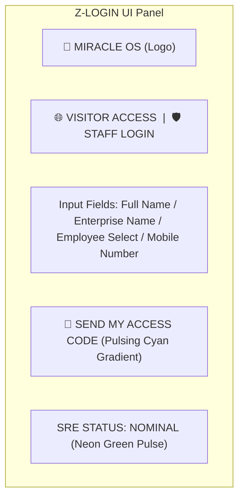
```mermaid
graph TD
    subgraph Z-LOGIN UI Panel
        Logo["👑 MIRACLE OS (Logo)"]
        Tab["🌐 VISITOR ACCESS  |  🛡️ STAFF LOGIN"]
        Form["Input Fields: Full Name / Enterprise Name / Employee Select / Mobile Number"]
        SubmitBtn["📲 SEND MY ACCESS CODE (Pulsing Cyan Gradient)"]
        Status["SRE STATUS: NOMINAL (Neon Green Pulse)"]
    end
```


---
## Zone 1: Z-07 — Master Command Grid
**Path:** `/dashboard` | **Access:** CDO, GM, ADMIN, VISITOR

### 1. The C-Suite Pitch
The Master Command Grid provides the "God View" of all enterprise operations on a single screen. Legacy systems require managers to toggle between property management, maintenance tickets, housekeeping statuses, and restaurant bookings. Z-07 visualizes every physical room, suite, villa, or asset as an interactive grid card displaying status, active issues, running guest folio balance, and active staff alerts, eliminating operational blind spots.

### 2. Focus Points & Core Capabilities
- Real-time room status grid (Available, Occupied, Dirty, Maintenance, Critical Alarm)
- 33-department Signal Matrix display per room
- Real-time Yield monitoring (Total active folio balances)

### 3. Tabs & Sub-Zones
- **Command Matrix:** Filterable grid layout (All, Royal Suites, Villas, Overwater Bungalows).
- **Yield HUD:** Displays live occupancy numbers and revenue indicators.

### 4. Technical Process & Data Flow
```
Guest Check-in (Z-05) -> Updates `asset_grid` to OCCUPIED via WebSocket
  -> Z-07 Room Card border transitions to Neon Cyan
  -> Z-16 logs AC leakage -> Z-07 card triggers Amber border + blinking HK/MN badge
  -> Resolve ticket (Z-17) -> WebSocket clears Z-07 card alarm
```
- **Relevant Tables:** `asset_grid`, `guest_folios`, `solve_missions`
- **API Endpoints:** `/api/frontdesk/live-grid`, `/api/frontdesk/folios`, `/api/solve/active`

### 5. Enterprise Scope
- **Hospitality & Resorts:** Real-time suite/villa tracking.
- **Real Estate Management:** Operational overview of rented apartments.
- **Healthcare Clinics:** Live tracking of patient room occupancy and cleaning queues.

### 6. UI Layout Mockup & Aesthetics
- **Visual Styling:** Deep black background (`#080808`) with a holographic screen grid. Room cards have colored borders based on status (Cyan = In-House, Purple = Dirty, Red Strobe = Critical Alarm). Neon green data pulses travel along grid axes.
- **Layout Wireframe:**
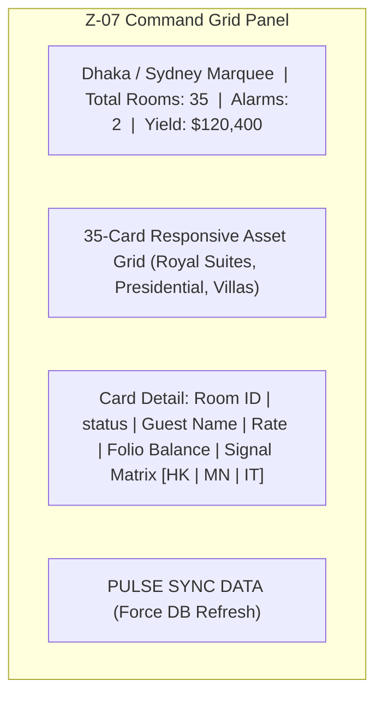
```mermaid
graph TD
    subgraph Z-07 Command Grid Panel
        HUD[" Dhaka / Sydney Marquee  |  Total Rooms: 35  |  Alarms: 2  |  Yield: $120,400"]
        Grid["35-Card Responsive Asset Grid (Royal Suites, Presidential, Villas)"]
        Card["Card Detail: Room ID | status | Guest Name | Rate | Folio Balance | Signal Matrix [HK | MN | IT]"]
        RefreshBtn["PULSE SYNC DATA (Force DB Refresh)"]
    end
```


---
## Zone 2: Z-30 — Sovereign Property Portfolio (PMS)
**Path:** `/dashboard/pms` | **Access:** CDO, GM, ADMIN, ACC, VISITOR

### 1. The C-Suite Pitch
Large property portfolios must manage diverse ownership terms—from wholly owned freehold assets to leased properties and franchised/managed units. Z-30 combines portfolio asset listing, landlord lease payouts, owner commission accruals, and property capital expenditure (BOM) tracking. This eliminates the need for separate property portfolios, landlord databases, and capital expenditure trackers.

### 2. Focus Points & Core Capabilities
- Asset Ownership mapping (Owned, Leased, Managed)
- Lease payout and commission aging tracking
- CAPEX Capitalization via Room Bill of Materials (BOM)

### 3. Tabs & Sub-Zones
- **Portfolio Grid:** Flat grid showing asset ownership type and yields.
- **Asset Gallery:** Photo-rich catalog of all rooms and units.
- **BOM Builder:** Room construction inventory manager (capitalization tracker).
- **Card Vault:** Secure, tokenized guest card vault.
- **Financial Ledger:** Lease and commission settlement panel.
- **Owner Payouts:** Landlord disbursement approval queue.

### 4. Technical Process & Data Flow
```
Add table to Room BOM -> Inserts line to `pms_bom_lines` -> Recalculates asset setup cost
  -> Updates `capitalized_setup_cost` in `properties` -> Increases total asset value in Z-11
  -> Night Audit processes rented lease -> Generates lease liability in accounts payable
```
- **Relevant Tables:** `properties`, `pms_bom_lines`, `vault_cards`, `owner_payout_requests`
- **API Endpoints:** `/api/pms/portfolio`, `/api/pms/bom/{roomId}`, `/api/pms/lease/post`

### 5. Enterprise Scope
- **Real Estate Holdings:** Tracks rental contracts and monthly lease liabilities.
- **Hotel Franchise Chains:** Tracks franchisee commission percentages.
- **Co-Living Spaces:** Manages multiple landlords under a unified ledger.

### 6. UI Layout Mockup & Aesthetics
- **Visual Styling:** High-end Bloomberg terminal layout. Financial statistics cards have colored top borders matching ownership type (Owned = Light Cyan, Rented = Amber, Affiliated = Purple).
- **Layout Wireframe:**
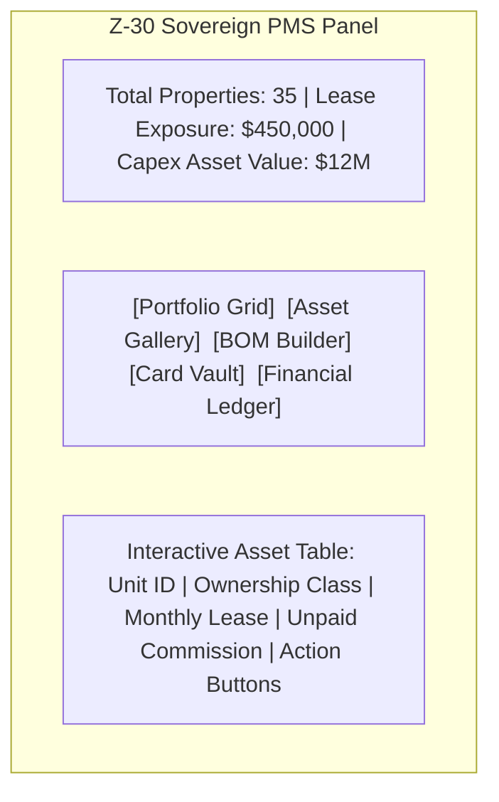
```mermaid
graph TD
    subgraph Z-30 Sovereign PMS Panel
        Summary["Total Properties: 35 | Lease Exposure: $450,000 | Capex Asset Value: $12M"]
        Tabs["[Portfolio Grid]  [Asset Gallery]  [BOM Builder]  [Card Vault]  [Financial Ledger]"]
        Grid["Interactive Asset Table: Unit ID | Ownership Class | Monthly Lease | Unpaid Commission | Action Buttons"]
    end
```


---
## Zone 3: Z-05 — Global Reservations Engine
**Path:** `/dashboard/reservations` | **Access:** CDO, GM, ADMIN, FD, VISITOR

### 1. The C-Suite Pitch
The lifeblood of hospitality is booking availability. Z-05 replaces disjointed reservation sheets with a dynamic, rolling 45-day horizontal Gantt-style Tape Chart. Room categories populate the Y-axis and dates run along the X-axis. Front Desk agents can book, walk-in, and allocate rooms directly on the chart, with real-time currency calculation and tax configurations fetched from the Policy Engine (Z-19), preventing overbooking or manual pricing errors.

### 2. Focus Points & Core Capabilities
- Rolling 45-day Gantt tape chart with live reservation blocks
- Instant walk-in registration and credit card swipe integrations
- Comprehensive VIP guest vault with WhatsApp/Email API communication

### 3. Tabs & Sub-Zones
- **Reservations Chart (Tape Chart):** Scrollable Gantt booking panel.
- **VIP CRM Vault:** Database of guest profiles, lifetime value (LTV), and coin logs.

### 4. Technical Process & Data Flow
```
Click empty chart cell -> Open Booking Form -> Select Guest -> POST /api/frontdesk_engine/commit
  -> Inserts to `reservations` -> Updates `asset_grid` status to RESERVED
  -> Broadcasts WebSocket status -> Z-07 Command Grid card updates to Pulsing Blue
```
- **Relevant Tables:** `reservations`, `guest_crm`, `asset_grid`
- **API Endpoints:** `/api/frontdesk_engine/reservations`, `/api/frontdesk_engine/commit`

### 5. Enterprise Scope
- **Hotels & Resorts:** Manages room bookings and arrival queues.
- **Car Rental Fleets:** Adapts Y-axis to vehicles and X-axis to rental periods.
- **Co-Working Spaces:** Tracks desk and conference room bookings.

### 6. UI Layout Mockup & Aesthetics
- **Visual Styling:** Large horizontal scheduling grid with colored timeline blocks (Active Check-Ins = Cyan, Reservations = Blue, Overstay = Red).
- **Layout Wireframe:**
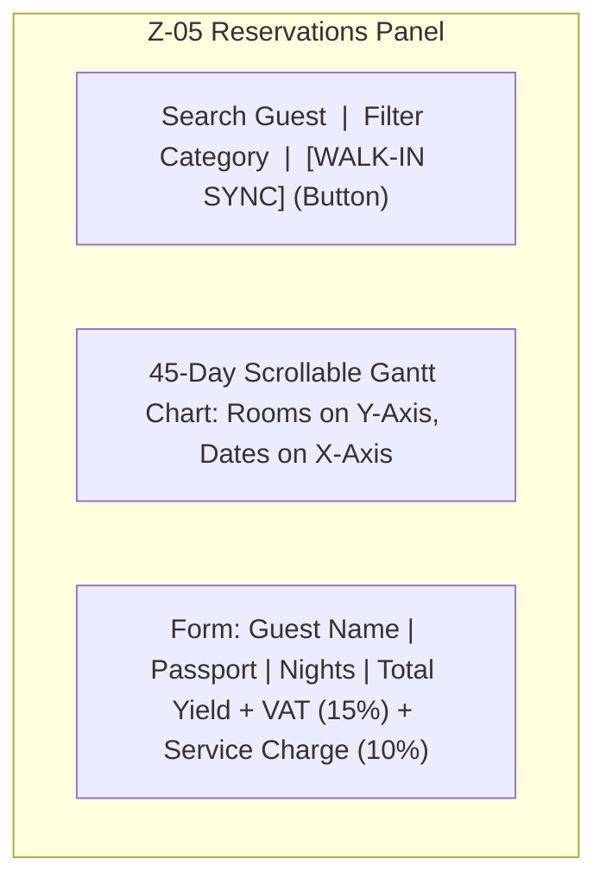
```mermaid
graph TD
    subgraph Z-05 Reservations Panel
        Controls["Search Guest  |  Filter Category  |  [WALK-IN SYNC] (Button)"]
        Gantt["45-Day Scrollable Gantt Chart: Rooms on Y-Axis, Dates on X-Axis"]
        FormOverlay["Form: Guest Name | Passport | Nights | Total Yield + VAT (15%) + Service Charge (10%)"]
    end
```


---
## Zone 4: Z-06 — Centralized POS & Retail Matrix
**Path:** `/dashboard/pos` | **Access:** CDO, GM, ADMIN, POS, SPA, VISITOR

### 1. The C-Suite Pitch
Traditional resorts suffer massive revenue leakages because retail shops, bars, spas, and room services run separate, unlinked POS registers. Z-06 is the **sole authorized point of sale** in Miracle OS. Every transaction—whether a dining bill, spa massage, or boutique purchase—must flow through this panel. It supports cash, credit card, or direct room charge, querying the grid (Z-07) to verify guest status before posting directly to their folio (Z-08).

### 2. Focus Points & Core Capabilities
- Centralized point of sale for F&B, Spa, Boutiques, and Activities
- Real-time guest room charge validation (0% leakage)
- Direct link to Z-12 Inventory for Bill of Materials (BOM) recipe stock deduction

### 3. Tabs & Sub-Zones
- **Boutique POS:** Retail product inventory grid.
- **Gastronomy POS:** Food & Beverage menu grid.
- **Med-Spa POS:** Wellness packages grid.
- **Checkout Cart:** Live cart calculation including taxes (15% VAT) and service charge (10%).

### 4. Technical Process & Data Flow
```
Select Product -> Add to Cart -> Select payment method: ROOM CHARGE -> Validate guest check-in
  -> POST /api/pos/checkout -> Writes to `pos_transactions` -> Deducts stock from `inventory`
  -> Appends line to `folio_charges` -> Updates Z-11 Ledger: DR Accounts Receivable / CR F&B Revenue
```
- **Relevant Tables:** `pos_transactions`, `pos_order_items`, `inventory`, `folio_charges`
- **API Endpoints:** `/api/pos/checkout`, `/api/pos/products`, `/api/pos/validate-room`

### 5. Enterprise Scope
- **Resort & Theme Parks:** Centralized guest spending across all retail/F&B.
- **Cruise Liners:** Room-card key charge verification.
- **Boutique Gyms:** Wellness treatments and juice bar checkouts.

### 6. UI Layout Mockup & Aesthetics
- **Visual Styling:** Responsive two-column split layout. Left side: category tabs with visual product grid cards. Right side: glassmorphic scrolling order cart with neon green "ROOM CHARGE" and "CASH/CARD" checkout buttons.
- **Layout Wireframe:**
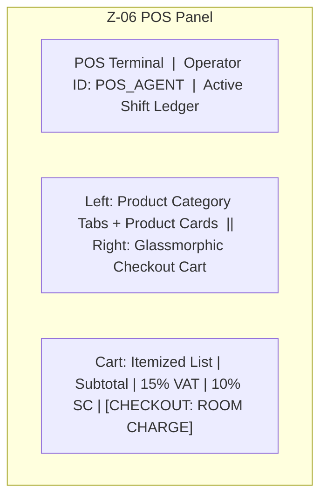
```mermaid
graph TD
    subgraph Z-06 POS Panel
        Header["POS Terminal  |  Operator ID: POS_AGENT  |  Active Shift Ledger"]
        SplitLayout["Left: Product Category Tabs + Product Cards  ||  Right: Glassmorphic Checkout Cart"]
        Cart["Cart: Itemized List | Subtotal | 15% VAT | 10% SC | [CHECKOUT: ROOM CHARGE]"]
    end
```


---
## Zone 5: Z-26 — Fleet & Aviation Command
**Path:** `/dashboard/fleet` | **Access:** CDO, GM, ADMIN, VISITOR

### 1. The C-Suite Pitch
Managing multi-million dollar transport assets—like helicopters, private yachts, executive limousines, and shuttle buses—requires absolute precision. Z-26 is a dedicated fleet asset management hub. It coordinates driver/pilot rosters, schedules vehicle maintenance, tracks fuel consumption, and books transfers directly. Transfers booked for resort guests are billed to their open folio via Z-06 POS, ensuring zero unbilled transport costs.

### 2. Focus Points & Core Capabilities
- Roster control for pilots, captains, and executive drivers
- Flight/transfer dispatch grid with real-time status
- Scheduled maintenance, logbooks, and fuel expense monitoring

### 3. Tabs & Sub-Zones
- **Dispatch Grid:** Scheduled arrivals and departures tracker.
- **Staff Roster:** Active pilots and drivers calendar.
- **Maintenance Bay:** Asset logs and repair requests.
- **Fuel Ledger:** Logistics expense records.

### 4. Technical Process & Data Flow
```
Book Airport transfer -> Create transfer dispatch record -> Assign driver and vehicle
  -> POST /api/fleet/transfer/dispatch -> Generates service ticket in Z-16 
  -> Completes transfer -> Z-06 rungs up charge -> Posts to `folio_charges`
```
- **Relevant Tables:** `fleet_assets`, `fleet_dispatch`, `employees`
- **API Endpoints:** `/api/fleet/vehicles`, `/api/fleet/dispatch/create`, `/api/fleet/maintenance`

### 5. Enterprise Scope
- **Luxury Resorts:** Airport pickup rosters and yacht charter scheduling.
- **Corporate Office Groups:** Executive shuttle and limousine fleet tracking.
- **Helicopter Charters:** FAA/CAA logbook tracking and flight dispatching.

### 6. UI Layout Mockup & Aesthetics
- **Visual Styling:** High-tech control panel layout. Dispatch logs resemble airport arrival/departure screens with blinking status pills (En Route, Dispatched, In Maintenance).
- **Layout Wireframe:**
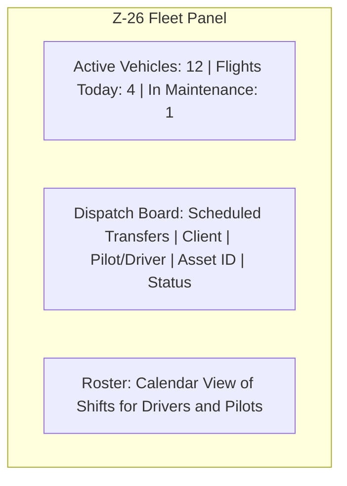
```mermaid
graph TD
    subgraph Z-26 Fleet Panel
        Stats["Active Vehicles: 12 | Flights Today: 4 | In Maintenance: 1"]
        Dispatch["Dispatch Board: Scheduled Transfers | Client | Pilot/Driver | Asset ID | Status"]
        Scheduler[" Roster: Calendar View of Shifts for Drivers and Pilots"]
    end
```


---
## Zone 6: Z-27 — Med-Spa & Wellness Command
**Path:** `/dashboard/wellness` | **Access:** CDO, GM, ADMIN, SPA, VISITOR

### 1. The C-Suite Pitch
The wellness and clinical spa sector is characterized by high service margins and complex therapist/room scheduling. Z-27 acts as the operational nervous system for wellness departments. It manages therapy room allocations, therapist shift grids, treatment recipe BOMs, and booking schedules. By connecting treatment recipes directly to inventory (Z-12), it auto-deducts oils, creams, and medical supplies in real time, preventing inventory shrinkage.

### 2. Focus Points & Core Capabilities
- Therapy room and clinician scheduling matrix
- Treatment recipe ingredient mapping (BOM)
- Therapist commission ledger calculations

### 3. Tabs & Sub-Zones
- **Wellness Calendar:** Hourly room scheduling grid.
- **Service Architect:** Constructor for medical/spa treatment packages.
- **Therapist Dossiers:** Performance, rosters, and commission ledgers.

### 4. Technical Process & Data Flow
```
Book Spa massage -> Check room availability -> Assign therapist -> POST /api/wellness/booking
  -> Confirms slot -> Guest completes massage -> Z-06 POS rings up sale
  -> Z-12 Inventory deducts massage oils -> Z-09 HR logs commission for therapist
```
- **Relevant Tables:** `spa_bookings`, `properties` (Therapy Rooms), `inventory`, `employees`
- **API Endpoints:** `/api/wellness/bookings`, `/api/wellness/therapists`, `/api/wellness/recipes`

### 5. Enterprise Scope
- **Wellness Spas:** Tracks therapist shifts and massage room availability.
- **Aesthetic Clinics:** Schedules dermatologists and tracks expensive Botox/filler inventory.
- **Diagnostic Centers:** Manages MRI/CT scan room bookings and technologist rosters.

### 6. UI Layout Mockup & Aesthetics
- **Visual Styling:** Soft glassmorphic calendar view with timeline channels for each therapy room/therapist.
- **Layout Wireframe:**
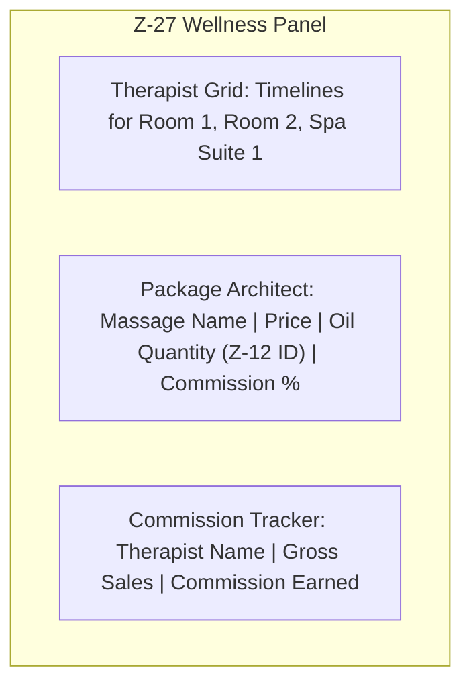
```mermaid
graph TD
    subgraph Z-27 Wellness Panel
        Calendar["Therapist Grid: Timelines for Room 1, Room 2, Spa Suite 1"]
        ServiceBuilder["Package Architect: Massage Name | Price | Oil Quantity (Z-12 ID) | Commission %"]
        Commissions["Commission Tracker: Therapist Name | Gross Sales | Commission Earned"]
    end
```


---
## Zone 7: Z-28 — Luxury Boutiques Command
**Path:** `/dashboard/boutiques` | **Access:** CDO, GM, ADMIN, POS, VISITOR

### 1. The C-Suite Pitch
High-value luxury retail (watches, jewelry, branded apparel) requires precise stock management, margin control, and vendor cataloging. Z-28 provides specialized retail managers with a product intake ledger, barcode generation tracking, and margin calculators. Selling a boutique item instantly executes a general ledger transaction in Z-11 (DR Cash/AR / CR Boutique Revenue) and calculates the exact Cost of Goods Sold (COGS) to measure net profitability.

### 2. Focus Points & Core Capabilities
- High-value inventory stock tracking
- Profit margin and wholesale purchase price calculator
- Sales data integration to centralized POS (Z-06)

### 3. Tabs & Sub-Zones
- **Catalog Management:** Add retail items, purchase cost, retail price, and tax bracket.
- **Purchase Orders:** Manage vendor deliveries and stock intake.
- **Sales Analytics:** Retail turnover and profit margins dashboard.

### 4. Technical Process & Data Flow
```
Boutique sales transaction completed (Z-06) -> POST /api/pos/checkout
  -> Deducts stock count from `inventory` -> Logs transaction to `pos_transactions`
  -> Posts to Z-11 ledger: DR cash, CR boutique revenue, DR COGS expense, CR stock asset
```
- **Relevant Tables:** `inventory`, `pos_transactions`, `accounting_ledger`
- **API Endpoints:** `/api/boutiques/products`, `/api/boutiques/vendors`, `/api/boutiques/performance`

### 5. Enterprise Scope
- **Resort Shops:** Tracks souvenir and convenience stock.
- **Luxury Brand Boutiques:** Manages high-ticket jewelry and clothing catalog.
- **Consignment Stores:** Tracks consignor commission splits and stock age.

### 6. UI Layout Mockup & Aesthetics
- **Visual Styling:** Frosted dark cards detailing item metadata. Progress bars display item-specific markup percentage and stock level alerts (e.g. low stock triggers neon amber warning).
- **Layout Wireframe:**
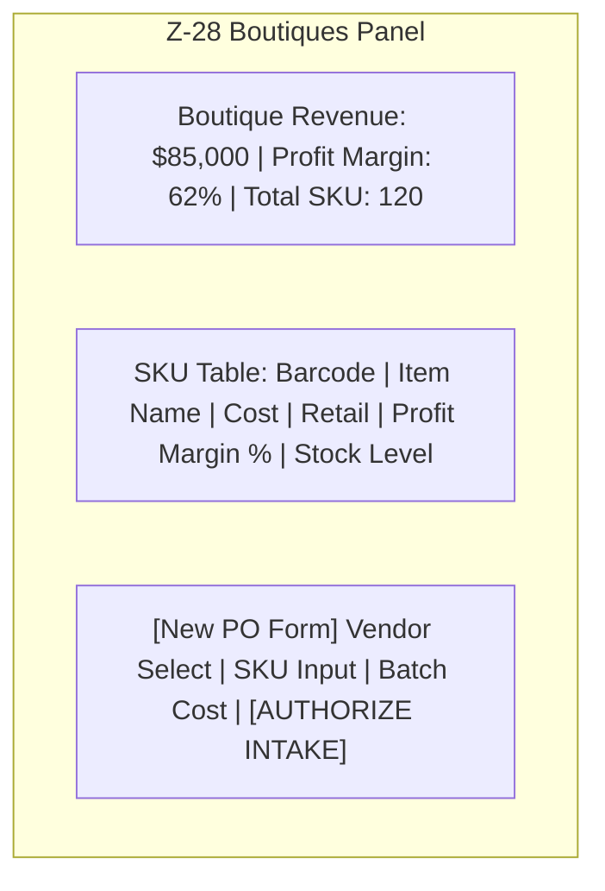
```mermaid
graph TD
    subgraph Z-28 Boutiques Panel
        Metrics["Boutique Revenue: $85,000 | Profit Margin: 62% | Total SKU: 120"]
        ProductList["SKU Table: Barcode | Item Name | Cost | Retail | Profit Margin % | Stock Level"]
        VendorForm["[New PO Form] Vendor Select | SKU Input | Batch Cost | [AUTHORIZE INTAKE]"]
    end
```


---
## Zone 8: Z-29 — Gastronomy & F&B Engine
**Path:** `/dashboard/z29-gastronomy` | **Access:** CDO, GM, ADMIN, FB, VISITOR

### 1. The C-Suite Pitch
Food and beverage operations have high waste rates and low net margins. Z-29 is the core F&B architect engine. Instead of running stand-alone restaurant calculators, F&B GMs use Z-29 to build menu item recipes by pulling raw items from the main stock vault (Z-12). It calculates the precise cost of ingredients (COGS) for a dish, recommends pricing, and logs discarded ingredients to the wastage ledger, syncing directly with the general ledger.

### 2. Focus Points & Core Capabilities
- Recipe Bill of Materials (BOM) constructor with live ingredient costing
- Wastage audit log with direct ledger depreciation posts
- Menu architect connected to POS product catalogs

### 3. Tabs & Sub-Zones
- **Menu Architect:** Design dishes and link to ingredient items.
- **Recipe BOM:** Visual database of menu recipe costs and margins.
- **Wastage Log:** Log discarded ingredients with write-off reasons.

### 4. Technical Process & Data Flow
```
Add raw ingredient to recipe -> Recalculates dish cost in `recipe_bom`
  -> Pos transaction completed (Z-06) -> Explodes recipe -> Deducts raw items from `inventory`
  -> Log waste -> POST /api/fb/waste -> Z-11 logs: DR Wastage Expense, CR Inventory Asset
```
- **Relevant Tables:** `inventory`, `pos_transactions`, `recipe_bom_lines`, `wastage_ledger`
- **API Endpoints:** `/api/fb/menu`, `/api/fb/recipe/{menuId}`, `/api/fb/wastage/log`

### 5. Enterprise Scope
- **Fine Dining Restaurants:** Tracks dish costs and recipe margins.
- **Hotel Food & Beverage:** Integrates room service menus and buffet inventory.
- **Catering Services:** Compiles banquet package recipes and raw bulk orders.

### 6. UI Layout Mockup & Aesthetics
- **Visual Styling:** Modern culinary builder interface. A drag-and-drop panel allows F&B managers to select raw stock (e.g. fresh coffee beans) and configure recipe ounces.
- **Layout Wireframe:**
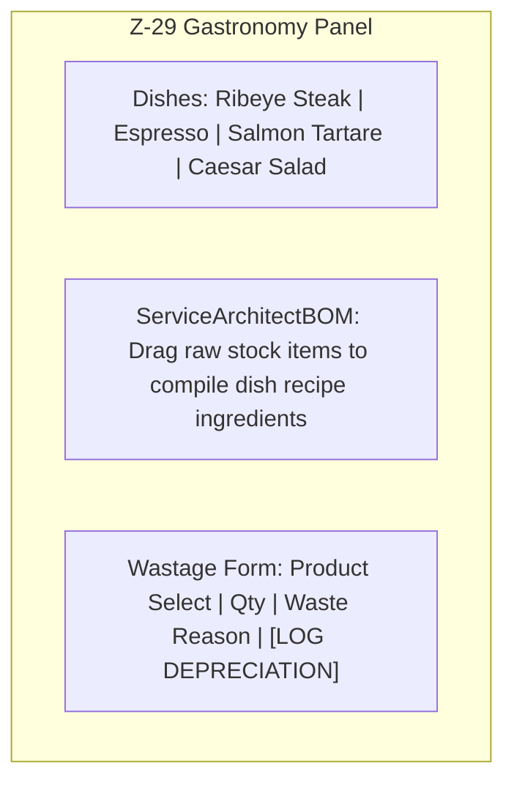
```mermaid
graph TD
    subgraph Z-29 Gastronomy Panel
        Menu["Dishes: Ribeye Steak | Espresso | Salmon Tartare | Caesar Salad"]
        BOMBuilder["ServiceArchitectBOM: Drag raw stock items to compile dish recipe ingredients"]
        WasteLog["Wastage Form: Product Select | Qty | Waste Reason | [LOG DEPRECIATION]"]
    end
```


---
## Zone 9: Z-25 — Guest Marketing & Cineplex Hub
**Path:** `/dashboard/guest-marketing` | **Access:** CDO, GM, ADMIN, GUEST_MARKETING, VISITOR

### 1. The C-Suite Pitch
Acquiring guest phone numbers is useless unless you can engage them directly. Z-25 serves as the resort's outreach coordinator. It handles guest app distribution (pushing APK links via WhatsApp), schedules marketing broadcasts to selected VIP lists, and manages the in-room entertainment library (Guest Cinema). This keeps guests engaged and encourages repeat bookings without requiring external email or SMS campaign services.

### 2. Focus Points & Core Capabilities
- Native guest app distribution system
- Segmented marketing broadcasts and loyalty campaign management
- Cineplex media vault administrator

### 3. Tabs & Sub-Zones
- **App Distribution:** Send Capacitor guest app download links.
- **Campaign Panel:** Create and schedule promotional campaigns and loyalty bonuses.
- **Miracle Cinema:** Manage the in-room movie library and live channels.

### 4. Technical Process & Data Flow
```
Add new movie -> Inserts to `cinema_vault` -> Instantly visible on in-room WebView
  -> Create promotional campaign -> Queries `guest_crm` -> Filters by VIP Tier
  -> Triggers batch SMS/WhatsApp broadcasts via marketing webhook
```
- **Relevant Tables:** `cinema_vault`, `guest_crm`, `campaigns`
- **API Endpoints:** `/api/marketing/campaign/send`, `/api/marketing/app-link`, `/api/cinema/add-movie`

### 5. Enterprise Scope
- **Luxury Resorts:** Airport transfer notifications and resort promotional push messages.
- **Boutique Hotels:** In-room media and Netflix-style cinema control.
- **Theme Parks:** Direct app distribution and fast-track pass purchases.

### 6. UI Layout Mockup & Aesthetics
- **Visual Styling:** High-tech broadcast command console. Campaigns appear as progress bars detailing send statistics (Delivered, Clicked, Redeemed).
- **Layout Wireframe:**
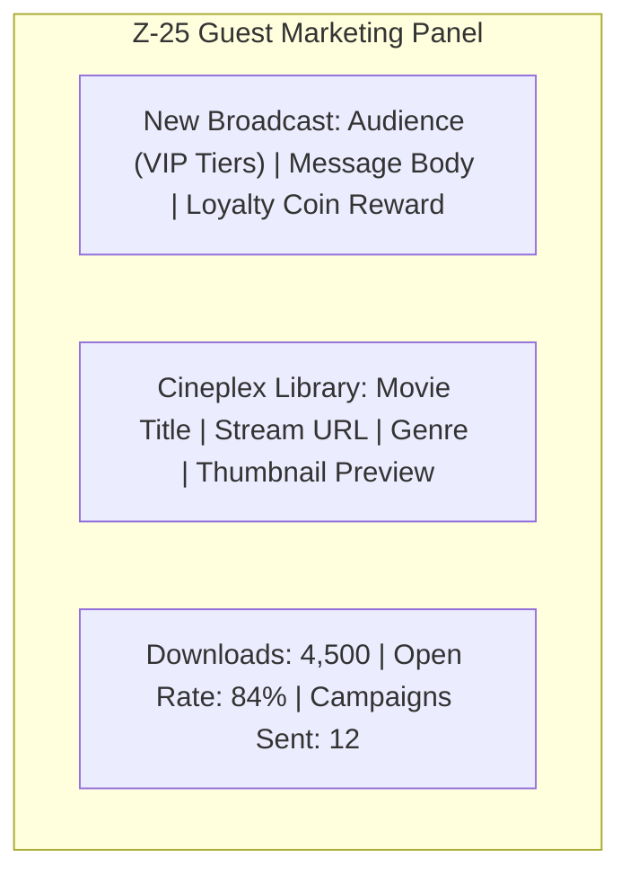
```mermaid
graph TD
    subgraph Z-25 Guest Marketing Panel
        Broadcast["New Broadcast: Audience (VIP Tiers) | Message Body | Loyalty Coin Reward"]
        CinemaLibrary["Cineplex Library: Movie Title | Stream URL | Genre | Thumbnail Preview"]
        Metrics["Downloads: 4,500 | Open Rate: 84% | Campaigns Sent: 12"]
    end
```


---
## Zone 10: Z-08 — Checkout & Folio Settlement
**Path:** `/dashboard/checkout` | **Access:** CDO, GM, ADMIN, FD, POS, SPA, ACC, VISITOR

### 1. The C-Suite Pitch
The point of guest departure is a critical financial node. Z-08 consolidates every transaction logged against a guest's room (POS room charges, spa treatments, night room rates, advance deposits) into a unified bill. Front Desk agents can apply discounts, split the bill between cash/card, process card swipes, and finalize settlement. This single-kernel architecture prevents guests from leaving with unpaid balances.

### 2. Focus Points & Core Capabilities
- Unified guest folio billing (zero lost room charges)
- Split payment processing (Cash, Card, Loyalty Coins)
- Automated room dirty transition on settlement

### 3. Tabs & Sub-Zones
- **Settle Folio:** Search guest, view itemized charges, and process payment.
- **History Ledger:** Archive of settled folios and invoice print panel.

### 4. Technical Process & Data Flow
```
Search Guest -> Queries `folio_charges` -> Sums transactions -> Subtracts advance paid
  -> Click SETTLE FOLIO -> POST /api/frontdesk/checkout/settle -> Writes to `pos_transactions`
  -> Updates `asset_grid` to DIRTY -> Updates Z-11 ledger: DR Cash, CR Accounts Receivable
```
- **Relevant Tables:** `guest_folios`, `folio_charges`, `pos_transactions`, `asset_grid`
- **API Endpoints:** `/api/frontdesk/checkout/folio/{roomId}`, `/api/frontdesk/checkout/settle`

### 5. Enterprise Scope
- **Hotel Operations:** Room folio checkout and invoice printing.
- **Private Clubs:** Monthly member billing and dues settlement.
- **Healthcare Wards:** Consolidates room fees, medical tests, and medicines for discharge billing.

### 6. UI Layout Mockup & Aesthetics
- **Visual Styling:** Glassmorphic Bloomberg invoice layout. Itemized billing table features clear columns showing department source, charge type, and tax breakdowns.
- **Layout Wireframe:**
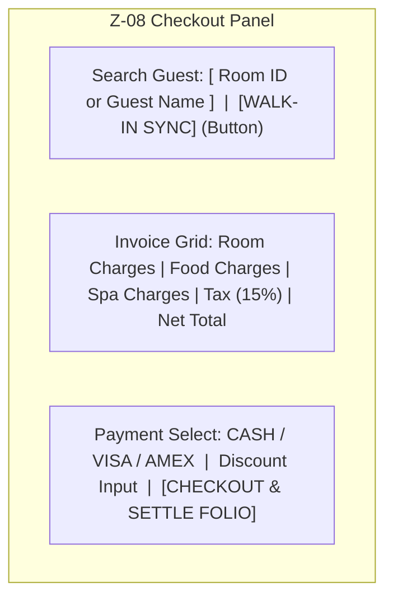
```mermaid
graph TD
    subgraph Z-08 Checkout Panel
        Search["Search Guest: [ Room ID or Guest Name ]  |  [WALK-IN SYNC] (Button)"]
        InvoiceBox["Invoice Grid: Room Charges | Food Charges | Spa Charges | Tax (15%) | Net Total"]
        Settlement["Payment Select: CASH / VISA / AMEX  |  Discount Input  |  [CHECKOUT & SETTLE FOLIO]"]
    end
```


---
## Zone 11: Z-16 — Sovereign Issue Ticketing
**Path:** `/dashboard/issue-tickets` | **Access:** ANY (All Authenticated Roles)

### 1. The C-Suite Pitch
Operational failures (maintenance issues, housekeeping requests, guest complaints) directly impact company reputation if they are not tracked. Z-16 is the centralized ticketing registry. Any employee, from any department, can log an issue and assign it to a team (IT, Housekeeping, Maintenance). Critical tickets automatically trigger a visual alert on the Z-07 Command Grid card, alerting the GM immediately.

### 2. Focus Points & Core Capabilities
- Centralized complaint and maintenance ticketing
- Real-time visual binding to Z-07 Command Grid cards
- Automatic priority routing (Low, Medium, High, Critical)

### 3. Tabs & Sub-Zones
- **Create Ticket:** Log a room number, target department, description, and priority.
- **All Active Tickets:** Filterable queue of open and in-progress issues.

### 4. Technical Process & Data Flow
```
Staff logs ticket -> POST /api/solve/missions/create -> Writes to `solve_missions`
  -> If priority is CRITICAL -> WebSocket triggers Red Strobe border on Z-07 card
  -> HK ticket -> Triggers purple HK pulse badge on Z-07 card
```
- **Relevant Tables:** `solve_missions`, `asset_grid`
- **API Endpoints:** `/api/solve/missions/create`, `/api/solve/active`

### 5. Enterprise Scope
- **Resort Management:** Tracks room repair and housekeeping requests.
- **Facility Management:** Schedules elevator, HVAC, and generator repairs.
- **B2B Office Buildings:** Tracks IT infrastructure and janitorial tickets.

### 6. UI Layout Mockup & Aesthetics
- **Visual Styling:** Cyberpunk dashboard with priority indicators. Critical tickets flash with a crimson background and a pulsing scanning glow.
- **Layout Wireframe:**
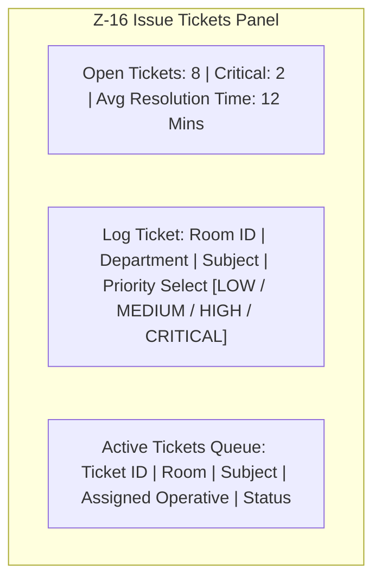
```mermaid
graph TD
    subgraph Z-16 Issue Tickets Panel
        Stats["Open Tickets: 8 | Critical: 2 | Avg Resolution Time: 12 Mins"]
        Form["Log Ticket: Room ID | Department | Subject | Priority Select [LOW / MEDIUM / HIGH / CRITICAL]"]
        TicketList["Active Tickets Queue: Ticket ID | Room | Subject | Assigned Operative | Status"]
    end
```


---
## Zone 12: Z-17 — Solve Portal (Field Operations)
**Path:** `/dashboard/solve` | **Access:** ANY (All Authenticated Roles)

### 1. The C-Suite Pitch
Fulfilling service tickets requires field staff to have an uncluttered interface. Z-17 is the mobile-optimized staff portal. Field staff only see tasks assigned to their specific department or ID. Operatives update tasks to "In-Progress", write resolution notes, and upload photo proof of completion, which instantly clears the alarm on the Z-07 Command Grid.

### 2. Focus Points & Core Capabilities
- Mobile-optimized interface for field operatives
- Photo proof upload and status toggle
- Automatic sync to Z-09 HR productivity matrices

### 3. Tabs & Sub-Zones
- **My Tasks:** Operative-specific queue of assigned tickets.
- **All Active (CDO Only):** Administrative grid to override and reassign tickets.

### 4. Technical Process & Data Flow
```
Operative opens Z-17 -> Fetches assigned tasks -> Click START -> Updates `solve_missions`
  -> Click RESOLVE -> Upload photo proof -> POST /api/solve/missions/resolve
  -> WebSocket broadcasts -> Z-07 room card clears alarm -> Z-09 increments staff ROI score
```
- **Relevant Tables:** `solve_missions`, `employees`
- **API Endpoints:** `/api/solve/missions/start/{id}`, `/api/solve/missions/resolve/{id}`

### 5. Enterprise Scope
- **Housekeeping Teams:** Real-time room cleaning updates.
- **Maintenance Crews:** HVAC/plumbing repair closeouts.
- **Food Delivery Services:** Tracks meal preparation and delivery handoff.

### 6. UI Layout Mockup & Aesthetics
- **Visual Styling:** Clean, high-contrast grid interface designed for mobile screens. Buttons are large and touch-friendly (Start = Cyan, Resolve = Green).
- **Layout Wireframe:**
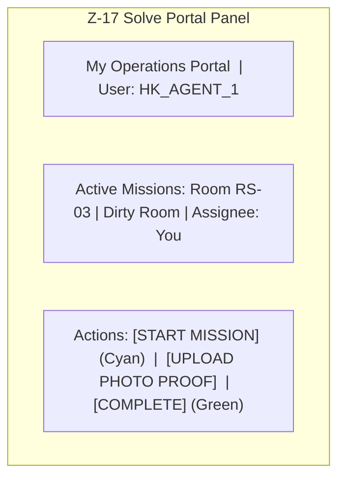
```mermaid
graph TD
    subgraph Z-17 Solve Portal Panel
        Title["My Operations Portal  |  User: HK_AGENT_1"]
        ActiveList["Active Missions: Room RS-03 | Dirty Room | Assignee: You"]
        TaskControl["Actions: [START MISSION] (Cyan)  |  [UPLOAD PHOTO PROOF]  |  [COMPLETE] (Green)"]
    end
```


---
## Zone 13: Z-14 — Media Lab
**Path:** `/dashboard/media-lab` | **Access:** CDO, GM, ADMIN, VISITOR

### 1. The C-Suite Pitch
Large enterprises waste time using external drives and cloud folders to share company images, logos, menus, and staff photos. Z-14 is the **integrated Digital Asset Management (DAM) system**. Media uploaded here is stored in the central database and is immediately available to the customer website, in-room guest TVs, POS product cards, and HR dossiers.

### 2. Focus Points & Core Capabilities
- Centralized Digital Asset Management (DAM)
- Auto-indexing by department tag (F&B, Rooms, HR)
- Seamless frontend image rendering integration

### 3. Tabs & Sub-Zones
- **Upload Bay:** Drag-and-drop file upload tool.
- **Asset Library:** Filterable image grid sorted by tags.

### 4. Technical Process & Data Flow
```
Upload image -> POST /api/media/upload -> Saves to disk -> Inserts to `media_assets`
  -> Assign tag -> Z-06 POS displays image on corresponding product card
  -> Z-09 HR displays image on employee card
```
- **Relevant Tables:** `media_assets`
- **API Endpoints:** `/api/media/upload`, `/api/media/library`, `/api/media/delete/{id}`

### 5. Enterprise Scope
- **Marketing Departments:** Manages campaign assets and resort photography.
- **Culinary Teams:** Syncs menu dish images with POS terminals.
- **Human Resources:** Uploads official staff profile photographs.

### 6. UI Layout Mockup & Aesthetics
- **Visual Styling:** Media library grid with frosted glass card outlines. Hovering over an asset reveals metadata overlays (resolution, size, usage tags).
- **Layout Wireframe:**
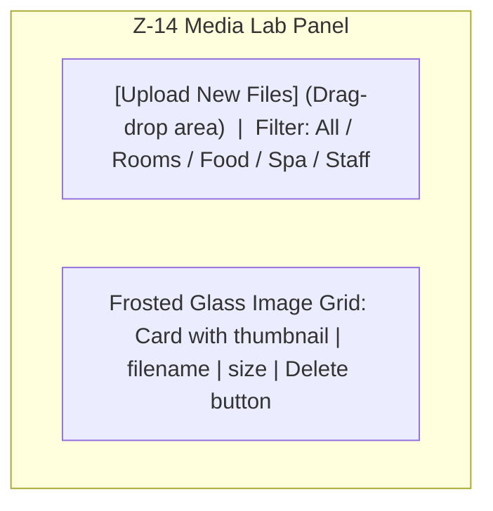
```mermaid
graph TD
    subgraph Z-14 Media Lab Panel
        ControlBar["[Upload New Files] (Drag-drop area)  |  Filter: All / Rooms / Food / Spa / Staff"]
        LibraryGrid["Frosted Glass Image Grid: Card with thumbnail | filename | size | Delete button"]
    end
```


---
## Zone 14: Z-18 — Biometric Security Portal
**Path:** `/dashboard/portal` | **Access:** CDO, GM, ADMIN, HR, VISITOR

### 1. The C-Suite Pitch
Corporate payroll fraud ("ghost employees" and proxy sign-ins) cost large businesses millions annually. Z-18 eliminates this by tracking staff attendance through biometric verification. Shift hours are logged against biometric logins, ensuring payroll calculations in Z-09 are backed by verified biometric data.

### 2. Focus Points & Core Capabilities
- Secure biometric staff check-in/check-out logs
- Immutable security session trail mapping (IP and User Agent)
- Real-time dashboard detailing active logins

### 3. Tabs & Sub-Zones
- **Live Attendance:** Displays on-duty operatives and active sessions.
- **Access Logs:** Forensic audit trail of failed and successful logins.

### 4. Technical Process & Data Flow
```
Staff logs in (Biometric Check-In) -> Writes success log to `biometric_attendance`
  -> Shifts status of employee to ON-DUTY -> Syncs with Z-09 Payroll hourly calculator
  -> Z-20 org-chart updates node status to Neon Green
```
- **Relevant Tables:** `biometric_attendance`, `employees`, `audit_logs`
- **API Endpoints:** `/api/biometrics/check-in`, `/api/biometrics/logs`, `/api/biometrics/on-duty`

### 5. Enterprise Scope
- **Conglomerates:** Eliminates buddy-punching payroll fraud.
- **Manufacturing Plants:** Tracks factory shift floor check-ins.
- **Security Services:** Verifies patrol guard sign-in locations.

### 6. UI Layout Mockup & Aesthetics
- **Visual Styling:** High-security interface styling. Active sessions appear in a grid of neon-trimmed diagnostic cards showing device fingerprint details.
- **Layout Wireframe:**
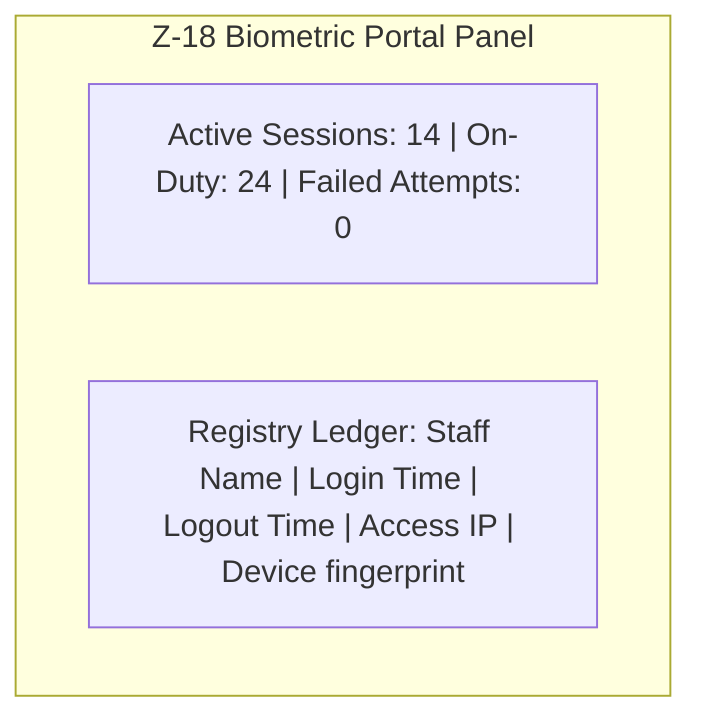
```mermaid
graph TD
    subgraph Z-18 Biometric Portal Panel
        Stats["Active Sessions: 14 | On-Duty: 24 | Failed Attempts: 0"]
        LogsTable["Registry Ledger: Staff Name | Login Time | Logout Time | Access IP | Device fingerprint"]
    end
```


---
## Zone 15: Z-12 — Inventory Matrix & Stock Vault
**Path:** `/dashboard/inventory` | **Access:** CDO, GM, ADMIN, POS, HK, MN, VISITOR

### 1. The C-Suite Pitch
Inventory shrinkage and stockout events are major operational hurdles. Z-12 serves as the unified inventory vault. It tracks physical items across all departments (cleaning supplies, food ingredients, spa supplies, boutique SKUs, maintenance parts). When items fall below threshold levels (PAR), Z-12 triggers low-stock alerts, enabling automated replenishment and minimizing cash locked up in excess stock.

### 2. Focus Points & Core Capabilities
- Unified stock catalog across all departments
- Real-time stock alerts and automated reordering predictions
- Automated BOM ingredient deductions on sales transactions (Z-06)

### 3. Tabs & Sub-Zones
- **Stock Grid:** Product database showing stock counts and purchase prices.
- **Receiving Bay:** Log incoming supplier orders.
- **Stock Adjustment:** Log physical counts and document variances.

### 4. Technical Process & Data Flow
```
POS transaction completed (Z-06) -> Explodes recipe -> Deducts ingredient quantities
  -> If stock < min_level -> Triggers LOW STOCK alert (Presents item in red on Stock Grid)
  -> Adjust stock -> Writes to Z-11 Ledger: DR Stock Asset, CR Accounts Payable
```
- **Relevant Tables:** `inventory`, `inventory_transactions`, `accounting_ledger`
- **API Endpoints:** `/api/inventory/live`, `/api/inventory/adjustment`, `/api/inventory/reorder`

### 5. Enterprise Scope
- **Hotel Operations:** Tracks linen, amenities, and cleaning fluid inventory.
- **Restaurants & Bars:** Monitored beverage ounces and fresh food counts.
- **Retail Outlets:** Barcode management and retail stock-level tracking.

### 6. UI Layout Mockup & Aesthetics
- **Visual Styling:** Frosted glass stock inventory catalog. Items with stock levels below their PAR threshold flash with an amber warning sign.
- **Layout Wireframe:**
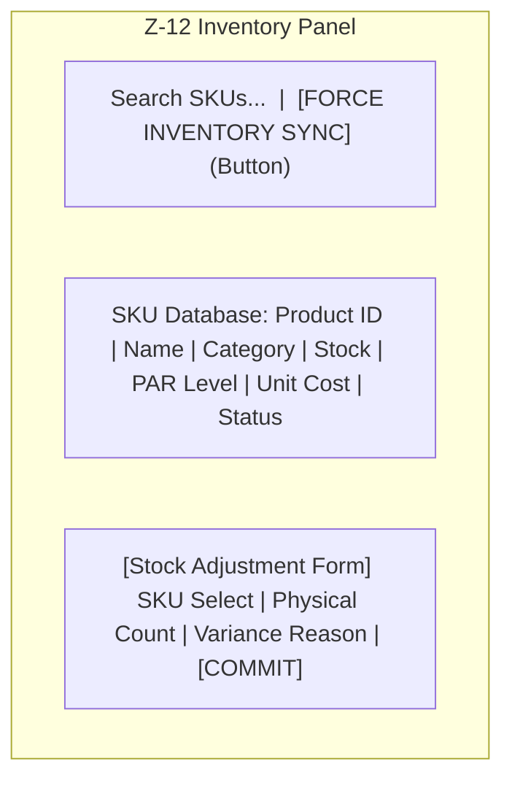
```mermaid
graph TD
    subgraph Z-12 Inventory Panel
        Search["Search SKUs...  |  [FORCE INVENTORY SYNC] (Button)"]
        SKUTable["SKU Database: Product ID | Name | Category | Stock | PAR Level | Unit Cost | Status"]
        AdjustForm["[Stock Adjustment Form] SKU Select | Physical Count | Variance Reason | [COMMIT]"]
    end
```


---
## Zone 16: Z-09 — Human Capital Command (HR)
**Path:** `/dashboard/hr` | **Access:** CDO, GM, ADMIN, HR, VISITOR

### 1. The C-Suite Pitch
Corporate payroll management and staff performance reviews often require separate HR suites. Z-09 integrates the entire employee lifecycle—from onboarding and contract generation to shift performance metrics and automated payroll runs. Z-09 calculates a live "ROI Factor" for each staff member by comparing their salary against the revenue generated by their completed POS sales or resolved tickets, optimizing workforce efficiency.

### 2. Focus Points & Core Capabilities
- Employee gallery and digital dossiers
- Automated contract generation (Appointment Letter Forge)
- Staff Performance and ROI ranking dashboard

### 3. Tabs & Sub-Zones
- **Gallery:** Visual card grid of all staff.
- **Performance:** Productivity table detailing staff ROI scores.
- **Payroll:** Monthly shift log summaries and salary payout triggers.
- **Documents:** Digital folder containing employee records and contract drafts.
- **Onboarding:** Multi-field onboarding registration form.
- **Registry:** Direct data editor for employee settings.

### 4. Technical Process & Data Flow
```
Onboard employee -> Form submit -> Writes to `employees` -> Auto-generates staff credentials
  -> Logs attendance -> Calculates shift hours -> Click PUSH TO PAYROLL
  -> POST /api/hr/payroll/approve -> Posts transaction in Z-11: DR Payroll Expense, CR Cash
```
- **Relevant Tables:** `employees`, `biometric_attendance`, `accounting_ledger`
- **API Endpoints:** `/api/hr/performance-matrix`, `/api/hr/onboard`, `/api/hr/payroll/payout`

### 5. Enterprise Scope
- **Corporations:** Performance tracking and payroll calculation.
- **Hospitality groups:** Manages commission payouts for spa therapists and restaurant staff.
- **Logistics Companies:** Tracks driver working hours and logs transport metrics.

### 6. UI Layout Mockup & Aesthetics
- **Visual Styling:** Executive HR dashboard. Employee cards show active indicators (Neon Green for online staff). Dossiers slide out as glassmorphic panels.
- **Layout Wireframe:**
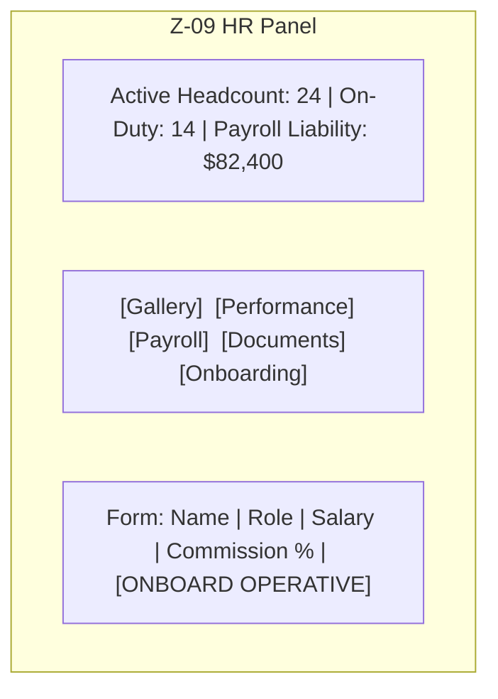
```mermaid
graph TD
    subgraph Z-09 HR Panel
        Stats["Active Headcount: 24 | On-Duty: 14 | Payroll Liability: $82,400"]
        Tabs["[Gallery]  [Performance]  [Payroll]  [Documents]  [Onboarding]"]
        OnboardForm["Form: Name | Role | Salary | Commission % | [ONBOARD OPERATIVE]"]
    end
```


---
## Zone 17: Z-10 — CRM & Guest Loyalty Engine
**Path:** `/dashboard/crm` | **Access:** CDO, GM, ADMIN, FD, VISITOR

### 1. The C-Suite Pitch
Loyal clients spend more. Z-10 consolidates all guest profiles into a unified database detailing VIP status, booking history, lifetime value (LTV), and loyalty coins. When checkout is finalized in Z-08, Z-10 automatically updates the guest's loyalty coins (1 coin per currency unit spent). This incentivizes repeat bookings without requiring external guest marketing programs.

### 2. Focus Points & Core Capabilities
- Multi-tier VIP progression dashboard (Bronze, Silver, Gold, Platinum)
- Guest loyalty coin accrual and redemption log
- Direct communication channel (WhatsApp/Email) integration per guest

### 3. Tabs & Sub-Zones
- **Guest List:** Interactive guest database detailing VIP status and LTV.
- **Loyalty Ledger:** Log showing loyalty coin issuances and redemptions.

### 4. Technical Process & Data Flow
```
Checkout settled (Z-08) -> POST /api/frontdesk/checkout/settle -> Calculates total spend
  -> Updates `guest_crm` LTV -> Calculates coins -> Increments loyalty balance
  -> If LTV passes threshold -> Upgrades VIP tier -> Z-07 Grid updates guest badge
```
- **Relevant Tables:** `guest_crm`, `reservations`, `folio_charges`
- **API Endpoints:** `/api/crm/guests`, `/api/crm/guest/{id}/add-coins`, `/api/crm/tiers`

### 5. Enterprise Scope
- **Resorts & Casinos:** Tracks high-value VIP players and manages comp upgrades.
- **Private Member Clubs:** Manages club member loyalty rewards and guest lists.
- **Retail Brands:** Tracks loyalty coin conversions and targeted marketing promotions.

### 6. UI Layout Mockup & Aesthetics
- **Visual Styling:** Premium customer profiles featuring luxury gold trim. VIP progress bars show how close a guest is to the next status tier.
- **Layout Wireframe:**
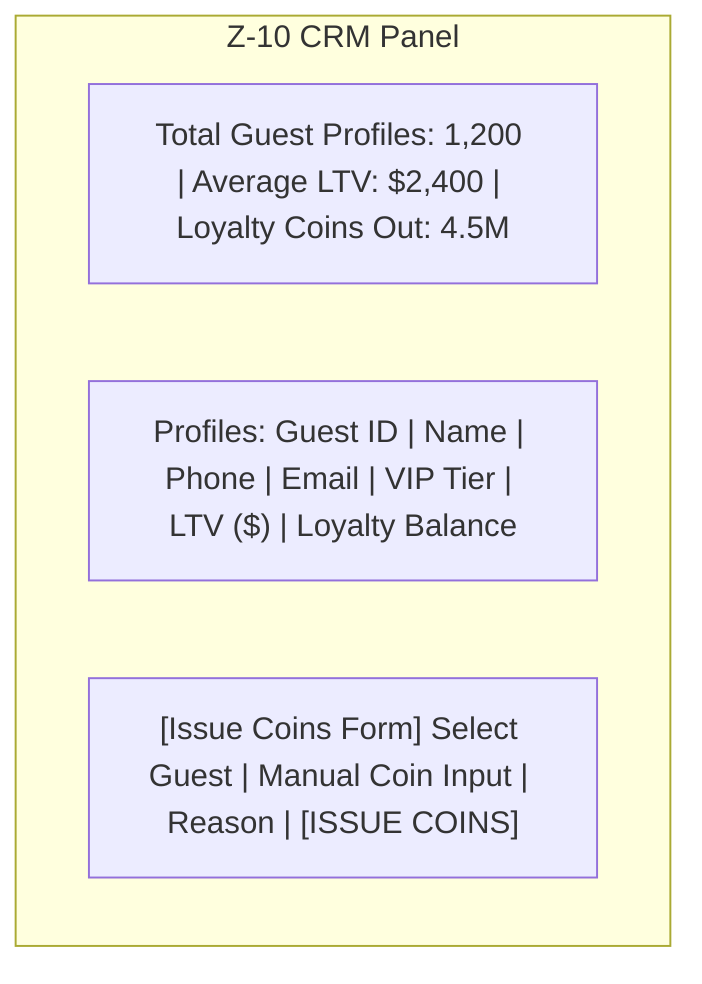
```mermaid
graph TD
    subgraph Z-10 CRM Panel
        Metrics["Total Guest Profiles: 1,200 | Average LTV: $2,400 | Loyalty Coins Out: 4.5M"]
        CRMTable["Profiles: Guest ID | Name | Phone | Email | VIP Tier | LTV ($) | Loyalty Balance"]
        ActionForm["[Issue Coins Form] Select Guest | Manual Coin Input | Reason | [ISSUE COINS]"]
    end
```


---
## Zone 18: Z-19 — CORE PMS & Policy Engine
**Path:** `/dashboard/policy` | **Access:** CDO, GM, ADMIN, VISITOR

### 1. The C-Suite Pitch
Pricing inconsistency causes direct margin loss. Z-19 serves as the **central control panel for pricing policy**. Any changes to room rates, seasonal pricing schedules, tax rates (VAT), or service charges (SC) must be configured here. The Policy Lock freezes configuration parameters system-wide, preventing unauthorized modifications during checkout.

### 2. Focus Points & Core Capabilities
- Configurable tax rules (VAT) and Service Charge ratios
- Unit-type pricing schedules (peak and off-peak seasons)
- System-wide immutable Policy Lock

### 3. Tabs & Sub-Zones
- **Policy Control:** Central switchboard to configure VAT and Service Charge rates.
- **Room Classes:** Pricing editor for Royal Suites, Presidential Suites, and Villas.
- **SOP Manager:** Document repository for employee guidelines.

### 4. Technical Process & Data Flow
```
Admin modifies VAT (Z-19) -> Clicks COMMIT POLICY LOCK -> POST /api/policy/lock
  -> Saves parameters to `policy_registry` -> Z-06 POS and Z-08 Checkout read parameters
  -> Calculations for VAT and Service Charge update system-wide
```
- **Relevant Tables:** `policy_registry`, `properties` (Base Rates)
- **API Endpoints:** `/api/policy/config`, `/api/policy/lock`, `/api/policy/rooms/update`

### 5. Enterprise Scope
- **Resorts & Hotels:** Manages seasonal price fluctuations and tax rules.
- **Office Property Groups:** Configures rental rates and lease terms.
- **Retail Conglomerates:** Manages regional VAT configurations and service charges.

### 6. UI Layout Mockup & Aesthetics
- **Visual Styling:** Structured admin dashboard. The Policy Lock button features an animated shield element (glowing Green when locked, pulsing Red when unlocked).
- **Layout Wireframe:**
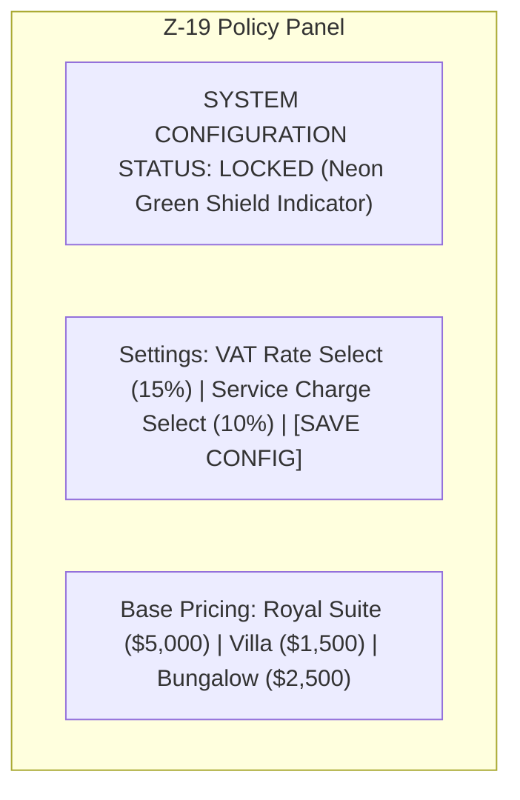
```mermaid
graph TD
    subgraph Z-19 Policy Panel
        LockHUD["SYSTEM CONFIGURATION STATUS: LOCKED (Neon Green Shield Indicator)"]
        RatesForm["Settings: VAT Rate Select (15%) | Service Charge Select (10%) | [SAVE CONFIG]"]
        RoomsGrid["Base Pricing: Royal Suite ($5,000) | Villa ($1,500) | Bungalow ($2,500)"]
    end
```


---
## Zone 19: Z-20 — Synapse Nexus (Enterprise War Room)
**Path:** `/dashboard/synapse` | **Access:** CDO, GM, ADMIN, SYNAPSE, VISITOR

### 1. The C-Suite Pitch
Fragmented communication platforms (Jira, Slack, Microsoft Teams) lead to misplaced documents, delayed tasks, and unmonitored staff communication. Z-20 replaces these apps with an integrated **Enterprise War Room**. Z-20 combines a visual organizational tree, WebRTC video links, secure chat rooms, a Kanban board, and an AGI task arbitrator. It models the corporate hierarchy, restricting chat authorization based on manager hierarchy, and decompiles complex tasks into sub-tasks via AGI.

### 2. Focus Points & Core Capabilities
- Visual org-chart with live on-duty indicators and direct WebRTC video calls
- Kanban board for strategic directives
- Hierarchical chat gatekeeper (preserves official communication structures)
- AGI Strategic Arbitrator (decompiles master directives into sub-task tickets)

### 3. Tabs & Sub-Zones
- **Neural Tree:** Interactive graphical org-chart of all employees.
- **Command Grid:** Strategic Kanban board for company-wide tasks.
- **Comm-Link:** Live WebRTC video panel and team chat folders.

### 4. Technical Process & Data Flow
```
Admin uploads directive -> Clicks AUTO-DECOMPILE -> POST /api/synapse/agi/decompose-directive
  -> AGI splits directive -> Spawns sub-task tickets (Z-16) -> Inserts to `solve_missions`
  -> WebSocket alerts department tiles -> Green neon pulsing badge on Z-07 Command Grid
```
- **Relevant Tables:** `employees`, `strategic_directives`, `solve_missions`, `chat_threads`
- **API Endpoints:** `/api/synapse/agi/decompose-directive`, `/api/synapse/chat/create`, `/api/synapse/org-tree`

### 5. Enterprise Scope
- **Corporations:** Strategic planning, task distribution, and video communication.
- **Conglomerates:** Direct communication management between managers and field agents.
- **Project Teams:** High-stakes project management with automated AGI task creation.

### 6. UI Layout Mockup & Aesthetics
- **Visual Styling:** Immersive control room view. Org-chart nodes feature employee status dots (Neon Green = Online, Orange = In-Call, Grey = Offline). Video windows appear as floating glassmorphic panels.
- **Layout Wireframe:**
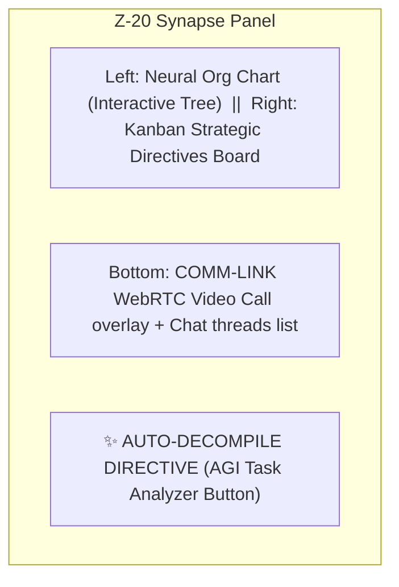
```mermaid
graph TD
    subgraph Z-20 Synapse Panel
        WarRoomGrid["Left: Neural Org Chart (Interactive Tree)  ||  Right: Kanban Strategic Directives Board"]
        ChatLink["Bottom: COMM-LINK WebRTC Video Call overlay + Chat threads list"]
        AGIBtn["✨ AUTO-DECOMPILE DIRECTIVE (AGI Task Analyzer Button)"]
    end
```


---
## Zone 20: Z-11 — Accounts & Finance Sovereign Kernel
**Path:** `/dashboard/accounts` | **Access:** CDO, GM, ADMIN, ACC, VISITOR

### 1. The C-Suite Pitch
The ultimate test of an ERP system is its accounting framework. Traditional systems export CSV files to external accounting platforms, introducing errors and synchronization delays. Z-11 is a **GAAP-compliant, double-entry general ledger engine** connected directly to the database kernel. Every transactions—whether a boutique POS checkout, payroll run, or stock purchase—writes matching debit and credit entries automatically.

### 2. Focus Points & Core Capabilities
- Live GAAP double-entry ledger database sync
- Revenue vector analysis and expense breakdown graphs
- Complete Chart of Accounts (COA) management
- Direct accounts payable (AP) and accounts receivable (AR) aging engines

### 3. Tabs & Sub-Zones
- **Revenue Vector:** P&L dashboard detailing income categories.
- **Item-Wise Trace:** General ledger logs showing transaction lines.
- **Burden Matrix:** Visual breakdown of operational expenses.
- **GL Entry:** Post manual journal entries.
- **Chart of Accounts:** Manage account codes (1000 = Cash, 4000 = Room Revenue, etc.).
- **Aging Engines:** AP / AR aging tables showing payment tracking.
- **Night Audit:** System closeout wizard.

### 4. Technical Process & Data Flow
```
Any transaction occurs (Z-06 / Z-08 / Z-09) -> Triggers SQL transaction block
  -> Writes double-entry record to `journal_entries` and `ledger_lines`
  -> Recalculates Chart of Accounts balances -> Live P&L dashboard updates
```
- **Relevant Tables:** `journal_entries`, `ledger_lines`, `accounts`
- **API Endpoints:** `/api/accounting/ledger`, `/api/accounting/chart-of-accounts`, `/api/accounting/night-audit`

### 5. Enterprise Scope
- **Corporations:** Comprehensive corporate financial auditing and P&L tracking.
- **Conglomerates:** Cross-subsidiary consolidated ledger reporting.
- **Firms:** Custom Chart of Accounts configurations and auditing exports.

### 6. UI Layout Mockup & Aesthetics
- **Visual Styling:** Professional financial dashboard. Accounts are grouped by class (Assets, Liabilities, Equity, Revenues, Expenses). Rebalance triggers are highlighted in Green/Red based on credit-debit balance check.
- **Layout Wireframe:**
```mermaid
graph TD
    subgraph Z-11 Accounts Panel
        RevenueChart["Revenue Vector Analysis: P&L Donut Chart (Room vs F&B vs Spa)"]
        LedgerTable["Item-Wise Ledger: Entry ID | Account Code | Description | Debit | Credit | Time"]
        NightWizard["Night Audit Wizard: Step 1 Cash -> Step 2 Stock -> Step 3 GL Lock"]
    end
```


---
## Zone 21: Z-11B — Accounting AGI & CoA Expander
**Path:** `/dashboard/agi-accounts` | **Access:** CDO, GM, ADMIN, ACC

### 1. The C-Suite Pitch
Classifying manual transactions into correct accounting folders takes hours of accountant work. Z-11B resolves this with a **10-sub-engine AGI Classification framework**. Utilizing 62 deterministic regex classification patterns, it reads incoming transaction descriptions, identifies the transaction class, and selects the matching Chart of Accounts folder. If a new pattern is found, Z-11B auto-expands the Chart of Accounts, preventing data misclassification.

### 2. Focus Points & Core Capabilities
- 10-sub-engine financial classification pipeline
- 62 deterministic regex classification rules (0% AI hallucination)
- Automated Chart of Accounts expansion

### 3. Tabs & Sub-Zones
- **Classify (Default):** Dry-run panel to test AGI account classification.
- **Auto-Post Rules:** Rule editor showing active classification parameters.

### 4. Technical Process & Data Flow
```
Incoming log item -> POST /api/accounting/agi/classify -> Engine parses description
  -> Applies 62 regex rules -> Identifies matching Account ID -> If missing, creates account
  -> CDO triggers ARMED toggle -> POST /api/accounting/agi/post -> Posts journal to Z-11
```
- **Relevant Tables:** `journal_entries`, `accounts`, `agi_classification_rules`
- **API Endpoints:** `/api/accounting/agi/classify`, `/api/accounting/agi/post`

### 5. Enterprise Scope
- **Conglomerates:** Automates bookkeeping for high-volume transactions.
- **Investment Portfolios:** Direct classification of asset acquisitions and payouts.
- **Auditing Firms:** Automates bank reconciliation classifications.

### 6. UI Layout Mockup & Aesthetics
- **Visual Styling:** Analytical dashboard layout. Features a golden neon scanning bar animation and a glowing "ARMED MODE" toggle button.
- **Layout Wireframe:**
```mermaid
graph TD
    subgraph Z-11B Accounting AGI Panel
        ArmedHeader["AGI ACCOUNT CLASSIFIER  |  [ARMED TOGGLE] (Pulsing Amber Button)"]
        ClassifyGrid["Dry Run Queue: Description | Predicted Debit Account | Predicted Credit Account | Match %"]
        PostConsole["Post Terminal: Selected Accounts | Transaction Value | [CONFIRM POST] (Modal)"]
    end
```


---
## Zone 22: Z-11C — Financial Intelligence War Room
**Path:** `/dashboard/sovereign-finance` | **Access:** CDO, GM, ADMIN, ACC

### 1. The C-Suite Pitch
Corporate financial fraud and cash shortages are primary operational threats. Z-11C provides the executive board with a **high-intelligence financial overview**. It runs a Benford's Law scanner to detect anomalous transaction patterns, projects cash inflows and outflows over a 90-day window, streams live journal postings, and tracks overdue AP/AR aging parameters.

### 2. Focus Points & Core Capabilities
- Benford's Law anomaly scan (detects invoice and transaction alterations)
- 90-day rolling cash flow projection calculations
- Real-time accounts payable (AP) and accounts receivable (AR) analytics

### 3. Tabs & Sub-Zones
- **Benford Radar:** 9-bar chart mapping actual vs expected digit distributions.
- **Liquidity Projection:** 90-day cash inflow and outflow projection chart.
- **Live Stream:** Real-time general ledger entry activity log.
- **AP/AR Matrix:** Aging analysis detailing net working capital assets.

### 4. Technical Process & Data Flow
```
Load Z-11C -> GET /api/accounting/agi/benford/scan -> Queries `ledger_lines`
  -> Checks leading digits -> Calculates Chi-Square score -> Red anomaly alert if score > threshold
  -> Load Liquidity -> GET /api/accounting/agi/treasury/radar -> Calculates active cash flow metrics
```
- **Relevant Tables:** `ledger_lines`, `ap_invoices`, `ar_receivables`
- **API Endpoints:** `/api/accounting/agi/benford/scan`, `/api/accounting/agi/treasury/radar`

### 5. Enterprise Scope
- **Conglomerates:** Direct cash flow forecasts across subsidiaries.
- **Corporate Boards:** Automated audits and fraud detection.
- **Finance Offices:** Net working capital asset tracking.

### 6. UI Layout Mockup & Aesthetics
- **Visual Styling:** High-tech Bloomberg terminal theme. Neon gold grids (`.fin-intel-bg`) scroll behind visual panels. Anomaly detections trigger a red pulse alert.
- **Layout Wireframe:**
```mermaid
graph TD
    subgraph Z-11C Financial Intel Panel
        BenfordChart["BENFORD ANOMALY RADAR (9-Bar Distribution Chart - Gold vs Red)"]
        LiquidityChart["90-DAY CASH PROJECTION (Weekly Inflow / Outflow Bar Chart)"]
        Details["Overdue AR: $140K | AP Due: $82K | Net Capital: +$58K | Anomaly Status: CLEAR"]
    end
```


---
## Zone 23: Z-21 — Kernel Settings & Theme Hub
**Path:** `/dashboard/settings` | **Access:** CDO, GM, VISITOR

### 1. The C-Suite Pitch
No two enterprises are identical. Z-21 is the core configuration panel. It lets GMs and CDOs adjust currency locales, modify backend connections, manage user logins, and customize the visual theme of the dashboard. The **Sovereign Theme Engine** allows administrators to select glowing city color presets and adjust opacity, blur, and neon intensity.

### 2. Focus Points & Core Capabilities
- Currency, language, and regional configuration mapping
- Secure password and access credential management
- Sovereign Theme Engine controls (Matrix, Neon preset overlays)

### 3. Tabs & Sub-Zones
- **General Settings:** Enterprise name, timezone, locale selection.
- **User Management:** Create, edit, and audit staff credentials.
- **Sovereign Theme:** Customize neon colors, page opacity, and background effects.

### 4. Technical Process & Data Flow
```
Modify settings -> POST /api/settings/kernel -> Writes to `miracle_settings.json`
  -> WebSocket broadcasts -> All active dashboard instances re-apply CSS variables
  -> Relogs session -> Saves updated credentials to SQLite `employees` table
```
- **Relevant Tables:** `employees`, `miracle_settings.json` (Configuration)
- **API Endpoints:** `/api/settings/kernel`, `/api/settings/theme`, `/api/auth/users/update`

### 5. Enterprise Scope
- **Multinational Groups:** Select localized currencies and timezones.
- **Corporate Operations:** Manage employee credentials and dashboard access.

### 6. UI Layout Mockup & Aesthetics
- **Visual Styling:** Glassmorphic control center. Slider controls allow adjustments to neon color glows and transparency, displaying theme modifications in real time.
- **Layout Wireframe:**
```mermaid
graph TD
    subgraph Z-21 Settings Panel
        GeneralForm["Settings: Company Name | Currency Select (USD) | Timezone (Dhaka)"]
        ThemeEngine["Theme Builder: Style Select (Matrix Rain) | Neon Color (Custom Hex) | Transparency Slider"]
        UsersGrid["User Accounts: Account ID | Name | Role Select | [RESET PASSWORD]"]
    end
```


---
## Zone 24: Z-23 — Sovereign Infrastructure & SRE Command
**Path:** `/dashboard/infrastructure` | **Access:** CDO, GM, VISITOR

### 1. The C-Suite Pitch
System crashes and database downtime directly affect company revenue. Z-23 provides the Chief Digital Officer (CDO) with an **integrated Site Reliability Engineering (SRE) command panel**. It monitors backend and frontend processes, displays CPU and RAM metrics, logs AI pipeline outcomes, lists active API response latency, and includes remote server controls (PM2 process restarts), eliminating the need for external command terminals.

### 2. Focus Points & Core Capabilities
- Live service monitor (Uvicorn backend, Next.js frontend, Nginx server)
- Active API endpoint latency ping matrix
- 3D Glass Body (Sovereign Anatomy) visual system diagnostic
- Log terminal streaming PM2 stdout/stderr files

### 3. Tabs & Sub-Zones
- **SRE Dashboard:** Live telemetry pillars, process health, and 3D Anatomy.
- **System Error Logs:** Aggregated JS console and backend exception logs.
- **PM2 Control:** Start, stop, and restart process services.
- **Log Stream:** Real-time server log viewer.

### 4. Technical Process & Data Flow
```
Ping endpoint -> GET /api/infra/ping -> Calculates response latency
  -> If database latency > 45ms -> Triggers alert -> Next.js flushes query cache
  -> Click PM2 RESTART -> POST /api/infra/pm2/restart -> Triggers terminal restart
```
- **Relevant Tables:** `SystemErrorLogs`, `telemetry_logs`
- **API Endpoints:** `/api/infra/telemetry`, `/api/infra/pm2/restart`, `/api/infra/logs`

### 5. Enterprise Scope
- **IT Departments:** Real-time server diagnostics and remote terminal management.
- **SRE Teams:** Error logging and database connection monitoring.

### 6. UI Layout Mockup & Aesthetics
- **Visual Styling:** Advanced diagnostic layout. Visual dials display CPU, RAM, and Disk space in real time. A central 3D Glass Body diagram maps system issues directly to body organs.
- **Layout Wireframe:**
```mermaid
graph TD
    subgraph Z-23 SRE Panel
        Services["Process Monitor: miracle-backend (ONLINE) | miracle-frontend (ONLINE)"]
        Gauges["Dials: CPU (12%) | RAM (67%) | Storage (45%) | DB Latency (14ms)"]
        AnatomySplit["Left: 3D SVG Glass Anatomy (System Health)  ||  Right: Live Logs Terminal"]
    end
```


---
## Zone 25: Z-GUEST — Sovereign Guest Concierge App
**Path:** `/dashboard/guest` or `/guest/*` (Capacitor WebView App) | **Access:** GUEST

### 1. The C-Suite Pitch
The modern guest experience must be mobile-first. Z-GUEST serves as the resort's guest app wrapper. Delivered as a thin-client Android APK pointing directly to the live server, it enables guests to check room service menus, order food, message the front desk, view their room folio bill, and view movies on the TV (Cineplex). Orders placed flow directly to the Z-07 Command Grid, keeping guest services integrated.

### 2. Focus Points & Core Capabilities
- Mobile guest ordering system (room service, housekeeping, amenities)
- Real-time guest folio bill transparency (reduces billing checkout disputes)
- Integrated Cineplex multimedia streaming player

### 3. Tabs & Sub-Zones
- **Hub:** Welcome screen detailing room information and quick links.
- **Folio:** Itemized guest bill viewer.
- **Room Service:** Order food, drinks, and wellness treatments.
- **Cinema:** Resort movie and TV channel player.
- **Concierge:** Messaging channel to front desk agents.

### 4. Technical Process & Data Flow
```
Guest orders room service -> POST /api/guest/order -> Inserts ticket to `solve_missions`
  -> Z-07 room card triggers pulses -> Z-17 Solve Portal updates housekeeping queue
  -> Guest checks folio -> GET /api/guest/folio -> Sums data from `folio_charges`
```
- **Relevant Tables:** `guest_folios`, `folio_charges`, `solve_missions`, `cinema_vault`
- **API Endpoints:** `/api/guest/details`, `/api/guest/order/create`, `/api/guest/folio`

### 5. Enterprise Scope
- **Luxury Resorts:** Direct guest room service and amenity ordering.
- **Serviced Apartments:** Automated utility billing and concierge chat.
- **Hospitals:** Patient in-room meal selection and nursing requests.

### 6. UI Layout Mockup & Aesthetics
- **Visual Styling:** Mobile-optimized dark interface with gold trims. Simple navigation tabs at the bottom of the screen.
- **Layout Wireframe:**
```mermaid
graph TD
    subgraph Z-GUEST Mobile UI
        Welcome["Welcome to Royal Suite RS-01  |  Guest: Sajeed Ahmed"]
        QuickGrid["Buttons: 🍽️ Room Service | 🧼 Housekeeping | 🎬 Cinema | 💬 Chat"]
        FolioPreview["My Folio Total: $2,450.00 | Advance Paid: $3,000.00 | Refund Due: $550.00"]
        BottomNav["[ Home ]   [ Order ]   [ Folio ]   [ Chat ]"]
    end
```


---
## Zone 26: Z-AUDIT — Forensics & Audit Ledger
**Path:** `/dashboard/audit-ledger` | **Access:** CDO, GM, ACC

### 1. The C-Suite Pitch
In enterprise systems, tracking transaction integrity is crucial for preventing fraud and error. Z-AUDIT is the **immutable forensics ledger**. Every action taken by any user (changing room rates, issuing loyalty coins, approving payouts, modifying general settings) is logged here. It records the action, timestamp, target ID, client IP, and operator ID. This log is immutable and cannot be deleted or modified, serving as the system's ultimate security ledger.

### 2. Focus Points & Core Capabilities
- Immutable logging of all administrative actions
- IP and user agent session fingerprint tracking
- Integrated forensic search query dashboard

### 3. Tabs & Sub-Zones
- **Audit Logs:** General table detailing system activity.
- **Security Alerts:** Log of failed logins and unauthorized action attempts.

### 4. Technical Process & Data Flow
```
Any administrative action occurs -> Database trigger or API middleware captures metadata
  -> POST /api/audit/log -> Inserts immutable record to `audit_ledger`
  -> CDO checks history -> GET /api/audit/logs -> Renders audit table
```
- **Relevant Tables:** `audit_ledger`, `employees`
- **API Endpoints:** `/api/infra/audit/logs`, `/api/infra/audit/export`

### 5. Enterprise Scope
- **Corporations:** Ensures complete transaction tracking and regulatory compliance.
- **Financial Institutions:** Tracks cash flow changes and logs user actions.
- **Luxury Brands:** Prevents price tampering and logs stock modifications.

### 6. UI Layout Mockup & Aesthetics
- **Visual Styling:** Tabular ledger layout. Failed logins or unauthorized actions are highlighted in pulsing red alerts (`.anomaly-strobe`).
- **Layout Wireframe:**
```mermaid
graph TD
    subgraph Z-AUDIT Panel
        Controls["Search Logs...  |  Filter: All / Security / Finance / Settings"]
        AuditTable["Ledger Table: Log ID | Operative ID | Action Type | Target | IP Address | Timestamp"]
    end
```


---
## Core Multi-Zone Workflows: The Integrated Kernel

The power of Miracle OS lies in its transactional database integrity. The following workflows illustrate how data cascades across zones instantly without requiring API middleware:

### 1. Guest Check-In & Folio Creation Flow
1. Guest reservation committed in Z-05 Reservations.
2. Z-07 Command Grid card updates status to RESERVED.
3. Upon check-in, guest record in `guest_folios` changes to IN-HOUSE.
4. Z-11 Accounts registers advance payment: DR Cash, CR Guest Advance Deposits (Liability).
5. Z-07 Command Grid card updates status to OCCUPIED (Cyan border glow).

### 2. Retail Sale & BOM Inventory Deduction Flow
1. Guest purchases item at boutique, processed via Z-06 POS.
2. POS queries Z-07 Command Grid to verify room charge eligibility.
3. Charge is appended to Z-08 guest folio.
4. Z-12 Inventory performs BOM explosion, deducting ingredients/stock counts.
5. Z-11 Accounts registers accounting ledger entries: DR Accounts Receivable, CR Boutique Revenue, DR Cost of Goods Sold (COGS), CR Stock Assets.

### 3. Staff Ticket & Performance Review Flow
1. Guest requests room service cleaning via Z-GUEST app.
2. Z-16 logs issue ticket, updating Z-07 Command Grid card status to DIRTY (Housekeeping signal pulses).
3. Z-17 Solve Portal lists ticket for assigned department operative.
4. Operative completes job, uploads photo proof, and marks ticket complete.
5. Z-07 Command Grid card clears alarm status.
6. Z-09 HR logs ticket resolution time, updating employee ROI score and shift payroll.
