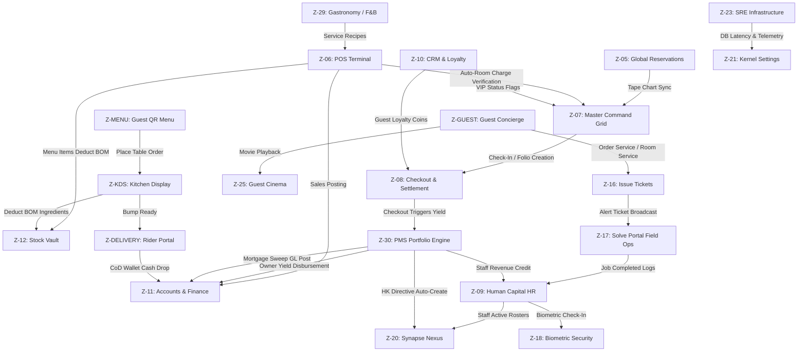

# Miracle OS: Sovereign Zone Architecture & Interrelationships
*A comprehensive guide to the 34 Sovereign Zones, their features, operations, and cross-kernel integrations.*

---

## Executive Summary
Miracle OS operates as a single, unified enterprise operating system designed by **Vigilant IT Solutions** (incorporating over 21 years of enterprise experience). Instead of running fragmented applications (PMS, POS, HR, Accounting, CRM, Inventory) in separate silos, Miracle OS executes all business domains in a single PostgreSQL/MySQL database kernel. 

This guide details each of the 34 Sovereign Zones and illustrates how they coordinate data transactions in real time.

---

## Part 1: Interactive System Map (Inter-Zone Data Flows)

The power of a single-kernel OS lies in its transactional integrity. When a guest orders a service, logs a complaint, or makes a payment, the data cascades across multiple zones instantly.



---

## Part 2: Detailed Zone Catalog


## 6. THE 34 SOVEREIGN ZONES - PANEL BIBLE

Each Zone in Miracle OS is a fully independent operational module that also communicates with every other zone via the shared database and WebSocket backbone. Below is the comprehensive reference for every zone.

---


---

## 6.1 Z-LOGIN - Sales & Lead Capture Portal

**Path:** `/`  
**Access:** PUBLIC (any visitor)  
**Role:** Enterprise Sales Executive + Lead Capture Engine

**Purpose:**
The public-facing gateway to Miracle OS. Every enterprise evaluator arrives here. The AI persona immediately engages as a **High-End Enterprise Sales Executive**, collecting four lead qualification data points before revealing demo credentials:
1. Visitor/Client Name
2. Enterprise / Business Name
3. Employee Count (enterprise size)
4. Contact Number

**AI Persona at Z-LOGIN:**
- Collects lead data conversationally
- Pitches: "One system replaces PMS + POS + Inventory + HR + Accounting + CRM + Guest App"
- ROI pitch: "Implementation: 10-25 working days"
- Demo credentials revealed after all 4 lead fields collected: `Login ID: Visitor / Password: Miracle4U`
- All leads saved to `sales_leads` table automatically

**VISITOR Mode:**
Once logged in as VISITOR, the operator has **full view access** to all 24 zones but **zero execution rights**. Every action attempt is intercepted by the AI, which pivots into a sales pitch and displays a WhatsApp contact button to connect with the Vigilant deployment team.

**Data Flow:**
```
Visitor arrives  AI collects 4 fields  sales_leads table  credentials revealed  login  VISITOR JWT issued  all zones unlocked (view only)
```

---


---

## 6.2 Z-07 - Master Command Grid

**Path:** `/dashboard`  
**Access:** CDO, GM, ADMIN, VISITOR  
**Role:** The Sovereign God View - Real-time enterprise asset grid

**Purpose:**
This is the operational nerve centre and the first screen visible after login. It provides a real-time card grid showing the live status of every room, suite, villa, or asset in the enterprise. No other system in the world provides this level of simultaneous visibility across every operational dimension on a single screen.

**Room Card Data:**
Each card displays all critical data points for one asset:
- **Room ID** (e.g., RS-01, V-05, LTR-12) in 32px Cinzel font
- **Asset Class & Status** (ROYAL SUITE | IN-HOUSE)
- **Active Ticket Badge** ( LEAKING AC - shows active issue)
- **Guest Name** (or VACANT)
- **Nightly Rate** (from Policy Engine Z-19)
- **Folio Balance** (running total from folio_charges)
- **Signal Matrix** (33 department activity grid): HK | MN | RS / IT | SPA | FLT

**Signal States:**
| State | Color | Meaning |
|:---|:---|:---|
| PULSE | Animated glow (dept color) | Active mission in this department |
| ON | Static glow | Department activity (e.g., room is dirty  HK on) |
| OFF | Dimmed | No activity |

**Status Border Colors:**
| Status | Border | Glow |
|:---|:---|:---|
| AVAILABLE | White/dark | None |
| RESERVED | Pulsing blue | Slow-breath animation |
| IN-HOUSE | Cyan | Soft cyan glow |
| DIRTY | Purple | Purple tint |
| MAINTENANCE | Amber | Amber glow |
| ALARM/CRITICAL | Red strobe | `retina-strobe` animation |

**Room Card Actions:**
| Status | Available Actions |
|:---|:---|
| AVAILABLE | CHECK-IN, RESERVE |
| RESERVED | PUSH CHECK-IN |
| IN-HOUSE | ADD CHARGE, FOLIO |
| IN-HOUSE + Ticket | FOLIO + RESOLVE (side-by-side) |
| DIRTY | ASSIGN HK, INSPECT |
| MAINTENANCE | WORK ORDER |
| ALARM | RESOLVE FRACTURE |

**Top HUD Bar:**
- Live time marquee: Dhaka, Sydney, Mumbai (and additional cities in marquee)
- Total room count, ALARMS count, DIRTY count, MAINTENANCE count
- LIVE YIELD display (total revenue from all IN-HOUSE folios)
- Zone 20 Synapse Nexus quick-link
- Accounts pulse dot (live indicator)
- PULSE SYNC DATA button (force-refresh from database)

**Asset Classes (Default Dubai Standard):**
- Royal Suites (5 units) - Rate: 500,000
- Presidential Suites (5 units) - Rate: 200,000
- Private Villas (10 units) - Rate: 150,000
- Luxury Residences (10 units) - Rate: 100,000
- Overwater Bungalows (5 units) - Rate: 250,000

**API Endpoints:**
- `GET /api/frontdesk/live-grid` - Full grid state
- `GET /api/frontdesk/folios` - Active folio balances
- `GET /api/solve/active` - Active missions (tickets)
- `POST /api/frontdesk/force-available/{roomId}` - CDO override to reset room

**WebSocket:** `wss://miracle.vigilantitsolution.com/ws/grid-sync`

---


---

## 6.3 Z-05 - Global Reservations Engine

**Path:** `/dashboard/reservations`  
**Access:** CDO, GM, ADMIN, FD, VISITOR

**Purpose:**
The complete booking engine. Manages the full reservation lifecycle from initial inquiry to physical check-in. Features a 45-day horizontal Gantt-style tape chart - the industry standard "tape chart" view where rooms appear on the Y-axis and dates on the X-axis.

**Tab 1 - Live Reservations (Tape Chart):**
- 45-day rolling view; each room has its own horizontal row
- Existing bookings appear as colored blocks on the chart
- Clicking any empty cell opens the booking form for that room and date
- **Booking Form Fields:** Guest Name (legal passport name), Phone/WhatsApp, NID/Passport Number, Number of Nights, Room Selection
- **Payment Options at Booking:**
  - RESERVE - Locks room for future date, no immediate payment
  - QUICK WALK-IN CASH - Immediate check-in, cash collected
  - SWIPE VISA / MASTERCARD / AMEX - Card payment at terminal
- **Auto-Calculation:** Rate  Nights + 10% Service Charge + 15% VAT = Total Yield
- Overstay Detection: Red banner appears when checkout date has passed
- WALK-IN SYNC: Force-backfills any missing in-house guests from the database

**Tab 2 - VIP CRM Vault:**
- Searchable guest database with all registered profiles
- Each record: Full Name, VIP Tier, Lifetime Value, Loyalty Coins, Phone, Email
- WhatsApp push button, Email button
- Full booking history per guest
- VIRAL GUEST APP DISTRIBUTION: Send APK download link via WhatsApp

**Data Flow:**
```
Booking Form  reservations table  asset_grid status  RESERVED 
 Z-07 room card updates via WebSocket  guest_crm created/updated
 accounting_ledger: CREDIT advance deposit
```

**API Endpoints:**
- `GET /api/frontdesk_engine/reservations` - All reservations
- `POST /api/frontdesk_engine/commit` - Commit new reservation
- `POST /api/reservation_engine/ota-ingest` - OTA (Online Travel Agent) bookings
- `GET /api/crm/guests` - Guest CRM vault

---


---

## 6.4 Z-06 - POS / Retail Matrix

**Path:** `/dashboard/pos`  
**Access:** CDO, GM, ADMIN, POS, SPA, VISITOR

**Purpose:**
The centralized Point of Sale for the entire enterprise. This is the ONLY authorized POS in Miracle OS - all revenue from F&B, Spa, Retail, Minibar, and any other product category flows through here. Departmental dummy POS systems have been eliminated.

**Transaction Flow:**
1. Staff selects a **Product** from the product grid (organized by category tabs)
2. Uses `+` / `-` to set quantity  ADD TO CART
3. Cart calculates: Subtotal + VAT (15%) + Service Charge (10%) = Grand Total
4. Selects payment method:
   - **ROOM CHARGE** - Posts directly to the in-house guest's open folio (validates guest is IN-HOUSE first)
   - **CASH** - Direct cash payment
   - **CARD** - Card terminal payment

**Auto-Integrations (Every Sale):**
1. **Inventory Deduction**  Z-12: BOM recipe ingredients deducted from stock in real time
2. **Accounting Post**  Z-11: `accounting_ledger` - CREDIT to F&B Revenue / Spa Revenue / Retail Revenue
3. **Folio Update**  Z-08: If room charge, guest folio balance increases immediately
4. **COGS Calculation**  Z-11: Cost of goods sold calculated and posted as DEBIT

**Product Categories:** Food & Beverage, Spa Treatments, Shop Items, Minibar, Wellness Services

**POS Admin (Z-POSADMIN):**
- CDO-only panel
- Manage product prices, categories, add/remove items
- Accessible at `/dashboard/pos-admin`

**Database Tables:**
- `pos_transactions` - Complete transaction records
- `pos_order_items` - Line items per transaction
- `inventory` - Stock levels (auto-deducted)
- `accounting_ledger` - Financial record

---


---

## 6.5 Z-08 - Checkout & Financial Settlement

**Path:** `/dashboard/checkout`  
**Access:** CDO, GM, ADMIN, FD, POS, SPA, ACC, VISITOR

**Purpose:**
The guest folio settlement terminal. Every cent spent by a guest during their stay is consolidated here for review, discount application, split-bill processing, and final settlement.

**Checkout Process:**
1. Search guest by name or room number  Full folio loads
2. View all itemized charges: Room nights, F&B, Spa, Extras, Advance deposit
3. Balance = Total charges  Advance deposit already paid
4. Select payment method(s): CASH, VISA, MASTERCARD, AMEX
5. Apply authorized discount (cannot exceed total bill)
6. Split-bill across multiple methods if required
7. Click CHECKOUT & SETTLE FOLIO

**Auto-Actions on Checkout:**
- **Accounts (Z-11):** Posts double-entry: CREDIT Advance Deposit liability, DEBIT Cash/Card received
- **Room Status:** Changes to DIRTY automatically, triggering HK signal on Z-07
- **Folio:** Locked as SETTLED, full history preserved in CRM
- **Loyalty Coins:** Calculated (1 coin per currency unit spent) and credited to guest_crm

**Key Rule:** Cannot checkout if outstanding balance > 0 without a payment method selected. This eliminates revenue leakage.

---


---

## 6.6 Z-09 - Human Capital Command (HR)

**Path:** `/dashboard/hr`  
**Access:** CDO, GM, ADMIN, HR, VISITOR

**Purpose:**
The full staff lifecycle management engine. From hiring to payroll to performance analytics to document generation - Z-09 handles every dimension of human capital management.

**Tabs:**

**GALLERY Tab:**
- Visual biometric card grid of all staff
- Each card: Photo/Avatar, Name, Job Title, Status (ON-DUTY/OFFLINE/TERMINATED), ROI score, Efficiency %
- Click card  Full Dossier Overlay (all financial and performance data)
- From Dossier: Generate Payslip, Generate Appointment Letter, Update avatar photo

**PERFORMANCE Tab:**
- Analytics table: Operative name, Base Salary, Revenue Impact, Efficiency %, ROI Factor
- Source: `/api/hr/performance-matrix`
- Ranks staff by contribution to enterprise revenue

**PAYROLL Tab:**
- Shows each staff member's Monthly Hours, Total Payout (Base + Commission)
- PUSH TO ACCOUNTS & INBOX: Executes payroll  posts DEBIT to Z-11 Payroll Expense account
- Total Payroll Liability chip in top-right

**DOCUMENTS Tab:**
- DUBAI 5-STAR VAULT: Library of SOPs, Handbooks, Policies (PDF/DOCX)
- APPOINTMENT LETTER FORGE: Auto-generates appointment letters
- MANTALA WORD MODULE: In-browser rich text editor - edit, save draft, print/export PDF

**ONBOARDING Tab:**
- New staff registration form: First Name, Last Name, Designation, Department, Access Zones (RBAC checkboxes), Base Salary, Commission Rate %
- Upload Personal Avatar and Biometric Scan
- On submit: Creates staff record, auto-generates username (FirstnameLastname format) and secure password, displays credentials banner

**REGISTRY Tab:**
- Surgery-level credential editor: Username, Password, Salary, Commission %, Status for every staff
- Direct image upload per staff
- AUTHORIZE GLOBAL SYNC: Pushes ALL changes to MySQL in one shot

**MY_SOP Tab:**
- Department SOP viewer pulled from Policy Engine (Z-19)

---


---

## 6.7 Z-10 - CRM & Guest Loyalty Engine

**Path:** `/dashboard/crm`  
**Access:** CDO, GM, ADMIN, FD, VISITOR

**Purpose:**
Complete Guest Relationship Management. Every guest who has ever interacted with the enterprise has a profile here, with full booking history, spending analytics, and loyalty rewards.

**Guest Profile Data:**
- Full name, VIP Tier, Total LTV (Lifetime Value), Loyalty Coins balance, Phone, Email, Last Stay date

**VIP Tier Progression:**
| Tier | LTV Threshold | Benefits |
|:---|:---|:---|
| Bronze | Base | Standard service |
| Silver | 500,000 LTV | Priority check-in |
| Gold | 2,000,000 LTV | Complimentary upgrade |
| Platinum | 5,000,000 LTV | Dedicated concierge |

**Loyalty Coin Engine:**
- 1 coin earned per currency unit spent on checkout
- Coins redeemable for discounts via the Guest App
- Manual coin issuance available for CDO

**Actions per Guest:**
- View complete booking history
- WhatsApp direct message
- Issue loyalty coins manually
- View all folio charges across all stays

---


---

## 6.8 Z-11 - Accounts & Finance Sovereign Kernel

**Path:** `/dashboard/accounts`  
**Access:** CDO, GM, ADMIN, ACC, VISITOR

**Purpose:**
The complete, GAAP-compliant, double-entry accounting engine. Every financial transaction generated by any zone in Miracle OS automatically posts a corresponding ledger entry here. No manual data entry required.

**8 Financial Tabs:**

| Tab | Function |
|:---|:---|
| REVENUE VECTOR ANALYSIS | Donut chart P&L: Room vs F&B vs Other revenue. Net Revenue, Operational Load, Net Margin |
| ACCUSATIVE ITEM-WISE TRACE | Raw transaction ledger - every CREDIT and DEBIT with source, amount, operator, timestamp |
| BURDEN MATRIX | Operational Expenses vs Payroll vs Commissions as visual progress bars |
| GL JOURNAL ENTRY | Manual double-entry posting with Account Code, Reference Number, Description |
| CHART OF ACCOUNTS (COA) | Complete account structure: 1000=Cash, 4000=Room Revenue, 5000=Payroll Expense, etc. |
| AR AGING | Outstanding guest payments by age bracket (0-30d, 31-60d, 61-90d, 90+d) |
| AP MODULE | Vendor invoice management, aging, AUTHORIZE DISBURSEMENT |
| BANK RECONCILIATION | Match bank statement entries against ledger, COMMIT RECEIPT |
| NIGHT AUDIT WIZARD | 4-step day-close: Cash Count  Inventory Count  Discrepancy Check  Final Lock |

**Auto-Posting Sources:**
- Every POS sale (Z-06)  CREDIT: Revenue category
- Every Checkout (Z-08)  CREDIT: Advance Deposit, DEBIT: Cash/Card
- Every Payroll Push (Z-09)  DEBIT: Payroll Expense
- Every Inventory Receipt  DEBIT: Inventory Asset, CREDIT: Accounts Payable

**Chart of Accounts (Core):**

| Code | Account Name | Type |
|:---|:---|:---|
| 1000 | Cash | Asset |
| 1100 | Advance Deposits Receivable | Asset |
| 1200 | Accounts Receivable - Guests | Asset |
| 2100 | Advance Deposit Liability | Liability |
| 4000 | Room Revenue | Revenue |
| 4100 | F&B Revenue | Revenue |
| 4200 | Spa Revenue | Revenue |
| 4300 | Retail Revenue | Revenue |
| 5000 | Payroll Expense | Expense |
| 5200 | Cost of Goods Sold | Expense |
| 5300 | Operational Expense | Expense |

---


---

## 6.9 Z-12 - Inventory Matrix & Stock Vault

**Path:** `/dashboard/inventory`  
**Access:** CDO, GM, ADMIN, POS, HK, MN, VISITOR

**Purpose:**
Tracks every physical item in the enterprise - F&B ingredients, spa supplies, minibar items, retail products, cleaning supplies, maintenance parts. The single source of truth for stock levels.

**Key Features:**
- Product grid: Product ID, Name, Category, Dept, Current Stock, Minimum Level (PAR), Purchase Price (PP), Retail Price (RP)
- LOW STOCK ALERT: Items below minimum level flash red and trigger a predictive reorder warning
- ASYNC SYNC INVENTORY: Force-syncs stock count from all POS deductions
- BOM (Bill of Materials): Each F&B menu item has a recipe - selling a dish automatically deducts all ingredient quantities
- Manual stock-in: Add received goods with quantity and purchase price
- Variance logging: Physical count vs system count discrepancy recording

**Auto-Deduction Flow:**
```
POS Sale (Z-06)  BOM lookup for product sold
 inventory table: stock -= required_qty for each ingredient
 if stock < min_level: LOW STOCK ALERT
 accounting_ledger: DEBIT COGS entry
```

---


---

## 6.10 Z-14 - Media Lab

**Path:** `/dashboard/media-lab`  
**Access:** CDO, GM, ADMIN, VISITOR

**Purpose:**
Digital Asset Management for the enterprise. All property photography, menu images, staff avatars, promotional banners, and branding assets are managed here. Assets stored in Z-14 are referenced by the Guest App, website, and marketing materials.

**Features:**
- Upload, organize, and tag assets
- Preview before publishing
- Assign assets to zones (e.g., Room photos  Guest App hub, Menu images  POS product grid)
- Bulk delete and folder organization

---


---

## 6.11 Z-16 - Issue Tickets & Fault Reporting

**Path:** `/dashboard/issue-tickets`  
**Access:** ANY (all authenticated roles)

**Purpose:**
The central fault reporting hub. Any staff member, from any zone, can raise a complaint, maintenance request, or operational fault. This zone is the aggregate view of all raised tickets.

**Ticket Form:**
- Room/Area, Department Responsible, Subject/Description
- Priority: LOW / MEDIUM / HIGH / CRITICAL
- Assign to: Specific staff or department

**Ticket States:** OPEN  IN-PROGRESS  RESOLVED  CLOSED

**Critical Ticket Visual Response:**
- CRITICAL priority tickets immediately trigger the **red strobe animation** on the corresponding room card in Z-07
- HK tickets  HK signal badge pulses purple on room card
- MN tickets  MN signal badge pulses orange on room card
- IT tickets  IT signal badge pulses green on room card

**Data Source:** `solve_missions` table

---


---

## 6.12 Z-17 - Solve Portal (Field Operations)

**Path:** `/dashboard/solve`  
**Access:** ANY (all authenticated roles)

**Purpose:**
The staff-facing mission execution terminal. While Z-16 is for raising tickets, Z-17 is for field operatives to see and act on their assigned missions.

**Staff View:** Only shows tickets assigned to the logged-in operative
**CDO View:** Shows ALL tickets across all departments, with override and reassignment capability

**Field Actions:**
- Mark ticket IN-PROGRESS
- Resolve with written notes
- Upload photo proof of completion
- CDO override: reassign, escalate, or force-close

**Integration with Z-07:** When a ticket is RESOLVED in Z-17, the signal badge on the corresponding room card in Z-07 clears automatically via WebSocket broadcast.

---


---

## 6.13 Z-18 - Biometric Security Portal

**Path:** `/dashboard/portal`  
**Access:** CDO, GM, ADMIN, HR, VISITOR

**Purpose:**
Staff attendance management via biometric verification. The immutable record of who entered the system, when, from where, and what they accessed.

**Session Log Data:**
- Staff name and role
- Login timestamp and logout timestamp
- Zone(s) accessed during session
- IP address and user agent (device fingerprint)
- Outcome: SUCCESS or FAILED ATTEMPT
- Duration in minutes

**Security Integration:**
- Failed login attempts flagged and visible to CDO in real time
- Biometric shift data flows to Z-09 (HR Payroll) - only verified biometric hours count
- Session logs are immutable and feed into Z-11 Audit Trail
- Prevents unauthorized access and ghost employee payroll fraud

---


---

## 6.14 Z-19 - Policy Engine

**Path:** `/dashboard/policy`  
**Access:** CDO, GM, ADMIN, VISITOR

**Purpose:**
The single source of truth for ALL pricing and operational policies in the enterprise. Any change to room rates, VAT rates, service charges, or SOPs must be made here - never in Reservations or Checkout.

**Controls:**
- Room pricing per unit per night (all asset classes)
- Seasonal pricing calendars (peak / off-peak)
- Service Charge: 10% (configurable)
- VAT Rate: 15% (configurable)
- Department SOPs: Upload and publish per department
- Policy Lock: Commits and freezes current pricing and SOPs

**Policy Lock Mechanism:**
Once locked, rates and SOPs are immutable until the next unlock cycle. This prevents accidental or unauthorized price changes during live operations. The lock state is reflected across Z-05 and Z-08 which read rates from this table.

---


---

## 6.15 Z-20 - Synapse Nexus (Enterprise War Room)

**Path:** `/dashboard/synapse`  
**Access:** CDO, GM, ADMIN, SYNAPSE, VISITOR

**Purpose:**
The most sophisticated panel in Miracle OS - the enterprise **War Room**. Synapse Nexus combines HR organizational visualization, strategic task management (Kanban), real-time P2P video conferencing (WebRTC), corporate hierarchy messaging, and the AGI Strategic Arbitrator. It goes beyond tools like Jira, Teams, or Slack by physically modeling the enterprise hierarchy and enforcing it mathematically.

**Panel 1 - Neural Tree (Org-Chart):**
- Live HR org-chart built from the Employee Registry
- Hierarchy: CEO > Director > Manager > Operative
- ON-DUTY staff glow neon green; OFFLINE staff are dimmed
- Click any node  Radial action menu: VIDEO CALL, VOICE LINK, SEND SECURE FILE, ASSIGN DIRECTIVE

**Panel 2 - War Room (Kanban + Command Grid):**
- VIEW A (KANBAN): Strategic Directives board with 4 columns: BACKLOG | ACTIVE | REVIEW | SECURED
- VIEW B (COMMAND GRID): Large Neon Glass Tiles for every Department (IT, HR, ACCOUNTS) and Area (POOL, SPA, BOARDROOM)
- When a directive node is assigned to a department, the corresponding tile pulses with Cyan Neon glow + badge ([3] pending)
- Multi-department tasks split into Nodes via AGI Arbitrator  multiple department tiles pulse simultaneously

**Panel 3 - COMM-LINK (WebRTC Video):**
- Click VIDEO CALL on any org-chart node  Conference Modal slides in
- Multi-participant video grid, frosted glass overlay
- Controls: MUTE, CAM OFF, HANG UP
- SOVEREIGN FREQUENCIES: Persistent voice channels (HK Frequency 1, Maintenance Channel, Management Room)

**AGI Arbitrator:**
-  AUTO-DECOMPILE button on any Strategic Directive
- The Miracle AGI analyzes the directive and splits it into department-specific sub-tasks
- Each sub-task spawns as a Z-16 Issue Ticket automatically
- Multiple department tiles in the Command Grid pulse simultaneously to signal the directive has been distributed

**Hierarchical Communication Gate (Synapse Bridge Protocol):**
| Tier | Role | DM Rights |
|:---|:---|:---|
| 4 (C-SUITE) | CDO, Board | Can initiate DM to any tier |
| 3 (DIRECTOR) | Directors | DM Tier 4, 3, 2 |
| 2 (MANAGER) | Managers | DM Tier 3, 2, 1 (immediate reports only) |
| 1 (OPERATIVE) | All staff | DM peers + immediate boss only |

**Secure File Exchange:**
Drop a PDF/file onto the War Room canvas  routed to the selected operative's feed as a glowing Data Chip with full audit trail.

---


---

## 6.16 Z-21 - Kernel Settings

**Path:** `/dashboard/settings`  
**Access:** CDO, GM, VISITOR

**Purpose:**
System-wide configuration hub for the entire Miracle OS kernel.

**Controls:**
- Enterprise name, currency, language/locale, timezone
- CDO master password management
- Database connection status
- Feature toggles for experimental modules
- **Sovereign Theme Engine:** 
  - Backgrounds: Matrix Rain, Circuit Board, Neon Dots, OFF
  - City Themes: Neon Dubai, Neon London, Neon New York, Neon Saudi, Neon Qatar, Neon Singapore
  - Intensity Slider (0-100%)
  - Transparency Slider (0-100%)
  - Sharpness Slider (0-100% blur control)
  - Neon Color: 8 presets + custom hex input
  - Per-page background override system
- User Management (login credentials)

---


---

## 6.17 Z-23 - Sovereign Infrastructure (SRE Command)

**Path:** `/dashboard/infrastructure`  
**Access:** CDO, GM, VISITOR

**Purpose:**
The CDO-level technical command centre for monitoring and controlling the entire Miracle OS infrastructure stack. This is the most powerful zone - a real-time Site Reliability Engineering (SRE) dashboard.

**Sections:**

1. **SERVICE HEALTH GRID:** PM2 process status for miracle-backend and miracle-frontend. Status: ONLINE (green) / OFFLINE (red). Memory, CPU %, restart count, uptime. Restart button (requires Master PIN).

2. **LIVE TELEMETRY PILLARS:** 5 data pillars refreshing every 5 seconds:
   - FINANCIAL - Revenue KPIs
   - OPERATIONAL - Occupancy, arrivals
   - STAFF - On-duty count, efficiency
   - GUEST - VIP count, LTV leaders
   - SRE - System health, error rate, response times

3. **LIVE REPLY AUDIT STREAM:** Every AI query/response logged. CLEAN vs HALLUCINATION detection. Auto-correction learning pipeline.

4. **SYSTEM ERROR LOGS:** Frontend and backend errors captured automatically. ANALYZE button: AI diagnoses and proposes exact code fix. DISMISS, REFRESH, DISMISS ANALYZED.

5. **SOVEREIGN BRAIN MANIFEST:** All pending AI knowledge rules. CDO APPROVES or REJECTS each one. Approved rules become permanent AI behavior.

6. **SRE SCAN ENGINE:** Full system-wide diagnostic scan. Checks DB connectivity, API response times, file integrity, AI pipeline health. INITIATE SOVEREIGN SRE SCAN button.

7. **LOG TERMINAL:** Real-time PM2 logs (backend / frontend / nginx). Last 50 lines, auto-scrolls. Switchable between processes.

8. **3D GLASS BODY:** Visual representation of AI health - each core system (Brain, Heart, Spine) maps to a physical organ visualization.

---


---

## 6.18 Z-25 - Guest Marketing Engine

**Path:** `/dashboard/guest-marketing`  
**Access:** CDO, GM, ADMIN, VISITOR

**Purpose:**
The digital bridge between the enterprise and its guests. Manages the Guest App distribution, promotional campaigns, and engagement analytics.

**Features:**
- APK Distribution via WhatsApp: Send the Android APK download link to any guest in one tap
- PROMOTIONAL BROADCASTS: Create and send offers to guest segments (VIP, all guests, specific dates)
- LOYALTY COIN CAMPAIGNS: Issue bonus coins as promotional incentives
- ANALYTICS: App downloads, engagement rates, redemption rates
- MIRACLE CINEMA Admin: Manage the in-room entertainment content library

---


---

## 6.19 Z-26 - Fleet & Aviation Command

**Path:** `/dashboard/fleet`  
**Access:** CDO, GM, ADMIN, VISITOR

**Purpose:**
Vehicle and aviation fleet management. Covers ground transportation (limousines, SUVs, golf carts) and aviation assets (helicopters, private aircraft). Manages transfer scheduling, maintenance tracking, driver and pilot assignments, and fuel/maintenance cost tracking. Revenue from fleet services posts via Z-06 POS to Z-11 Accounts.

---


---

## 6.20 Z-27 - Med-Spa & Wellness

**Path:** `/dashboard/wellness`  
**Access:** CDO, GM, ADMIN, SPA, VISITOR

**Purpose:**
Dedicated wellness department engine. Treatment scheduling, therapist assignments, service Bill of Materials (BOM) linked to the Z-12 Inventory Vault. Wastage from treatments logs to Z-11 COGS. Revenue from services flows through Z-06 POS.

---


---

## 6.21 Z-28 - Luxury Boutiques

**Path:** `/dashboard/boutiques`  
**Access:** CDO, GM, ADMIN, POS, VISITOR

**Purpose:**
Retail department management. Full product catalog, luxury goods inventory, pricing management. All sales flow through the centralized Z-06 POS. Stock managed in Z-12. Revenue in Z-11.

---


---

## 6.22 Z-29 - Gastronomy & F&B Engine

**Path:** `/dashboard/z29-gastronomy`  
**Access:** CDO, GM, ADMIN, FB, VISITOR

**Purpose:**
Dedicated Food & Beverage department engine. Menu management, recipe BOM construction (linking menu items to Z-12 inventory ingredients), kitchen workflow management, waste tracking. The Architect Engine (ServiceArchitectBOM component) allows F&B department heads to pull raw inventory items and compile services with calculated COGS and profit margins. Wastage logs flow to Z-11 Audit Ledger.

---


---

## 6.23 Z-GUEST - Guest Concierge App

**Path:** `/guest/*`  
**Access:** GUEST (hotel guests) via mobile app or browser

**Purpose:**
The guest-facing mobile application and web portal. Delivered as a thin-client Android APK (Capacitor) pointing to the live VPS - no APK rebuild required for any UI change.

**Guest Tabs:**
| Path | Feature |
|:---|:---|
| /guest/hub | Welcome dashboard, current room status, quick actions |
| /guest/folio | Real-time bill view: all charges, advance paid, current balance |
| /guest/order | Room service / food ordering from live menu |
| /guest/reserve | Extend stay, request future booking |
| /guest/concierge | Message front desk, request services |
| /guest/ecommerce | Shop resort merchandise |
| /guest/cinema | In-room entertainment (Netflix-style UI) |
| /guest/profile | Loyalty coins, VIP tier, past stays |

All guest requests flow to Z-07 Command Grid and Z-17 Solve Portal for staff action.

**Security Architecture (Guest):**
- Token stored in localStorage (never cookie - Capacitor doesn't support cookie auth)
- Bearer token sent in Authorization header for every API call
- `/guest/*` routes never intercepted by Nginx proxy (prevents redirect loop on Android)
- MiracleBotGuestGuard prevents AI engine from loading in guest WebView
- GlobalSyncContext aborts kernel polling on `/guest/*` routes

---


---

## 6.24 Z-AUDIT - Audit Ledger

**Path:** `/dashboard/audit-ledger`  
**Access:** CDO, GM, ACC

**Purpose:**
The immutable audit trail for the entire enterprise. Every action taken by every operator is logged here with: action type, operator name, target (which record/zone), timestamp, and result. This is the forensic record that cannot be modified, deleted, or altered.

---

## 6.25 Z-KDS - Kitchen Display System

**Path:** `/dashboard/orders`  
**Access:** CDO, GM, ADMIN, FB, CHEF, STAFF, VISITOR

**Purpose:**
Real-time kitchen order display and bumping system. Features visual cards for active F&B orders, showing items, quantities, table labels, and special notes. Renders auditory chimes on new orders and allows chefs to bump order status (PENDING → PREPARING → READY → DELIVERED). Integrates directly with Z-12 Inventory for Bill of Materials (BOM) stock deduction upon status changes.

---

## 6.26 Z-MENU - Guest QR Table Menu

**Path:** `/menu`  
**Access:** PUBLIC (Any visitor)

**Purpose:**
Public-facing guest self-service ordering app. Guests scan a table-specific QR code (e.g. `/menu?table=Table+7`) to view the digital menu, add items to their cart, and place orders. Pushes orders directly to the backend API (`/api/fnb/orders`) which broadcasts them instantly to Z-KDS via a Server-Sent Events (SSE) bus. Operates outside the dashboard authentication guard.

---

## 6.27 Z-DELIVERY - Rider Delivery Portal

**Path:** `/delivery`  
**Access:** CDO, GM, ADMIN, RIDER, FB, STAFF, VISITOR

**Purpose:**
Autonomous rider dispatch, location tracking, and Cash-on-Delivery (CoD) settlement system. Managers assign ready orders to riders. Riders log in via a PIN-based lock screen, view their dispatch queue, map routes, and update delivery status (PENDING → ASSIGNED → PICKED_UP → EN_ROUTE → DELIVERED). Virtual CoD wallet logs rider cash liabilities; auto-suspension triggers if cash-held exceeds limits, requiring operator settlement.

---


---

## Part 3: Critical Inter-Zone Integration Protocols

In Miracle OS, zones are not isolated software applications; they are logical partitions of the same database kernel. Here are the core cross-zone transaction workflows:

### 1. The "Silent Concierge" Loop (Z-GUEST -> Z-16 -> Z-17 -> Z-09)
*   **How it works:** A guest opens the native Android APK (`Z-GUEST`) on their in-room tablet and requests housekeeping.
*   **The Cascade:** The request writes directly to `Z-16: Issue Tickets`. The system's proactive dispatch engine immediately broadcasts the ticket to the `Z-17: Solve Portal` terminal of the on-duty operative in that room's section.
*   **The Resolution:** Once the operative marks the job complete in the field, `Z-09: Human Capital` updates that operative's daily duty efficiency score in the payroll ledger.

### 2. The Auto Room Charge Posting Loop (Z-06 -> Z-07 -> Z-08 -> Z-11)
*   **How it works:** A guest orders an espresso at the resort restaurant (`Z-29` Gastronomy, rung up on the `Z-06` POS).
*   **The Cascade:** The POS queries `Z-07: Master Command Grid` in real-time to verify that room `RS-02` is checked-in and matches the guest's name. Upon verification, the charge is posted directly to the guest's `Z-08: Folio Ledger`.
*   **The Ledger Flow:** The double-entry engine instantly posts a debit to Accounts Receivable and a credit to Food Revenue in `Z-11: Accounts & Finance`.

### 3. The Recipe Explosion & Stock Vault Loop (Z-06 -> Z-12 -> Z-11)
*   **How it works:** A transaction is finalized at a retail terminal (`Z-06`).
*   **The Cascade:** The system initiates a **BOM (Bill of Materials) Explosion** inside `Z-12: Stock Vault`. If the item sold was a cocktail, the vault deducts the exact ounces of alcohol, mixers, and garnishes from the store room.
*   **The Ledger Flow:** The system calculates the COGS (Cost of Goods Sold) and automatically adjusts the stock asset value and expense accounts in `Z-11`.

### 4. The SRE Telemetry & Diagnostics Loop (Z-23 -> Z-21)
*   **How it works:** The infrastructure logs (`Z-23`) detect database read latency exceeding 45ms.
*   **The Cascade:** SRE monitors trigger an automatic query optimizer and flush the Next.js cache. If the latency persists, a critical notification is piped directly to the CDO under `Z-21: Kernel Settings`.

### 5. The PMS Checkout Integration Loop (Z-08 -> Z-30 -> Z-11 -> Z-09 -> Z-20) ⭐ NEW
*   **How it works:** A guest checks out at `Z-08: Checkout & Settlement`.
*   **The Cascade (4 simultaneous flows):**
    1. **Owner Yield Disbursement** → `Z-30` calculates UDI share % for the room's pool, posts ACID double-entry to `Z-11` (Dr 521300 Owner Disbursement / Cr 113300 Owner Yield Payable), stamps `PMSOwnerLedger` with idempotency key.
    2. **AI Rotation Counter** → `Z-30` increments `nights_occupied_ytd` on `AssetGrid`. The AI Dispatcher will assign the next guest to the least-used room in the same category.
    3. **HR Revenue Credit** → `Z-09` receives `update_revenue_impact()` call for the processing front desk operative — feeds commission badge system.
    4. **Synapse HK Directive** → `Z-20` auto-receives a `StrategicDirective` with `DirectiveNode` tasks based on the pool's `hk_granularity` (PER_ROOM / PER_FLOOR / PER_WING).
*   **Non-Fatal Safety:** The Synapse HK directive fires AFTER `db.commit()`. If Synapse fails, checkout is unaffected.

### 6. The Monthly Mortgage Daemon Loop (Cron -> Z-30 -> Z-11)
*   **How it works:** First of every month at 06:00 UTC, the PMS daemon triggers automatically.
*   **The Sweep (3 phases):**
    1. **Compliance Scan** → 6-axis check: overdue mortgages, yield deficits, negative balances, missing override reasons, orphan pools, GL orphans. CRITICAL count logged to AuditLog.
    2. **Mortgage Sweep** → Per-room SAVEPOINT atomic transactions. Each MORTGAGE_BUYER room: amortization split calculated, `Dr 113200 Mortgage Principal / Cr 100000 Cash`. Idempotency key prevents double-posting.
    3. **Monthly Snapshot** → Full owner P&L per room and per pool. Available via API and `/agi monthly-snapshot` bot command.

---

## Z-30: Property Management System (PMS) V2.0 — SOVEREIGN ASSET PORTFOLIO ENGINE

**Path:** `/dashboard/pms`
**Access:** CDO, GM, ADMIN, PMS, VISITOR
**Zone Code:** `Z-30`
**Color:** `#60a5fa` (Sovereign Blue)

### Purpose
The sovereign financial intelligence engine for every physical property asset. Manages the full lifecycle of hotel rooms, suites, villas, and apartments across five ownership archetypes — with ACID-compliant double-entry accounting, AI-driven equity distribution, and a monthly autonomous compliance daemon.

### Ownership Archetypes

| Type | Description | GL Debit | GL Credit |
|---|---|---|---|
| `FULL_OWNER` | Freehold — yield net of management fee disbursed | 521300 Owner Disbursement | 113300 Owner Yield Payable |
| `MORTGAGE_BUYER` | Installment purchase — amortization swept monthly | 113200 Mortgage Principal | 100000 Cash & Bank |
| `RENTAL_OWNER` | Hotel pays fixed rent to owner | 521200 Lease Expense | 200300 AP-Lease Payable |
| `RENTED` | Hotel leases from external landlord | 520000 Lease Expense | 200300 AP-Lease Payable |
| `AFFILIATED` | Managed/franchise — commission accrued | 521000 Commission Expense | 200400 AP-Commission |

### New Chart of Accounts (Phase 1)

| Code | Name | Type |
|---|---|---|
| 113200 | Mortgage Principal Receivable | ASSET |
| 113300 | Owner Yield Payable | LIABILITY |
| 200300 | Lease Payable — Rental Owner | LIABILITY |
| 440100 | Interest & Fee Revenue — Mortgage | REVENUE |
| 521200 | Lease Expense — Rental Owner | EXPENSE |
| 521300 | Owner Disbursement Expense | EXPENSE |

### Dashboard Tabs (10 Tabs)

| Tab | Description |
|---|---|
| 🏢 Portfolio Grid | Property cards with OWNED/RENTED/AFFILIATED filter. Edit modal with Specs, Rooms, Facilities, Media, Owner Profile sub-tabs |
| 🖼 Asset Gallery | Visual room type gallery with status indicators |
| 🔧 BOM Builder | Bill of Materials to capitalize setup costs per property (links to Z-12 Inventory) |
| 🔐 Card Vault | PCI-DSS tokenized card vault (never stores raw PANs) |
| 📒 Financial Ledger | Lease schedule for RENTED, commission accrual log for AFFILIATED |
| 💸 Owner Payouts | Approval console: approve/reject owner withdrawal requests, posts GL automatically |
| 🏦 Mortgage Engine | Amortization schedule lookup + monthly sweep panel with DRY RUN / LIVE toggle |
| 🏊 Rental Pools | UDI share breakdown per room, YTD yield per pool |
| 🛡 AI Compliance | 6-axis scan results + data integrity score (0–100) + CLEAN/WARNING/CRITICAL verdict |
| 🤖 AI Dispatch | Room dispatcher: AI auto-selects lowest-wear room. Manual override requires reason (Iron Law 55) |

### Key API Endpoints

```
GET  /api/pms/portfolio                       ← Portfolio + summary stats
POST /api/pms/pools/configure                 ← Create/update rental pool
POST /api/pms/pools/assign-room               ← Assign room, recalculate UDI
GET  /api/pms/pools/status                    ← All pools with UDI % per room
POST /api/pms/dispatch/assign-room            ← AI dispatch (lowest nights_YTD)
GET  /api/pms/dispatch/equity-log             ← Rotation fairness view
GET  /api/mortgage/schedule/{room_id}         ← Full amortization table
POST /api/mortgage/sweep                      ← Monthly sweep (dry_run supported)
GET  /api/mortgage/owner-statement/{room_id}  ← Owner P&L full statement
POST /api/mortgage/manual-adjust              ← CDO balance correction
GET  /api/pms/alerts/compliance-scan          ← AI daily compliance scan
GET  /api/pms/alerts/monthly-snapshot         ← Monthly owner P&L snapshot
GET  /api/pms/alerts/ai-data-integrity        ← Integrity score 0-100
POST /api/pms/alerts/trigger-daemon-sweep     ← Full month-end daemon
```

### AGI Bot Commands (MiracleBot on Z-30)
Type any command below in the MiracleBot chat (CDO / GM / ADMIN / ACC roles only):

```
/agi pms-help                                    Full command reference
/agi owner-statement {room_id}                   P&L: yield, mortgage, ledger
/agi rotation-status [{category}]                Equity log grouped by category
/agi pool-status                                 All pools with UDI shares
/agi compliance-scan                             Instant compliance report
/agi integrity-check                             Data integrity score + verdict
/agi dispatch-room {cat} [manual:{id}] [reason:{text}]  AI or manual dispatch
/agi mortgage-sweep [dry]                        Live sweep or dry-run simulation
/agi monthly-snapshot [{MMYYYY}]                 Monthly P&L snapshot
```

### UDI Formula
```
UDI Share (%) = (Room Sq Ft ÷ Total Active Pool Sq Ft) × 100
```
Yield is distributed to each room proportionally. Flat equal splits are prohibited (Iron Law 54).

### Iron Laws Governing Z-30
- **Iron Law 54**: UDI pool math — never flat equal splits
- **Iron Law 55**: Every manual override requires reason ≥ 5 chars, stamped to audit trail
- **Iron Law 56**: Mortgage sweep uses per-room SAVEPOINT atomicity
- **Iron Law 57**: Daemon triggered max once per period; idempotency key checked first
- **Iron Law 58**: `/agi` PMS commands restricted to CDO/GM/ADMIN/ACC roles only

---

## Part 4: Sovereign Architectural Principles
Every developer modifying Miracle OS must abide by the **Sovereign Engineering Directives**:
1.  **Single Kernel Database:** All transactional queries must run directly in SQL/PostgreSQL. Cross-database APIs are strictly prohibited.
2.  **Strict Fluid UI (Iron Law 30):** The user interface uses a fluid-scaling system (`clamp()`). Absolute pixel dimensions for grid layout containers are banned.
3.  **Role-Based Access Control (RBAC):** Access to financial postings (`Z-11B` and `Z-11C`) requires an explicit `ARMED` status, reserved for CDO, Admin, and ACC roles. Visitors and operatives are hard-blocked.
4.  **ACID Double-Entry Mandate:** Every financial event in Z-30 (yield, mortgage, lease, commission) MUST use `post_double_entry()`. No direct table writes to accounting_ledger.
5.  **Idempotency Everywhere:** All recurring financial events carry an `idempotency_key` (`EVENT_TYPE-ROOM_ID-MMYYYY`). Duplicate calls are silently skipped, never double-posted.
6.  **Department Sovereignty (Iron Law 64-71):** Every revenue-generating zone is an independent profit center with its own till, primary ledger, expense catalog, and P&L. See `SOVEREIGN_ACCOUNTING_DIRECTIVE.md`.
7.  **Expense Catalog Enforcement (Iron Law 64):** Staff can ONLY select expense categories from pre-approved GL-coded catalogs. Freeform expense entries are system-blocked.
8.  **20-TX Batch Consent (Iron Law 65):** Department heads must PIN-certify every 20 transactions before they advance to the Ledger Auth Gateway.
9.  **Master Ledger Immutability (Iron Law 66):** The master_ledger table is APPEND-ONLY. All corrections via contra entries.
10. **Void Double-Authorization (Iron Law 67):** Voids require dept head approval AND accounts elimination — never single-party clearance.

---

## Part 5: Departmental Accounting Engine — Zone-Level Financial Architecture
> **NEW AS OF 2026-06-20** — The Departmental Accounting Engine transforms each revenue zone
> into a sovereign profit center. This is the foundational financial layer of Miracle OS V69.0.
>
> **GOVERNING DOCUMENTS**: `SOVEREIGN_ACCOUNTING_DIRECTIVE.md` | `MIRACLE_ACCOUNTING_BIBLE.md`

### The Three-Layer Ledger Stack

```
LAYER 3: MASTER ACCOUNTS LEDGER  (ACC / GM / CDO — IMMUTABLE, APPEND-ONLY)
              ↑ Auto-posted via Gateway approval only
LAYER 2: LEDGER AUTH GATEWAY (Z-1B)  (ACC reviews + approves dept batches)
              ↑ Submitted by Dept Head after PIN consent
LAYER 1: DEPARTMENT PRIMARY LEDGER / TILL  (Staff enters | Dept Head consents)
```

### Zone → Department Vault Mapping

| Zone | Dept ID | GL Prefix | Till Type | Revenue Categories |
|---|---|---|---|---|
| Z-06 POS | `DEPT_POS` | 060 | PHYSICAL | F&B, Retail, Packages |
| Z-27 Wellness | `DEPT_WELLNESS` | 270 | PHYSICAL | Treatments, Memberships, Retail |
| Z-30 PMS | `DEPT_PMS` | 300 | VIRTUAL | Room Revenue, OTA Commission |
| Z-29 F&B | `DEPT_FB` | 290 | PHYSICAL | Covers, Bar, Room Service |
| Z-28 Boutique | `DEPT_BOUTIQUE` | 280 | PHYSICAL | Retail, Gift Sets |
| Z-26 Fleet | `DEPT_FLEET` | 260 | PHYSICAL | Rental Fees, Transfers |
| Z-3B Rentals | `DEPT_RENTAL` | 3B0 | VIRTUAL | Lease, Monthly Rent |

### The 20-Transaction Consent Mechanism

Every department batch cycles through exactly 20 transactions before requiring
Department Head PIN consent. This is the accountability heartbeat of the system:

```
TX [1..19] → OPEN (staff entries allowed)
TX [20]    → PENDING_CONSENT (entries blocked until dept head consents)
CONSENT    → CONSENTED (dept head PIN recorded, batch sealed)
SUBMIT     → submitted to Ledger Auth Gateway (Z-1B)
APPROVAL   → auto-posts to Layer 3 Master Ledger
```

### Void Authorization Chain

```
Staff initiates void (reason code required)
    → Dept Head receives alert → APPROVE or REJECT
    → If approved: Accounts eliminates from primary ledger in Gateway (Z-1B)
    → If 3+ voids/24h from same staff: AUTO-ALERT to GM + ACC
    → If void > PKR 10,000: GM approval mandatory regardless of dept head
```

### New Backend Router

| File | Purpose |
|---|---|
| `backend_api/app/routers/dept_accounting.py` | NEW — Department Vault Engine |
| Route prefix: `/api/accounting/` | 30+ endpoints: till, catalog, batch, void, gateway, reports |

### New Database Tables (7)

| Table | Description |
|---|---|
| `departments` | Dynamic dept registry with GL prefix and price-plan gating |
| `expense_categories` | Pre-approved expense catalog per department with GL codes + limits |
| `till_transactions` | All raw till entries (revenue, expense, void, float, cash drop) |
| `tx_batches` | 20-tx batch containers with consent state machine |
| `dept_ledger_entries` | Auto-generated double-entry records (Layer 1) |
| `void_log` | Dedicated void tracking with full authorization chain |
| `master_ledger` | Immutable final accounts ledger (Layer 3, APPEND-ONLY) |

### Department P&L Structure (per zone)

```
Gross Revenue (by category + payment method)
Less: Voids & Adjustments
= Net Revenue
Less: Direct Costs (BOM-linked + approved expenses)
= Gross Profit
Less: Allocated Operating Expenses
= Department Net Income / (Loss)
```

### Role Access Summary for Accounting Engine

| Operation | STAFF | DEPT_HEAD | ACCOUNTS | GM | CDO |
|---|:---:|:---:|:---:|:---:|:---:|
| Enter Revenue | OWN DEPT | YES | NO | NO | NO |
| Enter Expense (catalog only) | YES* | YES | NO | NO | NO |
| Initiate Void | YES | YES | NO | NO | NO |
| Consent Batch (PIN) | NO | YES | NO | NO | NO |
| Submit to Gateway | NO | YES | NO | NO | NO |
| Approve in Gateway | NO | NO | YES | NO | NO |
| Force-Approve (CDO override) | NO | NO | NO | NO | YES |
| View Master Ledger | NO | NO | YES | YES | YES |

`*` = within role's daily limit; above limit requires dept head PIN at entry time

---

*End of MIRACLE_ZONE_ARCHITECTURE.md — Last Updated: 2026-06-20*
*New in V69.0: Departmental Accounting Engine (Phase 6) — Department Sovereignty Doctrine*
