# MIRACLE OS — THE SOVEREIGN BIBLE
### Complete Architectural Blueprint, Feature Reference & Enterprise Deployment Guide
### Edition V66.0 — SOVEREIGN KERNEL

---

**DEVELOPED BY:** Vigilant IT Solutions  
**FOUNDING YEAR:** 2003  
**YEARS OF ENTERPRISE EXPERIENCE:** 21+  
**PLATFORM VERSION:** V66.0-SOVEREIGN-SRE  
**AI ENGINE:** Miracle Navigator V4.0 (Gemini 1.5 Flash + Groq Llama 3.3 70B)  
**LIVE DEPLOYMENT:** https://miracle.vigilantitsolution.com  
**DOCUMENT CLASSIFICATION:** ENTERPRISE DISTRIBUTION — CONFIDENTIAL  
**DOCUMENT VERSION:** BIBLE-V1.0 / 2026  

---

> *"For over two decades, Vigilant IT Solutions has engineered enterprise command systems that outlast trends and outperform expectations. Miracle OS is not software. It is a sovereign operating philosophy — a living, AI-driven nucleus that governs every atom of your enterprise in real time."*  
> — Vigilant IT Solutions, Founding Directive

---

## TABLE OF CONTENTS

| Chapter | Section | Page Ref |
|:---|:---|:---|
| 1 | Executive Summary | §1 |
| 2 | The Vigilant Legacy — 21 Years of Enterprise DNA | §2 |
| 3 | System Architecture Blueprint | §3 |
| 3.1 | Frontend Architecture — Next.js Sovereign UI | §3.1 |
| 3.2 | Backend Architecture — FastAPI Kernel Engine | §3.2 |
| 3.3 | Database Architecture — Dual-Mode Vault | §3.3 |
| 3.4 | Deployment & Infrastructure Architecture | §3.4 |
| 3.5 | WebSocket Real-Time Sync Architecture | §3.5 |
| 3.6 | Full System Data Flow Diagram | §3.6 |
| 4 | AI / AGI Brain Architecture — The Miracle Navigator | §4 |
| 4.1 | The 4-Layer Intelligence Engine | §4.1 |
| 4.2 | The 5 Sovereign Sensor Pillars | §4.2 |
| 4.3 | Navigator Tags & UI Control Protocol | §4.3 |
| 4.4 | The Wisp Visual Guidance System | §4.4 |
| 4.5 | Multi-Key API Vault & Quota Protection | §4.5 |
| 5 | AGI-Driven Triple Layer Security Management | §5 |
| 5.1 | Layer 1 — Perimeter Intelligence | §5.1 |
| 5.2 | Layer 2 — Behavioral Intelligence | §5.2 |
| 5.3 | Layer 3 — Vault Intelligence | §5.3 |
| 5.4 | Security Architecture Diagram | §5.4 |
| 6 | The 24 Sovereign Zones — Panel Bible | §6 |
| 6.1 | Z-LOGIN — Sales & Lead Capture Portal | §6.1 |
| 6.2 | Z-07 — Master Command Grid | §6.2 |
| 6.3 | Z-05 — Global Reservations Engine | §6.3 |
| 6.4 | Z-06 — POS / Retail Matrix | §6.4 |
| 6.5 | Z-08 — Checkout & Financial Settlement | §6.5 |
| 6.6 | Z-09 — Human Capital Command (HR) | §6.6 |
| 6.7 | Z-10 — CRM & Guest Loyalty Engine | §6.7 |
| 6.8 | Z-11 — Accounts & Finance Sovereign Kernel | §6.8 |
| 6.9 | Z-12 — Inventory Matrix & Stock Vault | §6.9 |
| 6.10 | Z-14 — Media Lab | §6.10 |
| 6.11 | Z-16 — Issue Tickets & Fault Reporting | §6.11 |
| 6.12 | Z-17 — Solve Portal (Field Operations) | §6.12 |
| 6.13 | Z-18 — Biometric Security Portal | §6.13 |
| 6.14 | Z-19 — Policy Engine | §6.14 |
| 6.15 | Z-20 — Synapse Nexus (Enterprise War Room) | §6.15 |
| 6.16 | Z-21 — Kernel Settings | §6.16 |
| 6.17 | Z-23 — Sovereign Infrastructure (SRE Command) | §6.17 |
| 6.18 | Z-25 — Guest Marketing Engine | §6.18 |
| 6.19 | Z-26 — Fleet & Aviation Command | §6.19 |
| 6.20 | Z-27 — Med-Spa & Wellness | §6.20 |
| 6.21 | Z-28 — Luxury Boutiques | §6.21 |
| 6.22 | Z-29 — Gastronomy & F&B Engine | §6.22 |
| 6.23 | Z-GUEST — Guest Concierge App | §6.23 |
| 6.24 | Z-AUDIT — Audit Ledger | §6.24 |
| 7 | Database Architecture & Full Schema Reference | §7 |
| 8 | API Endpoint Directory | §8 |
| 9 | Role-Based Access Control (RBAC) Matrix | §9 |
| 10 | Multi-Enterprise Single Kernel Architecture | §10 |
| 11 | Enterprise Industry Deployment Blueprints | §11 |
| 11.1 | Hospitality — Hotels, Resorts & Eco-Resorts | §11.1 |
| 11.2 | Food & Beverage (F&B) Management | §11.2 |
| 11.3 | Human Resources & Payroll Automation | §11.3 |
| 11.4 | Supply & Distribution Management | §11.4 |
| 11.5 | AI Automated Accounting & Finance | §11.5 |
| 11.6 | Real Estate Management | §11.6 |
| 11.7 | Facility Management | §11.7 |
| 11.8 | Staff Efficiency & Productivity Intelligence | §11.8 |
| 11.9 | ROI Monitoring & Business Intelligence | §11.9 |
| 11.10 | Data Security Management | §11.10 |
| 11.11 | Hospital & Healthcare Management | §11.11 |
| 11.12 | Production + Supply + Distribution + After-Sales | §11.12 |
| 12 | Small Enterprise Deployment Guide | §12 |
| 13 | Expansion Roadmap & Future Vision | §13 |

---

## §1. EXECUTIVE SUMMARY

Miracle OS is a **Sovereign Enterprise Operating System** — a single, unified command platform that replaces the fragmented ecosystem of disconnected enterprise tools with one living, AI-governed nucleus. Built over 21 years of enterprise solution experience by Vigilant IT Solutions, Miracle OS operates on a principle that every major enterprise operation — rooms management, point of sale, human resources, accounting, inventory, guest loyalty, fleet, wellness, security, and artificial intelligence governance — must flow through one sovereign kernel.

### What Problem Does Miracle OS Solve?

In the modern enterprise, fragmentation is the silent enemy. A typical medium-to-large enterprise deploys between 8 and 24 separate software platforms: a Property Management System (PMS), a Point of Sale (POS), an HR platform, a separate payroll system, an accounting package (QuickBooks, SAP, or Sage), an inventory tool, a CRM, a communication platform, and a security system. Each of these systems creates a **data silo**, which means:

- Decision-makers receive reports that are hours or days old
- Data manually re-entered between systems introduces critical human error
- Staff operate different interfaces requiring separate training
- Integration breaks cause revenue leakage and compliance failures
- Security gaps exist at every seam between disconnected systems

**Miracle OS eliminates all of this** with a single kernel, a single login, a single AI brain, a single database, and a single real-time view of your entire enterprise.

### The Miracle Proposition

| Traditional Enterprise Stack | Miracle OS |
|:---|:---|
| 8–24 separate platforms | 1 sovereign kernel |
| Hours-old reports | Real-time WebSocket sync (60FPS) |
| Manual data re-entry | Automatic double-entry across all zones |
| Separate logins and training | Single RBAC login, role-filtered dashboard |
| No AI intelligence | AGI-driven 5-pillar sensor engine |
| Zero security coherence | AGI Triple Layer Security (3 shields) |
| Weeks to months for reports | Instant AI synthesis, British Executive narration |
| Enterprise cost: $500K–$2M/year | One sovereign deployment |

### Core Capabilities at a Glance

- **24 Operational Zones** covering every department of any enterprise
- **AI Navigator "Miracle"** — British Executive AGI that understands your business, narrates reports, navigates the UI, and executes SQL in real time
- **AGI Triple Layer Security** — Perimeter, Behavioral, and Vault intelligence working simultaneously
- **Real-time WebSocket Grid Sync** — All dashboards update simultaneously across all logged-in operators
- **Full GAAP-Compliant Double-Entry Accounting** — Every transaction auto-posts to the ledger
- **Mobile Android APK** — Thin-client guest app, always reflects live VPS data with no APK rebuild required
- **Multi-Enterprise Kernel** — Deploy one OS across multiple properties, branches, or enterprises under a unified CDO command
- **Dark Sovereign UI** — Glassmorphism design with 9 theme modes including cyberpunk city backgrounds (Dubai, London, New York, Saudi Arabia, Qatar, Singapore)

---

## §2. THE VIGILANT LEGACY — 21 YEARS OF ENTERPRISE DNA

Vigilant IT Solutions was founded in 2003 with a singular mission: to engineer enterprise solutions that outlast trends, survive scale, and serve organizations that cannot afford failure. Over 21 years, Vigilant has delivered enterprise systems across hospitality, manufacturing, healthcare, real estate, and public sector organizations.

Miracle OS is the culmination of that 21-year experience — not a fresh startup experiment, but a **battle-tested, production-hardened, AI-accelerated platform** built from real operational pain that real enterprises have faced.

### The Vigilant Engineering Philosophy

1. **The Sovereign Standard:** No feature ships unless it can survive 24/7 uptime, 365 days a year, across multiple time zones simultaneously.
2. **Zero Data Silo:** Every byte of data generated by any department must flow to every authorized stakeholder in real time.
3. **AI-First, Human-Confirmed:** The AI runs autonomously, but critical financial and security decisions always require a human CDO to approve.
4. **The Iron Law System:** Miracle OS operates on 51 documented Iron Laws — non-negotiable engineering rules that prevent regression, enforce data integrity, and protect the sovereign kernel.

---

## §3. SYSTEM ARCHITECTURE BLUEPRINT

Miracle OS is built on a modern, production-grade three-tier architecture with AI integration at every layer.

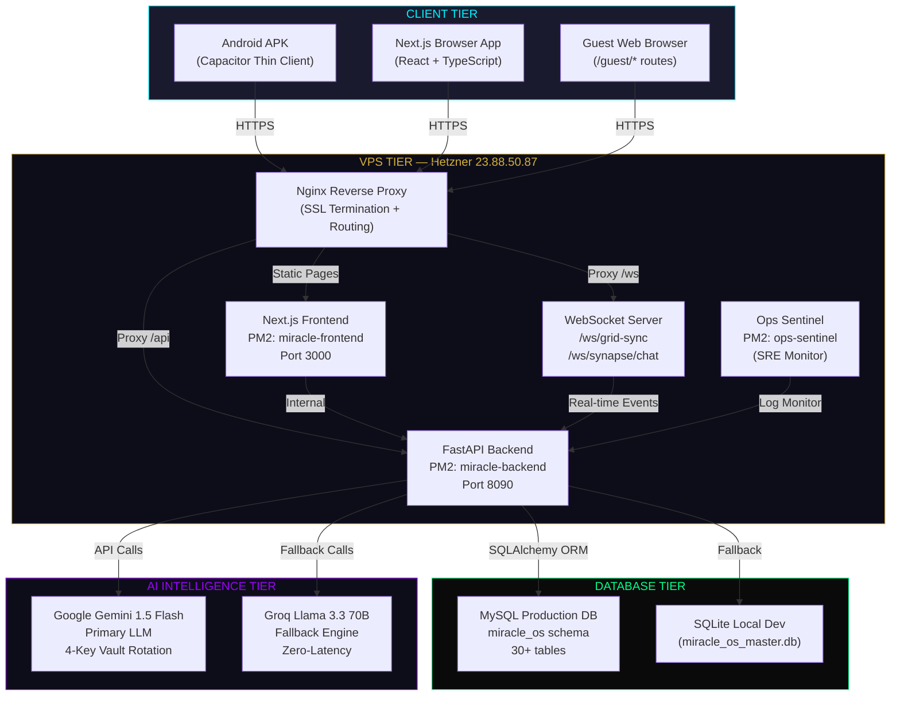

### §3.1 Frontend Architecture — Next.js Sovereign UI

The Miracle OS frontend is built on **Next.js 16.1.6** with **Turbopack**, the fastest JavaScript bundler available. The UI implements a **Glassmorphism Design System** — frosted glass panels, neon glow borders, cyberpunk color palettes, and smooth micro-animations that create an interface that feels simultaneously premium and militarily precise.

**Technology Stack:**

| Layer | Technology | Purpose |
|:---|:---|:---|
| Framework | Next.js 16 (App Router) | Routing, SSR, Static Generation |
| Language | TypeScript | Type safety across 50,000+ lines |
| Styling | Vanilla CSS + CSS Custom Properties | Fluid scaling, glassmorphism |
| State | React Context API | Theme, Currency, GlobalSync, Radio |
| Real-time | Native WebSocket (browser API) | 60FPS grid synchronization |
| Fonts | Google Fonts: Cinzel, Inter | Sovereign typographic identity |
| Mobile | Capacitor.js | Android APK thin-client wrapper |
| Build | Turbopack (Next.js 16) | 88-second production build |

**Key Frontend Components:**

| Component | File | Role |
|:---|:---|:---|
| SovereignThemeEngine | components/SovereignThemeEngine.tsx | Background animations (Matrix Rain, Circuit Board, Neon Dots, 6 City Themes) |
| ThemeControlPanel | components/ThemeControlPanel.tsx | Admin theme customization UI |
| MiracleBot | components/MiracleBot.tsx | AGI Navigator chat interface + Wisp |
| MiracleBotGuestGuard | components/MiracleBotGuestGuard.tsx | Prevents AI from loading in Guest WebView |
| GlobalSyncContext | context/GlobalSyncContext.tsx | WebSocket state bridge for real-time updates |
| ThemeContext | context/ThemeContext.tsx | Theme state management |
| CurrencyLangContext | context/CurrencyLangContext.tsx | Multi-currency / multi-language engine |
| Dashboard Layout | dashboard/layout.tsx | Sidebar navigation, role-based zone rendering |
| ViewModeBanner | components/ViewModeBanner.tsx | VISITOR-mode overlay |
| WeatherCorner | components/WeatherCorner.tsx | Live weather display |
| SovereignToast | components/SovereignToast.tsx | System-wide notification toasts |

**UI Architecture Laws (Iron Laws 1–10):**

The frontend operates under 10 non-negotiable CSS and layout laws:
1. **No Global Zoom Hacks** — Never alter `html, body` font-size
2. **No Hardcoded Grids** — Always use fractional units (`fr`) for major columns
3. **No Stuck Sidebars** — Sidebar transitions between 80px (collapsed) and 280px (expanded) via `isHovered` React state
4. **No Overflow Hidden on Containers** — Users must always scroll to action buttons
5. **Min-Width Squeeze** — All flex/grid items must have `min-width: 0` to shrink below content size
6. **CSS Bloat Ban** — Never append styles to `globals.css`; always audit and merge
7. **Safe Build Protocol** — Never delete `.next` on production before a new build is complete
8. **Background Never Competes** — Theme animations are opacity 0.03–0.15 max
9. **Hardware Acceleration Only** — Animations use only `transform`, `opacity`, or `filter`
10. **Transparent Backgrounds** — Dashboard and guest containers use `background: transparent` so the Theme Engine layer is visible

### §3.2 Backend Architecture — FastAPI Kernel Engine

The Miracle OS backend is a **Python 3.12 FastAPI** application running under **Uvicorn ASGI** server, managed by **PM2** for production resilience. The backend serves both REST API endpoints and WebSocket connections simultaneously.

**Technology Stack:**

| Layer | Technology | Purpose |
|:---|:---|:---|
| Framework | FastAPI (Python 3.12) | REST API + WebSocket server |
| ORM | SQLAlchemy 2.0 | Database models and queries |
| Auth | JWT (python-jose) | Token-based authentication |
| Process Manager | PM2 | Production uptime management |
| ASGI Server | Uvicorn | High-performance async server |
| AI Integration | google-generativeai, groq | LLM API clients |
| Schema Validation | Pydantic V2 | Request/response validation |
| Password Hashing | bcrypt (passlib) | Secure credential storage |
| Database Driver | PyMySQL (production) / SQLite3 (dev) | Database connectivity |

**Backend Router Architecture:**

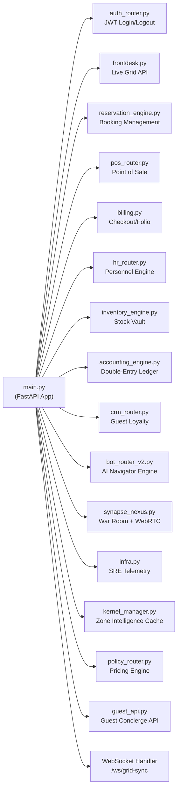

**The Genesis Sequence (Auto-Healing Startup):**

On every PM2 restart, the backend runs `run_genesis_sequence()` from `genesis.py` which:
1. Verifies database connectivity
2. Runs schema surgery (`perform_database_surgery()`) — detects missing columns and runs `ALTER TABLE` injections automatically
3. Loads the Zone Intelligence Map from `miracle_kernel.json` into memory
4. Warms the AI Knowledge Cache
5. Opens WebSocket listener channels
6. Confirms all 30+ API routes are mounted correctly

This means **zero manual migrations** are ever needed — the system heals itself on every restart.

### §3.3 Database Architecture — Dual-Mode Vault

Miracle OS operates a **dual-mode database architecture**:

| Environment | Database | Location |
|:---|:---|:---|
| Production (VPS) | MySQL via cPanel | `miracle_os` database |
| Local Development | SQLite | `miracle_os_master.db` |

SQLAlchemy ORM handles both engines transparently — the same Python models work for both. The `DB_TYPE` environment variable switches between engines automatically.

**Database Scale (Production):**

| Metric | Value |
|:---|:---|
| Total Tables | 30+ |
| Core Transactional Tables | 18 |
| AI/Intelligence Tables | 6 |
| Audit/Security Tables | 4 |
| Configuration Tables | 3 |

### §3.4 Deployment & Infrastructure Architecture

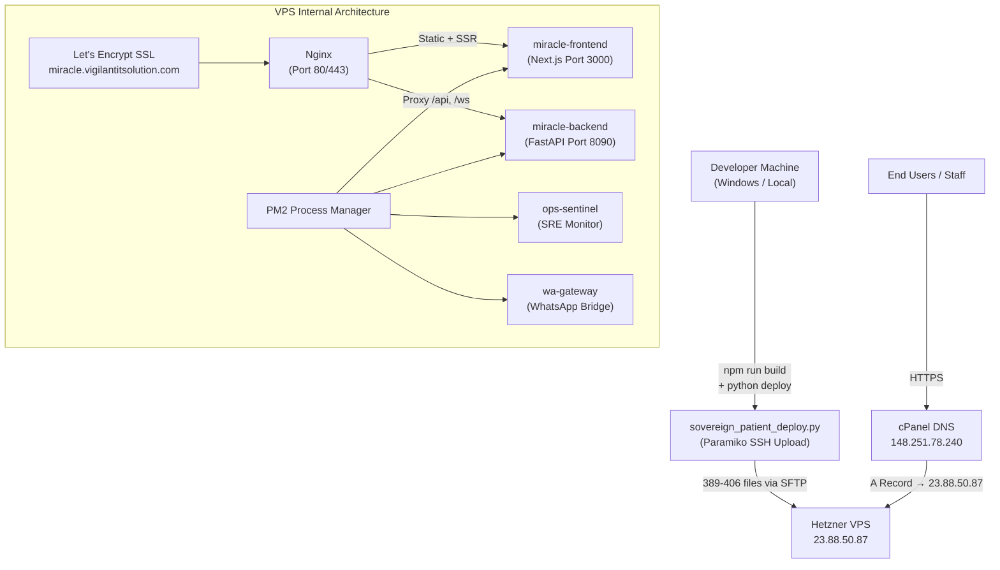

**Iron Law Deployment Rules:**
- All deployments use `python scripts/sovereign_patient_deploy.py all` — never manual SFTP
- SSH authentication uses Paramiko with password-first, RSA key fallback
- MTU is set to 1350 on the VPS `eth0` interface via a systemd startup service to prevent packet fragmentation
- Before every deploy, `rm -rf .next` runs on the VPS to prevent Ghost Middleware (cached old pages)
- The deploy script uploads 389–406 files including all Next.js build artifacts, backend Python files, and city theme images

### §3.5 WebSocket Real-Time Sync Architecture

Every connected staff operator sees the same live state simultaneously, without page refresh. This is achieved via a persistent WebSocket connection to `wss://miracle.vigilantitsolution.com/ws/grid-sync`.

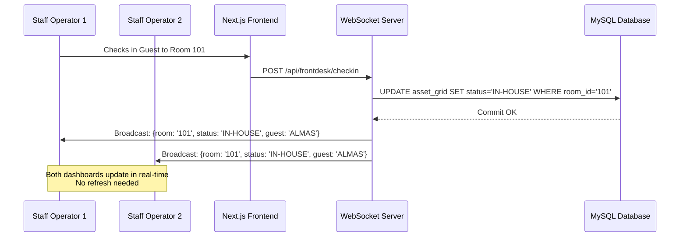

**GlobalSyncContext** (`web/app/context/GlobalSyncContext.tsx`) manages the WebSocket connection lifecycle:
- Connects on mount
- Reconnects automatically on disconnect
- Pushes `globalGridState` updates to all subscribed zone components
- Guards against firing on `/guest/*` routes (Iron Law 50)

### §3.6 Full System Data Flow Diagram

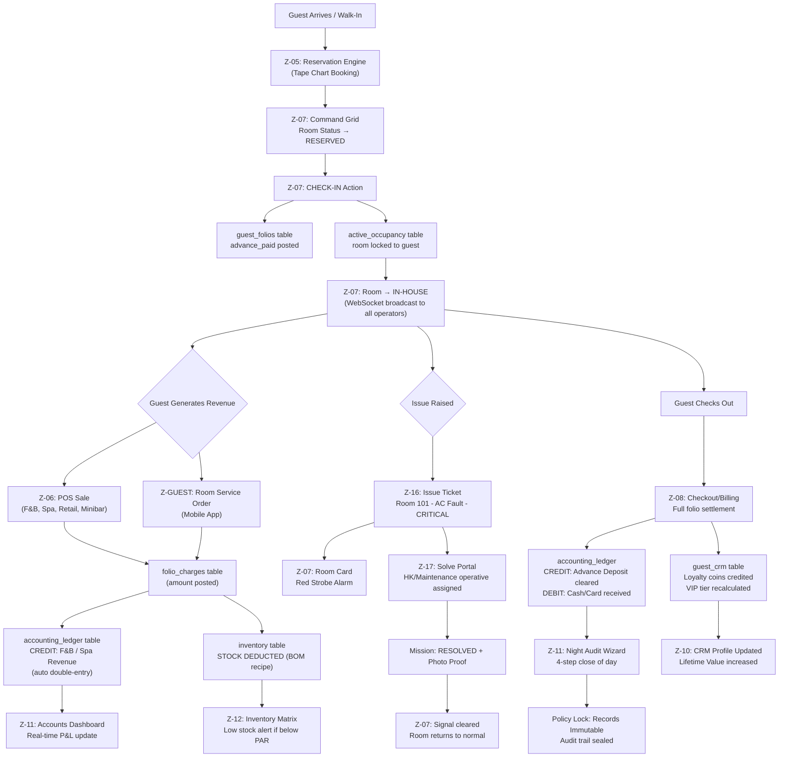

---

## §4. AI / AGI BRAIN ARCHITECTURE — THE MIRACLE NAVIGATOR

The Miracle AI is not a chatbot. It is a **Sovereign Navigator** — an AGI engine that understands the full operational state of your enterprise in real time, narrates executive reports in a confident British tone, navigates the UI on behalf of staff, and executes live SQL queries to answer questions with factual precision.

### §4.1 The 4-Layer Intelligence Engine

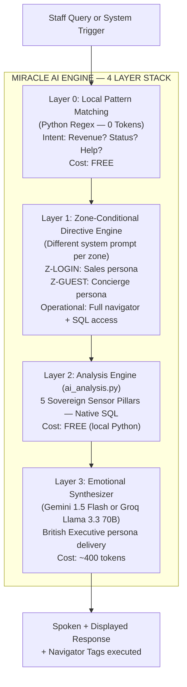

**Layer 0 — Local Pattern Matching (0 Cost):**
The first shield. Pure Python regex detects common queries (revenue, status, help) and responds instantly without any AI API call. This handles approximately 30% of all queries at zero cost.

**Layer 1 — Zone-Conditional Directives:**
Every zone receives a purpose-built system directive. The Z-LOGIN portal acts as an enterprise sales executive collecting leads. The Z-GUEST portal acts as a concierge. All operational zones receive the full navigator directive with complete SQL access and zone map knowledge. This prevents the Z-LOGIN sales script from leaking into operational zones.

**Layer 2 — Analysis Engine (0 Cost):**
Native Python pulls live data from MySQL using the 5 Sovereign Sensor Pillars (see §4.2). The result is a structured JSON object containing real business data — no AI hallucination possible at this stage because it is pure SQL execution.

**Layer 3 — Emotional Synthesizer:**
The structured JSON data from Layer 2 is passed to Gemini 1.5 Flash, which transforms raw SQL results into the British Executive narrative that Miracle delivers to the staff member.

### §4.2 The 5 Sovereign Sensor Pillars

These are the 5 live data feeds that the AI pulls on every operational query:

| Pillar | Function | Key Data Points |
|:---|:---|:---|
| 1 — Financial Vault | `get_financial_vault()` | Revenue today / 7d / 30d / MTD, VAT, Service Charge, F&B / Pool / Spa / Retail earnings, COGS, Net Profit, AR/AP outstanding, Folio dues |
| 2 — Operational Grid | `get_operational_grid()` | Room status (IN-HOUSE / AVAILABLE / DIRTY / MAINTENANCE), Occupancy %, Today's Arrivals, Today's Departures, HK queue |
| 3 — Human Capital | `get_human_capital_report()` | Staff headcount, On-duty count, Average efficiency rating %, Open tickets by dept, Critical issues, Dept breakdown |
| 4 — Guest Intelligence | `get_guest_intelligence()` | CRM profiles, VIP counts, Returning guest %, Loyalty coin totals, Top guest LTV, Live promotional offers, Upcoming reservations |
| 5 — SRE Infrastructure | `get_system_health()` | DB query latency (ms), PM2 process states, API port confirmation, Error log count, Telemetry |

### §4.3 Navigator Tags & UI Control Protocol

The Miracle AI does not just speak — it **controls the UI**. Through a set of protocol tags embedded in its responses, Miracle can navigate the operator to any zone, highlight specific UI elements, and execute database operations:

| Tag | Syntax | Effect |
|:---|:---|:---|
| `[NAVIGATE]` | `[NAVIGATE: /dashboard/hr]` | Routes the browser to the specified zone after 1.5s delay |
| `[FOCUS]` | `[FOCUS: element-label]` | Moves the Wisp light to a specific UI element |
| `[STATUS]` | `[STATUS: Processing payroll...]` | Shows a processing indicator in the chat panel |
| `[LOGIN]` | `[LOGIN: pin]` | Executes the authentication handshake |
| `EXECUTE_SQL` | `EXECUTE_SQL: SELECT ...` | Backend runs the SQL query and re-synthesizes (2-pass loop) |
| `[BTN_WHATSAPP]` | `[BTN_WHATSAPP]` | Renders a WhatsApp contact button for restricted actions |

**Interceptor Chain (V4.0 — Critical Order):**
1. Extract ALL tags from raw AI reply
2. Strip ALL tags from display text
3. If `NAVIGATE` found → execute route (1.5s delay), skip FOCUS
4. If FOCUS-only → move Wisp after 600ms delay
5. Show/speak clean text
6. If text empty after stripping → "Taking you there now, Sir."

### §4.4 The Wisp Visual Guidance System

The **Wisp** is a glowing visual dot (`miracle-wisp` div, `position: fixed`) that floats across the screen to guide operators to the exact UI element the AI is referring to. It is purely visual — it never blocks interaction, never hides the chat panel, and returns to its home position after 4 seconds.

### §4.5 Multi-Key API Vault & Quota Protection

To prevent API quota exhaustion (each Gemini key allows 1,500 requests/day), Miracle OS employs a **4-Key Sovereign Vault** with round-robin rotation:

```python
GEMINI_API_KEY_1 = "AIzaSyD..."  # Key 1 — Primary
GEMINI_API_KEY_2 = "AIzaSyD..."  # Key 2 — Secondary
GEMINI_API_KEY_3 = "AIzaSyB..."  # Key 3 — Tertiary
GEMINI_API_KEY_4 = "AIzaSyC..."  # Key 4 — Quaternary
GROQ_API_KEY     = "gsk_..."     # Final failover — Llama 3.3 70B
```

**Model Selection Policy:**
- **Gemini 1.5 Flash Latest** — Default for all operational queries (1,500/day per key)
- **Gemini 2.5 Flash** — Strictly forbidden as default (limited to 20/day per key)
- **Fallback Chain:** Flash-Latest → Flash-2.0 → Flash-1.5 → Flash-8b → GROQ Llama-3.1

---

## §5. AGI-DRIVEN TRIPLE LAYER SECURITY MANAGEMENT

Miracle OS does not have a security module. It **is** a security system. Every layer of the architecture — from the login screen to the immutable financial ledger — is governed by a three-shield security architecture driven by the AGI engine. These three layers work simultaneously, continuously, and without operator intervention.

```mermaid
graph TB
    subgraph L1["LAYER 1: PERIMETER INTELLIGENCE"]
        RBAC["RBAC Engine\n8 Roles × N Zones"]
        JWT["JWT Token Auth\nAuto-Expiry"]
        BIO["Biometric Portal Z-18\nSession Fingerprinting"]
        IP["IP Whitelist\nsystem_settings table"]
        FAIL["Failed Login Detector\nFlagged + Logged"]
    end

    subgraph L2["LAYER 2: BEHAVIORAL INTELLIGENCE (AGI)"]
        SENSOR["5 Sovereign Sensor Pillars\nContinuous Monitoring"]
        AUDIT["AI Audit Stream\nEvery query logged\nHallucination detection"]
        BROWSER["Browser Console Monitor\nJS errors + suspicious requests"]
        ANOMALY["Transaction Anomaly Engine\nAfter-hours POS\nUnusual amounts\nFolio drops"]
        BRAIN["Sovereign Brain Manifest\nCDO must APPROVE\nevery AI knowledge injection"]
    end

    subgraph L3["LAYER 3: VAULT INTELLIGENCE"]
        LEDGER["Immutable Double-Entry Ledger\nAppend-only\nNo DELETE allowed"]
        NIGHT["Night Audit Wizard\n4-step physical verification\nLocks all financial records"]
        POLICY["Policy Lock Z-19\nPricing/SOPs frozen\nNo accidental changes"]
        PAYROLL["Biometric-Verified Payroll\nOnly confirmed hours count"]
        BRIDGE["Synapse Bridge Protocol\nMathematical communication gate\nUnauthorized cross-tier: BLOCKED"]
    end

    USER["Enterprise User / Operator"] --> L1
    L1 --> L2
    L2 --> L3
    L3 --> DATA["Sovereign Data Vault\n(MySQL — Immutable Core)"]
```

### §5.1 Layer 1 — Perimeter Intelligence (Access Control)

**Role-Based Access Control (RBAC):**
Every user is assigned exactly one role at onboarding. Each role has a mathematically defined set of zones they can access. Attempting to access a zone outside your role returns a 403 Forbidden response with no data leakage.

| Role | Code | Zones Accessible |
|:---|:---|:---|
| Chief Digital Officer | CDO | ALL 24 zones — God Mode |
| General Manager | GM | All operational zones except Z-21 master passwords and Z-23 Infra |
| System Admin | ADMIN | HR, Inventory, Accounts, all logs |
| Front Desk | FD | Z-05 Reservations, Z-07 Command Grid, Z-08 Checkout, Z-10 CRM |
| Point of Sale | POS | Z-06 POS, Z-12 Inventory (view only) |
| Human Resources | HR | Z-09 HR Engine, Z-18 Biometric Portal |
| Accounts | ACC | Z-11 Accounts & Finance, Z-08 Checkout |
| Field Operative | HK/MN/IT | Z-17 Solve Portal, Z-16 Issue Tickets only |
| Guest | GUEST | /guest/* routes only — never /dashboard/* |
| Visitor/Demo | VISITOR | Full view of all panels — ZERO execution rights |

**JWT Token Architecture:**
- Login issues a JWT with role, user ID, and expiry embedded
- Every API request validates the token and extracts the role
- Tokens auto-expire per `auth_expiry_minutes` in `system_settings` table
- Session history logged to `login_session_log` table (immutable)

**Biometric Session Fingerprinting (Z-18):**
Every login is logged with: operative name, role, IP address, user agent, login time, logout time, zones accessed, and outcome (SUCCESS / FAILED). Failed login attempts are flagged and visible to CDO.

**IP Whitelisting:**
The `system_settings` table contains an `ip_whitelist` field. When populated, only requests from listed IPs are processed — all others return 403.

### §5.2 Layer 2 — Behavioral Intelligence (AGI Anomaly Detection)

The Miracle AGI continuously monitors all 5 Sensor Pillars and flags behavioral anomalies in real time:

**Transaction Anomaly Detection:**
- After-hours POS sales (e.g., a POS transaction at 3:00 AM) flagged for CDO review
- Unusually large single transactions (above configurable threshold) trigger an alert
- Folio balance drops without a corresponding checkout transaction
- Inventory deductions without matching POS records

**AI Audit Stream (Z-23):**
Every single AI query and response is logged with a **hallucination detection score**:
- `CLEAN` — AI answered with real SQL data
- `HALLUCINATION` — AI invented data not in the database
- Hallucination entries auto-correct the AI brain via knowledge injection (requires CDO approval via Sovereign Brain Manifest)

**Browser Console Monitor:**
The `MiracleBot.tsx` component intercepts:
- `console.error` calls (any JavaScript error)
- `window.onerror` (uncaught exceptions)
- `window.unhandledrejection` (promise failures)
All are batched and sent to `POST /api/infra/browser-error` with a 3-second debounce. They appear in Z-23 System Error Logs for CDO analysis.

**Sovereign Brain Manifest (Knowledge Gate):**
No new knowledge can be injected into the AI's permanent memory without CDO approval. The Brain Manifest in Z-23 shows all pending knowledge rules as PENDING_INJECTION. The CDO must explicitly APPROVE or REJECT each one. This prevents unauthorized behavior modification of the AI.

### §5.3 Layer 3 — Vault Intelligence (Data Integrity)

**Immutable Double-Entry Ledger:**
The `accounting_ledger` table is **append-only**. Every financial transaction is a CREDIT or DEBIT entry. No entry can be deleted or modified — only new correcting entries can be added. This ensures a complete, tamper-proof audit trail of every cent that has ever entered or left the enterprise.

**The Night Audit Lock (Z-11):**
Every day must be formally closed via the 4-step Night Audit Wizard:
1. **Blind Cash Count** — Physical cash counted and entered; system compares with POS records
2. **Inventory Water Count** — Physical stock count; system compares with recorded deductions
3. **FO-HK Discrepancy Check** — Front Office and Housekeeping room status reconciled
4. **Final Lock** — `RUN TRIAL BALANCE` executed; all records for the day sealed and immutable

**Policy Lock (Z-19):**
When the CDO commits a policy set (room rates, VAT, service charge, SOPs), the system enters a LOCKED state. No price changes can take effect until the next policy unlock cycle. This prevents unauthorized rate manipulation during live operations.

**Biometric-Verified Payroll:**
Payroll calculations use only hours that have been confirmed by a biometric login record in Z-18. A staff member who is not biometrically verified for a shift will not receive pay for that shift, regardless of manual timesheet entries. This eliminates ghost employees and time fraud.

**Synapse Bridge Protocol (Mathematical Communication Gate):**
In Z-20 Synapse Nexus, the corporate hierarchy enforces communication boundaries using a mathematical formula:

```python
delta = initiator.tier_weight - target.tier_weight
if delta >= 0 OR delta == -1: ALLOW_DIRECT_MESSAGE
else: REQUIRE_BRIDGE_PROTOCOL  # Block — offer Bridge Request
```

A field operative (Tier 1) cannot message a Director (Tier 3) directly. The system blocks the message and offers a Bridge Request — a 3-way thread that includes the operative's immediate Manager (Tier 2). This prevents chain-of-command bypasses and ensures every communication flows through the correct authority tier.

### §5.4 Security Architecture Flow Diagram

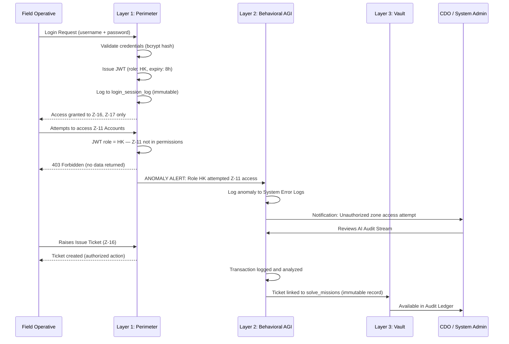

---

## §6. THE 24 SOVEREIGN ZONES — PANEL BIBLE

Each Zone in Miracle OS is a fully independent operational module that also communicates with every other zone via the shared database and WebSocket backbone. Below is the comprehensive reference for every zone.

---

### §6.1 Z-LOGIN — Sales & Lead Capture Portal

**Path:** `/`  
**Access:** PUBLIC (any visitor)  
**Role:** Enterprise Sales Executive + Lead Capture Engine

**Purpose:**
The public-facing gateway to Miracle OS. Every enterprise evaluator arrives here. The AI persona immediately engages as a **High-End Enterprise Sales Executive**, collecting four lead qualification data points before revealing demo credentials:
1. Visitor/Client Name
2. Enterprise / Business Name
3. Employee Count (enterprise size)
4. Contact Number

**AI Persona at Z-LOGIN:**
- Collects lead data conversationally
- Pitches: "One system replaces PMS + POS + Inventory + HR + Accounting + CRM + Guest App"
- ROI pitch: "Implementation: 10–25 working days"
- Demo credentials revealed after all 4 lead fields collected: `Login ID: Visitor / Password: Miracle4U`
- All leads saved to `sales_leads` table automatically

**VISITOR Mode:**
Once logged in as VISITOR, the operator has **full view access** to all 24 zones but **zero execution rights**. Every action attempt is intercepted by the AI, which pivots into a sales pitch and displays a WhatsApp contact button to connect with the Vigilant deployment team.

**Data Flow:**
```
Visitor arrives → AI collects 4 fields → sales_leads table → credentials revealed → login → VISITOR JWT issued → all zones unlocked (view only)
```

---

### §6.2 Z-07 — Master Command Grid

**Path:** `/dashboard`  
**Access:** CDO, GM, ADMIN, VISITOR  
**Role:** The Sovereign God View — Real-time enterprise asset grid

**Purpose:**
This is the operational nerve centre and the first screen visible after login. It provides a real-time card grid showing the live status of every room, suite, villa, or asset in the enterprise. No other system in the world provides this level of simultaneous visibility across every operational dimension on a single screen.

**Room Card Data:**
Each card displays all critical data points for one asset:
- **Room ID** (e.g., RS-01, V-05, LTR-12) in 32px Cinzel font
- **Asset Class & Status** (ROYAL SUITE | IN-HOUSE)
- **Active Ticket Badge** (🚨 LEAKING AC — shows active issue)
- **Guest Name** (or VACANT)
- **Nightly Rate** (from Policy Engine Z-19)
- **Folio Balance** (running total from folio_charges)
- **Signal Matrix** (3×3 department activity grid): HK | MN | RS / IT | SPA | FLT

**Signal States:**
| State | Color | Meaning |
|:---|:---|:---|
| PULSE | Animated glow (dept color) | Active mission in this department |
| ON | Static glow | Department activity (e.g., room is dirty → HK on) |
| OFF | Dimmed | No activity |

**Status Border Colors:**
| Status | Border | Glow |
|:---|:---|:---|
| AVAILABLE | White/dark | None |
| RESERVED | Pulsing blue | Slow-breath animation |
| IN-HOUSE | Cyan | Soft cyan glow |
| DIRTY | Purple | Purple tint |
| MAINTENANCE | Amber | Amber glow |
| ALARM/CRITICAL | Red strobe | `retina-strobe` animation |

**Room Card Actions:**
| Status | Available Actions |
|:---|:---|
| AVAILABLE | CHECK-IN, RESERVE |
| RESERVED | PUSH CHECK-IN |
| IN-HOUSE | ADD CHARGE, FOLIO |
| IN-HOUSE + Ticket | FOLIO + RESOLVE (side-by-side) |
| DIRTY | ASSIGN HK, INSPECT |
| MAINTENANCE | WORK ORDER |
| ALARM | RESOLVE FRACTURE |

**Top HUD Bar:**
- Live time marquee: Dhaka, Sydney, Mumbai (and additional cities in marquee)
- Total room count, ALARMS count, DIRTY count, MAINTENANCE count
- LIVE YIELD display (total revenue from all IN-HOUSE folios)
- Zone 20 Synapse Nexus quick-link
- Accounts pulse dot (live indicator)
- PULSE SYNC DATA button (force-refresh from database)

**Asset Classes (Default Dubai Standard):**
- Royal Suites (5 units) — Rate: ৳500,000
- Presidential Suites (5 units) — Rate: ৳200,000
- Private Villas (10 units) — Rate: ৳150,000
- Luxury Residences (10 units) — Rate: ৳100,000
- Overwater Bungalows (5 units) — Rate: ৳250,000

**API Endpoints:**
- `GET /api/frontdesk/live-grid` — Full grid state
- `GET /api/frontdesk/folios` — Active folio balances
- `GET /api/solve/active` — Active missions (tickets)
- `POST /api/frontdesk/force-available/{roomId}` — CDO override to reset room

**WebSocket:** `wss://miracle.vigilantitsolution.com/ws/grid-sync`

---

### §6.3 Z-05 — Global Reservations Engine

**Path:** `/dashboard/reservations`  
**Access:** CDO, GM, ADMIN, FD, VISITOR

**Purpose:**
The complete booking engine. Manages the full reservation lifecycle from initial inquiry to physical check-in. Features a 45-day horizontal Gantt-style tape chart — the industry standard "tape chart" view where rooms appear on the Y-axis and dates on the X-axis.

**Tab 1 — Live Reservations (Tape Chart):**
- 45-day rolling view; each room has its own horizontal row
- Existing bookings appear as colored blocks on the chart
- Clicking any empty cell opens the booking form for that room and date
- **Booking Form Fields:** Guest Name (legal passport name), Phone/WhatsApp, NID/Passport Number, Number of Nights, Room Selection
- **Payment Options at Booking:**
  - RESERVE — Locks room for future date, no immediate payment
  - QUICK WALK-IN CASH — Immediate check-in, cash collected
  - SWIPE VISA / MASTERCARD / AMEX — Card payment at terminal
- **Auto-Calculation:** Rate × Nights + 10% Service Charge + 15% VAT = Total Yield
- Overstay Detection: Red banner appears when checkout date has passed
- WALK-IN SYNC: Force-backfills any missing in-house guests from the database

**Tab 2 — VIP CRM Vault:**
- Searchable guest database with all registered profiles
- Each record: Full Name, VIP Tier, Lifetime Value, Loyalty Coins, Phone, Email
- WhatsApp push button, Email button
- Full booking history per guest
- VIRAL GUEST APP DISTRIBUTION: Send APK download link via WhatsApp

**Data Flow:**
```
Booking Form → reservations table → asset_grid status → RESERVED 
→ Z-07 room card updates via WebSocket → guest_crm created/updated
→ accounting_ledger: CREDIT advance deposit
```

**API Endpoints:**
- `GET /api/frontdesk_engine/reservations` — All reservations
- `POST /api/frontdesk_engine/commit` — Commit new reservation
- `POST /api/reservation_engine/ota-ingest` — OTA (Online Travel Agent) bookings
- `GET /api/crm/guests` — Guest CRM vault

---

### §6.4 Z-06 — POS / Retail Matrix

**Path:** `/dashboard/pos`  
**Access:** CDO, GM, ADMIN, POS, SPA, VISITOR

**Purpose:**
The centralized Point of Sale for the entire enterprise. This is the ONLY authorized POS in Miracle OS — all revenue from F&B, Spa, Retail, Minibar, and any other product category flows through here. Departmental dummy POS systems have been eliminated.

**Transaction Flow:**
1. Staff selects a **Product** from the product grid (organized by category tabs)
2. Uses `+` / `-` to set quantity → ADD TO CART
3. Cart calculates: Subtotal + VAT (15%) + Service Charge (10%) = Grand Total
4. Selects payment method:
   - **ROOM CHARGE** — Posts directly to the in-house guest's open folio (validates guest is IN-HOUSE first)
   - **CASH** — Direct cash payment
   - **CARD** — Card terminal payment

**Auto-Integrations (Every Sale):**
1. **Inventory Deduction** → Z-12: BOM recipe ingredients deducted from stock in real time
2. **Accounting Post** → Z-11: `accounting_ledger` — CREDIT to F&B Revenue / Spa Revenue / Retail Revenue
3. **Folio Update** → Z-08: If room charge, guest folio balance increases immediately
4. **COGS Calculation** → Z-11: Cost of goods sold calculated and posted as DEBIT

**Product Categories:** Food & Beverage, Spa Treatments, Shop Items, Minibar, Wellness Services

**POS Admin (Z-POSADMIN):**
- CDO-only panel
- Manage product prices, categories, add/remove items
- Accessible at `/dashboard/pos-admin`

**Database Tables:**
- `pos_transactions` — Complete transaction records
- `pos_order_items` — Line items per transaction
- `inventory` — Stock levels (auto-deducted)
- `accounting_ledger` — Financial record

---

### §6.5 Z-08 — Checkout & Financial Settlement

**Path:** `/dashboard/checkout`  
**Access:** CDO, GM, ADMIN, FD, POS, SPA, ACC, VISITOR

**Purpose:**
The guest folio settlement terminal. Every cent spent by a guest during their stay is consolidated here for review, discount application, split-bill processing, and final settlement.

**Checkout Process:**
1. Search guest by name or room number → Full folio loads
2. View all itemized charges: Room nights, F&B, Spa, Extras, Advance deposit
3. Balance = Total charges − Advance deposit already paid
4. Select payment method(s): CASH, VISA, MASTERCARD, AMEX
5. Apply authorized discount (cannot exceed total bill)
6. Split-bill across multiple methods if required
7. Click CHECKOUT & SETTLE FOLIO

**Auto-Actions on Checkout:**
- **Accounts (Z-11):** Posts double-entry: CREDIT Advance Deposit liability, DEBIT Cash/Card received
- **Room Status:** Changes to DIRTY automatically, triggering HK signal on Z-07
- **Folio:** Locked as SETTLED, full history preserved in CRM
- **Loyalty Coins:** Calculated (1 coin per currency unit spent) and credited to guest_crm

**Key Rule:** Cannot checkout if outstanding balance > 0 without a payment method selected. This eliminates revenue leakage.

---

### §6.6 Z-09 — Human Capital Command (HR)

**Path:** `/dashboard/hr`  
**Access:** CDO, GM, ADMIN, HR, VISITOR

**Purpose:**
The full staff lifecycle management engine. From hiring to payroll to performance analytics to document generation — Z-09 handles every dimension of human capital management.

**Tabs:**

**GALLERY Tab:**
- Visual biometric card grid of all staff
- Each card: Photo/Avatar, Name, Job Title, Status (ON-DUTY/OFFLINE/TERMINATED), ROI score, Efficiency %
- Click card → Full Dossier Overlay (all financial and performance data)
- From Dossier: Generate Payslip, Generate Appointment Letter, Update avatar photo

**PERFORMANCE Tab:**
- Analytics table: Operative name, Base Salary, Revenue Impact, Efficiency %, ROI Factor
- Source: `/api/hr/performance-matrix`
- Ranks staff by contribution to enterprise revenue

**PAYROLL Tab:**
- Shows each staff member's Monthly Hours, Total Payout (Base + Commission)
- PUSH TO ACCOUNTS & INBOX: Executes payroll → posts DEBIT to Z-11 Payroll Expense account
- Total Payroll Liability chip in top-right

**DOCUMENTS Tab:**
- DUBAI 5-STAR VAULT: Library of SOPs, Handbooks, Policies (PDF/DOCX)
- APPOINTMENT LETTER FORGE: Auto-generates appointment letters
- MANTALA WORD MODULE: In-browser rich text editor — edit, save draft, print/export PDF

**ONBOARDING Tab:**
- New staff registration form: First Name, Last Name, Designation, Department, Access Zones (RBAC checkboxes), Base Salary, Commission Rate %
- Upload Personal Avatar and Biometric Scan
- On submit: Creates staff record, auto-generates username (FirstnameLastname format) and secure password, displays credentials banner

**REGISTRY Tab:**
- Surgery-level credential editor: Username, Password, Salary, Commission %, Status for every staff
- Direct image upload per staff
- AUTHORIZE GLOBAL SYNC: Pushes ALL changes to MySQL in one shot

**MY_SOP Tab:**
- Department SOP viewer pulled from Policy Engine (Z-19)

---

### §6.7 Z-10 — CRM & Guest Loyalty Engine

**Path:** `/dashboard/crm`  
**Access:** CDO, GM, ADMIN, FD, VISITOR

**Purpose:**
Complete Guest Relationship Management. Every guest who has ever interacted with the enterprise has a profile here, with full booking history, spending analytics, and loyalty rewards.

**Guest Profile Data:**
- Full name, VIP Tier, Total LTV (Lifetime Value), Loyalty Coins balance, Phone, Email, Last Stay date

**VIP Tier Progression:**
| Tier | LTV Threshold | Benefits |
|:---|:---|:---|
| Bronze | Base | Standard service |
| Silver | ৳500,000 LTV | Priority check-in |
| Gold | ৳2,000,000 LTV | Complimentary upgrade |
| Platinum | ৳5,000,000 LTV | Dedicated concierge |

**Loyalty Coin Engine:**
- 1 coin earned per currency unit spent on checkout
- Coins redeemable for discounts via the Guest App
- Manual coin issuance available for CDO

**Actions per Guest:**
- View complete booking history
- WhatsApp direct message
- Issue loyalty coins manually
- View all folio charges across all stays

---

### §6.8 Z-11 — Accounts & Finance Sovereign Kernel

**Path:** `/dashboard/accounts`  
**Access:** CDO, GM, ADMIN, ACC, VISITOR

**Purpose:**
The complete, GAAP-compliant, double-entry accounting engine. Every financial transaction generated by any zone in Miracle OS automatically posts a corresponding ledger entry here. No manual data entry required.

**8 Financial Tabs:**

| Tab | Function |
|:---|:---|
| REVENUE VECTOR ANALYSIS | Donut chart P&L: Room vs F&B vs Other revenue. Net Revenue, Operational Load, Net Margin |
| ACCUSATIVE ITEM-WISE TRACE | Raw transaction ledger — every CREDIT and DEBIT with source, amount, operator, timestamp |
| BURDEN MATRIX | Operational Expenses vs Payroll vs Commissions as visual progress bars |
| GL JOURNAL ENTRY | Manual double-entry posting with Account Code, Reference Number, Description |
| CHART OF ACCOUNTS (COA) | Complete account structure: 1000=Cash, 4000=Room Revenue, 5000=Payroll Expense, etc. |
| AR AGING | Outstanding guest payments by age bracket (0-30d, 31-60d, 61-90d, 90+d) |
| AP MODULE | Vendor invoice management, aging, AUTHORIZE DISBURSEMENT |
| BANK RECONCILIATION | Match bank statement entries against ledger, COMMIT RECEIPT |
| NIGHT AUDIT WIZARD | 4-step day-close: Cash Count → Inventory Count → Discrepancy Check → Final Lock |

**Auto-Posting Sources:**
- Every POS sale (Z-06) → CREDIT: Revenue category
- Every Checkout (Z-08) → CREDIT: Advance Deposit, DEBIT: Cash/Card
- Every Payroll Push (Z-09) → DEBIT: Payroll Expense
- Every Inventory Receipt → DEBIT: Inventory Asset, CREDIT: Accounts Payable

**Chart of Accounts (Core):**

| Code | Account Name | Type |
|:---|:---|:---|
| 1000 | Cash | Asset |
| 1100 | Advance Deposits Receivable | Asset |
| 1200 | Accounts Receivable — Guests | Asset |
| 2100 | Advance Deposit Liability | Liability |
| 4000 | Room Revenue | Revenue |
| 4100 | F&B Revenue | Revenue |
| 4200 | Spa Revenue | Revenue |
| 4300 | Retail Revenue | Revenue |
| 5000 | Payroll Expense | Expense |
| 5200 | Cost of Goods Sold | Expense |
| 5300 | Operational Expense | Expense |

---

### §6.9 Z-12 — Inventory Matrix & Stock Vault

**Path:** `/dashboard/inventory`  
**Access:** CDO, GM, ADMIN, POS, HK, MN, VISITOR

**Purpose:**
Tracks every physical item in the enterprise — F&B ingredients, spa supplies, minibar items, retail products, cleaning supplies, maintenance parts. The single source of truth for stock levels.

**Key Features:**
- Product grid: Product ID, Name, Category, Dept, Current Stock, Minimum Level (PAR), Purchase Price (PP), Retail Price (RP)
- LOW STOCK ALERT: Items below minimum level flash red and trigger a predictive reorder warning
- ASYNC SYNC INVENTORY: Force-syncs stock count from all POS deductions
- BOM (Bill of Materials): Each F&B menu item has a recipe — selling a dish automatically deducts all ingredient quantities
- Manual stock-in: Add received goods with quantity and purchase price
- Variance logging: Physical count vs system count discrepancy recording

**Auto-Deduction Flow:**
```
POS Sale (Z-06) → BOM lookup for product sold
→ inventory table: stock -= required_qty for each ingredient
→ if stock < min_level: LOW STOCK ALERT
→ accounting_ledger: DEBIT COGS entry
```

---

### §6.10 Z-14 — Media Lab

**Path:** `/dashboard/media-lab`  
**Access:** CDO, GM, ADMIN, VISITOR

**Purpose:**
Digital Asset Management for the enterprise. All property photography, menu images, staff avatars, promotional banners, and branding assets are managed here. Assets stored in Z-14 are referenced by the Guest App, website, and marketing materials.

**Features:**
- Upload, organize, and tag assets
- Preview before publishing
- Assign assets to zones (e.g., Room photos → Guest App hub, Menu images → POS product grid)
- Bulk delete and folder organization

---

### §6.11 Z-16 — Issue Tickets & Fault Reporting

**Path:** `/dashboard/issue-tickets`  
**Access:** ANY (all authenticated roles)

**Purpose:**
The central fault reporting hub. Any staff member, from any zone, can raise a complaint, maintenance request, or operational fault. This zone is the aggregate view of all raised tickets.

**Ticket Form:**
- Room/Area, Department Responsible, Subject/Description
- Priority: LOW / MEDIUM / HIGH / CRITICAL
- Assign to: Specific staff or department

**Ticket States:** OPEN → IN-PROGRESS → RESOLVED → CLOSED

**Critical Ticket Visual Response:**
- CRITICAL priority tickets immediately trigger the **red strobe animation** on the corresponding room card in Z-07
- HK tickets → HK signal badge pulses purple on room card
- MN tickets → MN signal badge pulses orange on room card
- IT tickets → IT signal badge pulses green on room card

**Data Source:** `solve_missions` table

---

### §6.12 Z-17 — Solve Portal (Field Operations)

**Path:** `/dashboard/solve`  
**Access:** ANY (all authenticated roles)

**Purpose:**
The staff-facing mission execution terminal. While Z-16 is for raising tickets, Z-17 is for field operatives to see and act on their assigned missions.

**Staff View:** Only shows tickets assigned to the logged-in operative
**CDO View:** Shows ALL tickets across all departments, with override and reassignment capability

**Field Actions:**
- Mark ticket IN-PROGRESS
- Resolve with written notes
- Upload photo proof of completion
- CDO override: reassign, escalate, or force-close

**Integration with Z-07:** When a ticket is RESOLVED in Z-17, the signal badge on the corresponding room card in Z-07 clears automatically via WebSocket broadcast.

---

### §6.13 Z-18 — Biometric Security Portal

**Path:** `/dashboard/portal`  
**Access:** CDO, GM, ADMIN, HR, VISITOR

**Purpose:**
Staff attendance management via biometric verification. The immutable record of who entered the system, when, from where, and what they accessed.

**Session Log Data:**
- Staff name and role
- Login timestamp and logout timestamp
- Zone(s) accessed during session
- IP address and user agent (device fingerprint)
- Outcome: SUCCESS or FAILED ATTEMPT
- Duration in minutes

**Security Integration:**
- Failed login attempts flagged and visible to CDO in real time
- Biometric shift data flows to Z-09 (HR Payroll) — only verified biometric hours count
- Session logs are immutable and feed into Z-11 Audit Trail
- Prevents unauthorized access and ghost employee payroll fraud

---

### §6.14 Z-19 — Policy Engine

**Path:** `/dashboard/policy`  
**Access:** CDO, GM, ADMIN, VISITOR

**Purpose:**
The single source of truth for ALL pricing and operational policies in the enterprise. Any change to room rates, VAT rates, service charges, or SOPs must be made here — never in Reservations or Checkout.

**Controls:**
- Room pricing per unit per night (all asset classes)
- Seasonal pricing calendars (peak / off-peak)
- Service Charge: 10% (configurable)
- VAT Rate: 15% (configurable)
- Department SOPs: Upload and publish per department
- Policy Lock: Commits and freezes current pricing and SOPs

**Policy Lock Mechanism:**
Once locked, rates and SOPs are immutable until the next unlock cycle. This prevents accidental or unauthorized price changes during live operations. The lock state is reflected across Z-05 and Z-08 which read rates from this table.

---

### §6.15 Z-20 — Synapse Nexus (Enterprise War Room)

**Path:** `/dashboard/synapse`  
**Access:** CDO, GM, ADMIN, SYNAPSE, VISITOR

**Purpose:**
The most sophisticated panel in Miracle OS — the enterprise **War Room**. Synapse Nexus combines HR organizational visualization, strategic task management (Kanban), real-time P2P video conferencing (WebRTC), corporate hierarchy messaging, and the AGI Strategic Arbitrator. It goes beyond tools like Jira, Teams, or Slack by physically modeling the enterprise hierarchy and enforcing it mathematically.

**Panel 1 — Neural Tree (Org-Chart):**
- Live HR org-chart built from the Employee Registry
- Hierarchy: CEO > Director > Manager > Operative
- ON-DUTY staff glow neon green; OFFLINE staff are dimmed
- Click any node → Radial action menu: VIDEO CALL, VOICE LINK, SEND SECURE FILE, ASSIGN DIRECTIVE

**Panel 2 — War Room (Kanban + Command Grid):**
- VIEW A (KANBAN): Strategic Directives board with 4 columns: BACKLOG | ACTIVE | REVIEW | SECURED
- VIEW B (COMMAND GRID): Large Neon Glass Tiles for every Department (IT, HR, ACCOUNTS) and Area (POOL, SPA, BOARDROOM)
- When a directive node is assigned to a department, the corresponding tile pulses with Cyan Neon glow + badge ([3] pending)
- Multi-department tasks split into Nodes via AGI Arbitrator → multiple department tiles pulse simultaneously

**Panel 3 — COMM-LINK (WebRTC Video):**
- Click VIDEO CALL on any org-chart node → Conference Modal slides in
- Multi-participant video grid, frosted glass overlay
- Controls: MUTE, CAM OFF, HANG UP
- SOVEREIGN FREQUENCIES: Persistent voice channels (HK Frequency 1, Maintenance Channel, Management Room)

**AGI Arbitrator:**
- ✨ AUTO-DECOMPILE button on any Strategic Directive
- The Miracle AGI analyzes the directive and splits it into department-specific sub-tasks
- Each sub-task spawns as a Z-16 Issue Ticket automatically
- Multiple department tiles in the Command Grid pulse simultaneously to signal the directive has been distributed

**Hierarchical Communication Gate (Synapse Bridge Protocol):**
| Tier | Role | DM Rights |
|:---|:---|:---|
| 4 (C-SUITE) | CDO, Board | Can initiate DM to any tier |
| 3 (DIRECTOR) | Directors | DM Tier 4, 3, 2 |
| 2 (MANAGER) | Managers | DM Tier 3, 2, 1 (immediate reports only) |
| 1 (OPERATIVE) | All staff | DM peers + immediate boss only |

**Secure File Exchange:**
Drop a PDF/file onto the War Room canvas → routed to the selected operative's feed as a glowing Data Chip with full audit trail.

---

### §6.16 Z-21 — Kernel Settings

**Path:** `/dashboard/settings`  
**Access:** CDO, GM, VISITOR

**Purpose:**
System-wide configuration hub for the entire Miracle OS kernel.

**Controls:**
- Enterprise name, currency, language/locale, timezone
- CDO master password management
- Database connection status
- Feature toggles for experimental modules
- **Sovereign Theme Engine:** 
  - Backgrounds: Matrix Rain, Circuit Board, Neon Dots, OFF
  - City Themes: Neon Dubai, Neon London, Neon New York, Neon Saudi, Neon Qatar, Neon Singapore
  - Intensity Slider (0–100%)
  - Transparency Slider (0–100%)
  - Sharpness Slider (0–100% blur control)
  - Neon Color: 8 presets + custom hex input
  - Per-page background override system
- User Management (login credentials)

---

### §6.17 Z-23 — Sovereign Infrastructure (SRE Command)

**Path:** `/dashboard/infrastructure`  
**Access:** CDO, GM, VISITOR

**Purpose:**
The CDO-level technical command centre for monitoring and controlling the entire Miracle OS infrastructure stack. This is the most powerful zone — a real-time Site Reliability Engineering (SRE) dashboard.

**Sections:**

1. **SERVICE HEALTH GRID:** PM2 process status for miracle-backend and miracle-frontend. Status: ONLINE (green) / OFFLINE (red). Memory, CPU %, restart count, uptime. Restart button (requires Master PIN).

2. **LIVE TELEMETRY PILLARS:** 5 data pillars refreshing every 5 seconds:
   - FINANCIAL — Revenue KPIs
   - OPERATIONAL — Occupancy, arrivals
   - STAFF — On-duty count, efficiency
   - GUEST — VIP count, LTV leaders
   - SRE — System health, error rate, response times

3. **LIVE REPLY AUDIT STREAM:** Every AI query/response logged. CLEAN vs HALLUCINATION detection. Auto-correction learning pipeline.

4. **SYSTEM ERROR LOGS:** Frontend and backend errors captured automatically. ANALYZE button: AI diagnoses and proposes exact code fix. DISMISS, REFRESH, DISMISS ANALYZED.

5. **SOVEREIGN BRAIN MANIFEST:** All pending AI knowledge rules. CDO APPROVES or REJECTS each one. Approved rules become permanent AI behavior.

6. **SRE SCAN ENGINE:** Full system-wide diagnostic scan. Checks DB connectivity, API response times, file integrity, AI pipeline health. INITIATE SOVEREIGN SRE SCAN button.

7. **LOG TERMINAL:** Real-time PM2 logs (backend / frontend / nginx). Last 50 lines, auto-scrolls. Switchable between processes.

8. **3D GLASS BODY:** Visual representation of AI health — each core system (Brain, Heart, Spine) maps to a physical organ visualization.

---

### §6.18 Z-25 — Guest Marketing Engine

**Path:** `/dashboard/guest-marketing`  
**Access:** CDO, GM, ADMIN, VISITOR

**Purpose:**
The digital bridge between the enterprise and its guests. Manages the Guest App distribution, promotional campaigns, and engagement analytics.

**Features:**
- APK Distribution via WhatsApp: Send the Android APK download link to any guest in one tap
- PROMOTIONAL BROADCASTS: Create and send offers to guest segments (VIP, all guests, specific dates)
- LOYALTY COIN CAMPAIGNS: Issue bonus coins as promotional incentives
- ANALYTICS: App downloads, engagement rates, redemption rates
- MIRACLE CINEMA Admin: Manage the in-room entertainment content library

---

### §6.19 Z-26 — Fleet & Aviation Command

**Path:** `/dashboard/fleet`  
**Access:** CDO, GM, ADMIN, VISITOR

**Purpose:**
Vehicle and aviation fleet management. Covers ground transportation (limousines, SUVs, golf carts) and aviation assets (helicopters, private aircraft). Manages transfer scheduling, maintenance tracking, driver and pilot assignments, and fuel/maintenance cost tracking. Revenue from fleet services posts via Z-06 POS to Z-11 Accounts.

---

### §6.20 Z-27 — Med-Spa & Wellness

**Path:** `/dashboard/wellness`  
**Access:** CDO, GM, ADMIN, SPA, VISITOR

**Purpose:**
Dedicated wellness department engine. Treatment scheduling, therapist assignments, service Bill of Materials (BOM) linked to the Z-12 Inventory Vault. Wastage from treatments logs to Z-11 COGS. Revenue from services flows through Z-06 POS.

---

### §6.21 Z-28 — Luxury Boutiques

**Path:** `/dashboard/boutiques`  
**Access:** CDO, GM, ADMIN, POS, VISITOR

**Purpose:**
Retail department management. Full product catalog, luxury goods inventory, pricing management. All sales flow through the centralized Z-06 POS. Stock managed in Z-12. Revenue in Z-11.

---

### §6.22 Z-29 — Gastronomy & F&B Engine

**Path:** `/dashboard/z29-gastronomy`  
**Access:** CDO, GM, ADMIN, FB, VISITOR

**Purpose:**
Dedicated Food & Beverage department engine. Menu management, recipe BOM construction (linking menu items to Z-12 inventory ingredients), kitchen workflow management, waste tracking. The Architect Engine (ServiceArchitectBOM component) allows F&B department heads to pull raw inventory items and compile services with calculated COGS and profit margins. Wastage logs flow to Z-11 Audit Ledger.

---

### §6.23 Z-GUEST — Guest Concierge App

**Path:** `/guest/*`  
**Access:** GUEST (hotel guests) via mobile app or browser

**Purpose:**
The guest-facing mobile application and web portal. Delivered as a thin-client Android APK (Capacitor) pointing to the live VPS — no APK rebuild required for any UI change.

**Guest Tabs:**
| Path | Feature |
|:---|:---|
| /guest/hub | Welcome dashboard, current room status, quick actions |
| /guest/folio | Real-time bill view: all charges, advance paid, current balance |
| /guest/order | Room service / food ordering from live menu |
| /guest/reserve | Extend stay, request future booking |
| /guest/concierge | Message front desk, request services |
| /guest/ecommerce | Shop resort merchandise |
| /guest/cinema | In-room entertainment (Netflix-style UI) |
| /guest/profile | Loyalty coins, VIP tier, past stays |

All guest requests flow to Z-07 Command Grid and Z-17 Solve Portal for staff action.

**Security Architecture (Guest):**
- Token stored in localStorage (never cookie — Capacitor doesn't support cookie auth)
- Bearer token sent in Authorization header for every API call
- `/guest/*` routes never intercepted by Nginx proxy (prevents redirect loop on Android)
- MiracleBotGuestGuard prevents AI engine from loading in guest WebView
- GlobalSyncContext aborts kernel polling on `/guest/*` routes

---

### §6.24 Z-AUDIT — Audit Ledger

**Path:** `/dashboard/audit-ledger`  
**Access:** CDO, GM, ACC

**Purpose:**
The immutable audit trail for the entire enterprise. Every action taken by every operator is logged here with: action type, operator name, target (which record/zone), timestamp, and result. This is the forensic record that cannot be modified, deleted, or altered.

---

## §7. DATABASE ARCHITECTURE & FULL SCHEMA REFERENCE

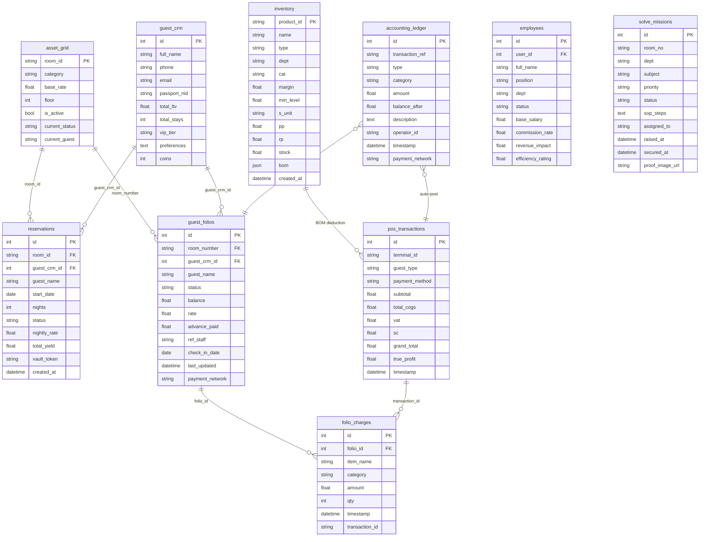

---

## §8. API ENDPOINT DIRECTORY

| Method | Endpoint | Zone | Purpose |
|:---|:---|:---|:---|
| POST | /api/auth/token | Z-LOGIN | Login, get JWT |
| GET | /api/frontdesk/live-grid | Z-07 | All room states |
| GET | /api/frontdesk/folios | Z-07 | Active folio balances |
| POST | /api/frontdesk/force-available/{id} | Z-07 | CDO room reset |
| GET | /api/frontdesk_engine/reservations | Z-05 | All reservations |
| POST | /api/frontdesk_engine/commit | Z-05 | New reservation |
| POST | /api/reservation_engine/ota-ingest | Z-05 | OTA booking import |
| POST | /api/pos/transaction | Z-06 | Complete POS sale |
| GET | /api/inventory/live | Z-12 | Stock levels |
| POST | /api/inventory/stock-in | Z-12 | Receive new stock |
| POST | /api/billing/checkout/{guest_ref} | Z-08 | Settle folio |
| GET | /api/hr/performance-matrix | Z-09 | Staff analytics |
| POST | /api/hr/onboard | Z-09 | New staff registration |
| POST | /api/hr/execute-payroll/{id} | Z-09 | Run payroll |
| POST | /api/hr/sync-registry | Z-09 | Bulk credential sync |
| GET | /api/accounting/ledger/live | Z-11 | Live P&L data |
| POST | /api/accounting/journal/manual | Z-11 | Manual journal entry |
| GET | /api/accounting/ar/aging | Z-11 | AR aging report |
| GET | /api/accounting/ap/invoices | Z-11 | Vendor invoices |
| POST | /api/policy/lock | Z-19 | Commit and lock pricing |
| POST | /api/bot/v2/query | Z-ALL | AI Navigator query |
| GET | /api/synapse/org-chart | Z-20 | HR org chart data |
| POST | /api/synapse/directives | Z-20 | New strategic directive |
| POST | /api/synapse/webrtc/create-room | Z-20 | Video conference room |
| GET | /api/infra/telemetry | Z-23 | System health metrics |
| GET | /api/infra/logs | Z-23 | System error logs |
| POST | /api/infra/pm2/restart | Z-23 | Restart PM2 process |
| POST | /api/infra/browser-error | Z-23 | Browser error ingest |
| GET | /api/settings/kernel | Z-ALL | Zone intelligence map |
| WS | /ws/grid-sync | Z-07 | Real-time grid events |
| WS | /ws/synapse/chat/{thread_id} | Z-20 | Corporate messaging |
| WS | /ws/synapse/signal/{room_id} | Z-20 | WebRTC P2P signaling |

---

## §9. ROLE-BASED ACCESS CONTROL (RBAC) MATRIX

| Zone | CDO | GM | ADMIN | FD | POS | HR | ACC | HK/MN/IT | GUEST | VISITOR |
|:---|:---:|:---:|:---:|:---:|:---:|:---:|:---:|:---:|:---:|:---:|
| Z-LOGIN | ✓ | ✓ | ✓ | ✓ | ✓ | ✓ | ✓ | ✓ | — | ✓ |
| Z-07 Command Grid | ✓ | ✓ | ✓ | — | — | — | — | — | — | ✓ |
| Z-05 Reservations | ✓ | ✓ | ✓ | ✓ | — | — | — | — | — | ✓ |
| Z-06 POS | ✓ | ✓ | ✓ | — | ✓ | — | — | — | — | ✓ |
| Z-08 Checkout | ✓ | ✓ | ✓ | ✓ | ✓ | — | ✓ | — | — | ✓ |
| Z-09 HR | ✓ | ✓ | ✓ | — | — | ✓ | — | — | — | ✓ |
| Z-10 CRM | ✓ | ✓ | ✓ | ✓ | — | — | — | — | — | ✓ |
| Z-11 Accounts | ✓ | ✓ | ✓ | — | — | — | ✓ | — | — | ✓ |
| Z-12 Inventory | ✓ | ✓ | ✓ | — | ✓ | — | — | ✓ | — | ✓ |
| Z-14 Media Lab | ✓ | ✓ | ✓ | — | — | — | — | — | — | ✓ |
| Z-16 Issue Tickets | ✓ | ✓ | ✓ | ✓ | ✓ | ✓ | ✓ | ✓ | — | ✓ |
| Z-17 Solve Portal | ✓ | ✓ | ✓ | ✓ | ✓ | ✓ | ✓ | ✓ | — | ✓ |
| Z-18 Biometric | ✓ | ✓ | ✓ | — | — | ✓ | — | — | — | ✓ |
| Z-19 Policy Engine | ✓ | ✓ | ✓ | — | — | — | — | — | — | ✓ |
| Z-20 Synapse | ✓ | ✓ | ✓ | — | — | — | — | — | — | ✓ |
| Z-21 Kernel | ✓ | ✓ | — | — | — | — | — | — | — | ✓ |
| Z-23 Infra (SRE) | ✓ | ✓ | — | — | — | — | — | — | — | ✓ |
| Z-25 Guest Mktg | ✓ | ✓ | ✓ | — | — | — | — | — | — | ✓ |
| Z-26 Fleet | ✓ | ✓ | ✓ | — | — | — | — | — | — | ✓ |
| Z-27 Wellness | ✓ | ✓ | ✓ | — | — | — | — | — | ✓ | ✓ |
| Z-28 Boutiques | ✓ | ✓ | ✓ | — | ✓ | — | — | — | — | ✓ |
| Z-29 Gastronomy | ✓ | ✓ | ✓ | — | — | — | — | — | — | ✓ |
| Z-GUEST | — | — | — | — | — | — | — | — | ✓ | — |

---

## §10. MULTI-ENTERPRISE SINGLE KERNEL ARCHITECTURE

The most powerful capability of Miracle OS — the ability to govern multiple enterprises, properties, or business units from a single sovereign kernel deployment.

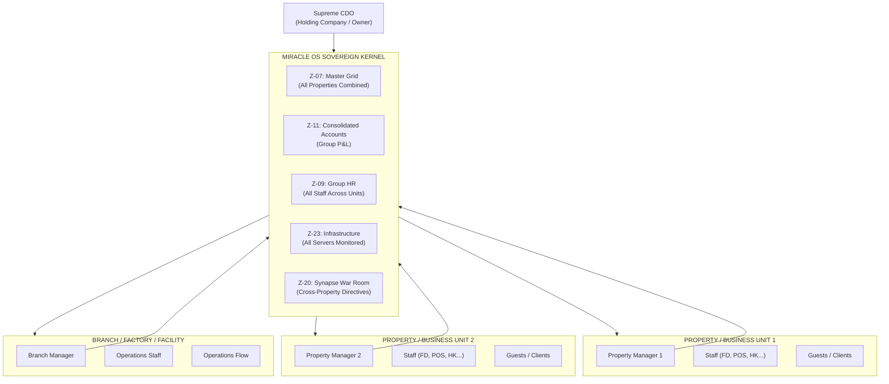

**Multi-Enterprise Kernel Capabilities:**
- **Consolidated Financial Reporting:** Z-11 aggregates P&L across all properties into a single group financial view
- **Cross-Property Staff Transfer:** Z-09 manages staff assignments across multiple business units
- **Unified Inventory Pool:** Z-12 can share inventory across properties or maintain separate vaults
- **Group-Wide Policy:** Z-19 can broadcast pricing and policy changes to all properties simultaneously
- **AGI Group Intelligence:** The Miracle AI understands the full group operation and can be asked: "What is the total group revenue across all properties this month?"
- **Hierarchical Security:** Each property manager sees only their property data; the Supreme CDO sees all

---

## §11. ENTERPRISE INDUSTRY DEPLOYMENT BLUEPRINTS

### §11.1 Hospitality — Hotels, Resorts & Eco-Resorts

**Industries:** Luxury Hotels, Budget Hotels, Eco-Resorts, Boutique Properties, Safari Lodges, Island Resorts, Cruise Ships

**Primary Zones:** Z-07, Z-05, Z-06, Z-08, Z-09, Z-10, Z-11, Z-12, Z-19, Z-27, Z-28, Z-29, Z-GUEST

**How Miracle OS Serves Hospitality:**

The hospitality industry is Miracle OS's origin application. Every zone was engineered to solve a real operational problem in a luxury hotel or resort environment.

**Operational Flow:**
```
Guest Inquiry → Z-LOGIN (AI Lead Capture) 
→ Z-05 (Reservation Booked on Tape Chart)
→ Z-07 (Room Status: RESERVED, pulsing amber)
→ Guest Arrives → Z-05 (PUSH CHECK-IN)
→ Z-07 (Room: IN-HOUSE, cyan glow)
→ Guest orders room service → Z-GUEST App / Z-06 POS
→ folio charges accumulate
→ Guest requests spa treatment → Z-27 Wellness
→ Z-06 POS charges posted to folio
→ Guest shops boutique → Z-28 Boutiques → Z-06 POS
→ Issue raised (AC fault) → Z-16 → Z-07 red strobe
→ Z-17 Maintenance dispatched → RESOLVED
→ Guest checks out → Z-08 Settlement
→ Z-11 Night Audit → Records sealed
→ Z-10 CRM → Loyalty coins credited, VIP tier upgraded
```

**Key ROI for Hospitality:**
| Metric | Without Miracle OS | With Miracle OS |
|:---|:---|:---|
| Revenue leakage (no room charge auth) | 3–8% | 0% (room charge validates IN-HOUSE) |
| Time to checkout (manual folio) | 8–15 minutes | Under 2 minutes |
| Night audit time | 2–4 hours | 25 minutes (automated) |
| Inventory shrinkage | 5–12% | Under 1% (BOM auto-deduction) |
| Staff efficiency visibility | None | Real-time ROI per operative |
| Guest retention (no loyalty program) | 25–35% return rate | 55–70% (loyalty coins + VIP tiers) |

---

### §11.2 Food & Beverage (F&B) Management

**Industries:** Restaurant Chains, Cloud Kitchens, Catering Companies, Food Courts, Hotel F&B Departments, Bakeries, Coffee Shop Chains

**Primary Zones:** Z-06 (POS), Z-12 (Inventory), Z-29 (Gastronomy), Z-11 (Accounts), Z-09 (HR)

**How Miracle OS Serves F&B:**

For a standalone restaurant or F&B operation, Miracle OS deploys as a complete F&B management kernel:

**Recipe Management (BOM Engine):**
- Every menu item has a Bill of Materials (recipe) defined in Z-12
- Selling one "Signature Wagyu Burger" automatically deducts: 200g Wagyu beef, 1 brioche bun, 20g truffle sauce, and 5g microgreens from the inventory vault
- COGS is calculated instantly per sale
- Gross Profit Margin per dish visible in real time

**Waste Tracking:**
- The Wastage Audit Log in Z-29 tracks every discarded ingredient
- Wastage posts to Z-11 as DEBIT: Cost of Goods Sold (Wastage)
- AI can query: "What was our food waste COGS this week?" and get an instant SQL-sourced answer

**Staff Efficiency in F&B:**
- Each server/cashier's POS sales tracked in Z-09
- Revenue Impact per staff member visible: Who is your most productive server?
- Commission rates configurable per staff for upsell incentives

**Multi-Outlet F&B:**
- Deploy Z-29 (Gastronomy) as a separate zone per outlet: Restaurant, Pool Bar, Room Service, Banquet
- Each outlet's revenue streams into separate revenue categories in Z-11
- Consolidated F&B P&L visible on the REVENUE VECTOR ANALYSIS tab

---

### §11.3 Human Resources & Payroll Automation

**Industries:** Corporate HR Departments, Staffing Agencies, Manufacturing Plants, Hospitals, Government Organizations, Any employer with 10+ staff

**Primary Zones:** Z-09 (HR), Z-18 (Biometric), Z-11 (Accounts), Z-20 (Synapse Nexus)

**How Miracle OS Serves HR:**

Miracle OS replaces standalone HR software (e.g., BambooHR, Workday, ADP) with a deeply integrated HR engine that connects staff performance directly to financial outcomes.

**Complete Staff Lifecycle:**
| Phase | Miracle OS Function |
|:---|:---|
| Recruitment | Onboarding Tab: Register candidate, assign RBAC zones, generate credentials |
| Onboarding | Document Vault: SOPs, handbooks, appointment letters via Mantala Word Module |
| Attendance | Z-18 Biometric Portal: Every shift biometrically verified |
| Performance | Z-09 Performance Tab: Revenue Impact %, Efficiency Rating, ROI Factor |
| Payroll | Z-09 Payroll Tab: Monthly hours × base salary + commission → PUSH TO ACCOUNTS |
| Appraisal | Z-20 Synapse: Directive assigned, tracked through Kanban to SECURED |
| Offboarding | Z-09 Registry: Status changed to TERMINATED, access revoked |

**AI-Driven HR Intelligence:**
- Ask Miracle: "Who is my highest ROI staff member in the spa department?"
- AI queries `employees` table, cross-references `pos_transactions` and `revenue_impact`, and delivers a British Executive summary with the exact operative's name and numbers

**The Synapse Corporate Hierarchy:**
- Z-20 enforces the org-chart with mathematical certainty
- No operative can bypass their manager to reach C-Suite
- Every directive assignment, task completion, and communication is logged

---

### §11.4 Supply & Distribution Management

**Industries:** Wholesale Distributors, FMCG Companies, Pharmaceutical Distributors, Auto Parts Distribution, Food & Beverage Distributors, E-commerce Fulfillment Centers

**Primary Zones:** Z-12 (Inventory), Z-11 (Accounts / AP), Z-06 (POS / Order Processing), Z-26 (Fleet), Z-16 (Issue Tickets), Z-19 (Policy Engine)

**How Miracle OS Serves Supply & Distribution:**

In a distribution context, Miracle OS rearchitects its zones for the supply chain:

| Miracle OS Zone | Distribution Function |
|:---|:---|
| Z-12 Inventory Matrix | Warehouse stock management — receiving bay, PAR levels, reorder alerts |
| Z-11 Accounts (AP) | Vendor invoice management, payment terms tracking, AUTHORIZE DISBURSEMENT |
| Z-11 Accounts (AR) | Customer invoice aging (0–30d, 31–60d, 61–90d, 90+d) |
| Z-06 POS | Order processing terminal — sales order entry, dispatch |
| Z-26 Fleet | Delivery fleet management — route assignment, driver tracking, vehicle maintenance |
| Z-16 Issue Tickets | Delivery exception reporting — damaged goods, late delivery, wrong shipment |
| Z-19 Policy Engine | Pricing tiers, discount policies, customer-specific rate cards |
| Z-07 Command Grid | Warehouse bay / zone status grid — which bays are occupied, which orders are pending dispatch |

**Distribution Data Flow:**
```
Purchase Order received → Z-12 (Receiving Bay stock-in)
→ accounting_ledger: DEBIT Inventory, CREDIT Accounts Payable (vendor)
→ Sales Order placed → Z-06 (Order processing)
→ Z-12: Stock allocated to order (reserved quantity)
→ Z-26: Delivery vehicle assigned, driver scheduled
→ Z-16: Delivery exception raised if issue occurs
→ Delivery confirmed → Z-11: AR invoice created
→ Payment received → Z-11: Bank Reconciliation, COMMIT RECEIPT
→ AR closed, cash position updated
```

**AGI Supply Intelligence:**
- "What is our current stock coverage for SKU-4521 at current sales velocity?" → AI executes SQL: `SELECT stock / (sales_last_30_days / 30) AS days_coverage FROM inventory WHERE product_id = 'SKU-4521'`
- "Which vendor has the highest outstanding AP balance?" → Real-time answer from `ap_invoices` and `vendors` tables

---

### §11.5 AI Automated Accounting & Finance

**Industries:** Any enterprise with financial operations — the AI Finance capability is horizontal across ALL industries

**Primary Zones:** Z-11 (Accounts & Finance), Z-06 (POS), Z-08 (Billing), Z-09 (Payroll), Z-12 (COGS)

**How Miracle OS Serves Accounting & Finance:**

Miracle OS eliminates the need for standalone accounting software (QuickBooks, Xero, SAP) by embedding a full GAAP-compliant accounting engine at the core of the operational system.

**What Makes It AI-Automated:**

1. **Zero Manual Entry:** Every transaction posts to the ledger automatically. A POS sale → CREDIT F&B Revenue. A payroll push → DEBIT Payroll Expense. A stock receipt → DEBIT Inventory Asset. No accountant needs to re-enter these.

2. **AI Financial Intelligence:** The Miracle Navigator can synthesize a full executive financial briefing on demand:
   - Revenue breakdown by category
   - Expense analysis vs budget
   - Cash position
   - Outstanding AR aging
   - Net profit calculation
   - Trend analysis (7-day, 30-day, MTD)

3. **GAAP Double-Entry:** Every financial event generates exactly two ledger entries (one DEBIT, one CREDIT) maintaining the accounting equation: `Assets = Liabilities + Equity` at all times.

4. **Night Audit Automation:** The 4-step Night Audit Wizard guides the team through end-of-day close in 25 minutes (vs. 2–4 hours manually).

5. **Immutable Audit Trail:** The ledger is append-only. No deletion possible. Every correcting entry creates a new record. This satisfies external audit requirements.

**Chart of Accounts (GAAP-Compliant):**

| Code Range | Category | Examples |
|:---|:---|:---|
| 1000–1999 | Assets | Cash, AR, Inventory, Prepaid |
| 2000–2999 | Liabilities | AP, Advance Deposits, VAT payable |
| 3000–3999 | Equity | Owner's Capital, Retained Earnings |
| 4000–4999 | Revenue | Room Revenue, F&B, Spa, Retail |
| 5000–5999 | Expenses | Payroll, COGS, Operational Expenses |

---

### §11.6 Real Estate Management

**Industries:** Property Management Companies, Real Estate Investment Firms, Mixed-Use Developments, Commercial Property Managers, Serviced Apartments, Co-living Operators

**Primary Zones:** Z-07 (Property Grid), Z-05 (Lease Management), Z-11 (Accounts/AR), Z-09 (Maintenance Staff), Z-12 (Asset Inventory), Z-16 (Issue Tickets), Z-19 (Policy Engine)

**How Miracle OS Serves Real Estate:**

Miracle OS rearchitects for real estate with these zone mappings:

| Miracle OS Zone | Real Estate Function |
|:---|:---|
| Z-07 Command Grid | Property/Unit Status Grid — Occupied, Vacant, Under Maintenance, Listed |
| Z-05 Reservations | Lease Management — tenant move-in, lease duration, renewal dates |
| Z-08 Checkout | Lease Settlement — final account reconciliation on move-out |
| Z-11 Accounts (AR) | Rental income tracking, payment aging, late fee calculation |
| Z-11 Accounts (AP) | Vendor management (contractors, utilities, maintenance) |
| Z-09 HR | Property management staff, maintenance team, security |
| Z-12 Inventory | Asset register — fixtures, appliances, common area assets |
| Z-16 Issue Tickets | Tenant maintenance requests — plumbing, electrical, HVAC |
| Z-17 Solve Portal | Contractor dispatch and work order management |
| Z-19 Policy Engine | Rent rate cards, escalation policies, service charge schedules |
| Z-10 CRM | Tenant database, renewal history, communication records |

**Real Estate Data Flow:**
```
Prospective Tenant → Z-LOGIN (AI lead capture and qualification)
→ Z-05 (Lease Agreement — unit, start date, duration, monthly rent)
→ Z-07 (Unit Status: RESERVED → IN-HOUSE / OCCUPIED)
→ Monthly: Z-11 AR → Rent invoice generated
→ Payment received → Z-11 Bank Reconciliation
→ Maintenance Request → Z-16 Ticket → Z-17 Contractor Dispatch
→ Lease End → Z-08 Final Settlement → Deposit reconciliation
→ Z-07 Unit: DIRTY (inspection) → AVAILABLE (re-listed)
→ Z-10 CRM: Tenant record archived, renewal probability scored
```

**AGI Real Estate Intelligence:**
- "What is our portfolio occupancy rate this quarter?" → AI queries all unit statuses
- "Which units have outstanding maintenance tickets older than 48 hours?" → Instant SQL result from `solve_missions`
- "What is our total rental income vs property expense for the last 6 months?" → Full P&L synthesis from `accounting_ledger`

---

### §11.7 Facility Management

**Industries:** Shopping Malls, Airport Facilities, Corporate Campuses, Industrial Complexes, Hospital Campuses, Government Buildings, Sports Stadiums

**Primary Zones:** Z-16 (Issue Tickets), Z-17 (Solve Portal), Z-09 (FM Staff), Z-12 (Asset Inventory), Z-07 (Facility Grid), Z-20 (Synapse), Z-18 (Biometric)

**How Miracle OS Serves Facility Management:**

Facility Management is fundamentally about tracking assets, managing maintenance, and deploying staff efficiently. Miracle OS provides exactly this infrastructure.

**Zone Remapping for FM:**
| Miracle OS Zone | FM Function |
|:---|:---|
| Z-07 Command Grid | Facility Zone Grid — each card = a zone/area of the building (Lobby, Parking, HVAC Room, Level 3, etc.) |
| Z-16 Issue Tickets | Work Order Management — any staff can raise a fault for any zone |
| Z-17 Solve Portal | FM Field Team — plumbers, electricians, cleaners see and action their work orders |
| Z-12 Inventory | Maintenance parts inventory, cleaning supplies, spare parts tracking |
| Z-09 HR | FM staff rosters, performance, payroll |
| Z-18 Biometric | Contractor and staff access logs — who entered which zone, when |
| Z-20 Synapse | Preventive maintenance scheduling, PPM program management |
| Z-11 Accounts | FM budget tracking, contractor payments, utility costs |

**Preventive Maintenance via Synapse:**
- CDO creates a Strategic Directive: "Monthly HVAC inspection — all 24 units"
- AGI Arbitrator decomposes into 24 sub-tasks → spawns 24 Issue Tickets in Z-16
- Each ticket assigned to the responsible technician
- Progress tracked in Z-20 Kanban: BACKLOG → ACTIVE → REVIEW → SECURED
- Completion percentage visible in real time on Z-07 Facility Grid

---

### §11.8 Staff Efficiency & Productivity Intelligence

**Industries:** Any enterprise with measurable staff output — Hospitality, Manufacturing, Healthcare, Retail, Call Centers, Logistics

**Primary Zones:** Z-09 (HR Performance), Z-16 (Issue Tickets), Z-17 (Solve Portal), Z-20 (Synapse), Z-11 (Payroll ROI)

**How Miracle OS Quantifies Staff Efficiency:**

Every action a staff member takes in Miracle OS generates a performance data point. Over time, the system builds a **360-degree staff efficiency profile** without any manual reporting.

**The Efficiency Rating Formula:**
```
Efficiency % = (Missions Secured / Missions Assigned) × (1 / Avg Resolution Time) × 100
```

**Revenue Impact Score:**
```
Revenue Impact = Total POS Sales by Staff + Total Room Revenue on Shifts Worked
```

**ROI Factor:**
```
ROI = Revenue Impact / (Base Salary + Commission Paid)
```

**Staff Performance Dashboard (Z-09 Performance Tab):**
| Column | Data Source |
|:---|:---|
| Operative Name | employees.full_name |
| Base Salary | employees.base_salary |
| Revenue Impact | employees.revenue_impact (auto-calculated from pos_transactions) |
| Efficiency % | employees.efficiency_rating |
| ROI Factor | revenue_impact / total_payout |
| Missions Secured | employees.missions_secured (from solve_missions) |

**AGI Staff Intelligence:**
- "Who is my least efficient staff member this month?"
- "What department has the highest average ROI?"
- "How many missions did maintenance team secure vs raise?"

These questions are answered in real time by the Miracle AI executing SQL against live production data.

---

### §11.9 ROI Monitoring & Business Intelligence

**Industries:** Any business needing real-time financial intelligence — Hotels, Restaurants, Retailers, Manufacturers, Healthcare, Real Estate

**Primary Zones:** Z-11 (Accounts), Z-07 (Revenue Grid), Z-23 (Infrastructure BI), Z-09 (HR ROI)

**The Miracle BI Architecture:**

Miracle OS does not require a separate Business Intelligence tool (Tableau, Power BI, Looker). The AGI Navigator IS the BI engine — it synthesizes data from all 5 Sensor Pillars on demand and delivers executive-grade intelligence in plain English.

**Real-Time KPIs Always Available:**

| KPI | SQL Source | Availability |
|:---|:---|:---|
| Total Revenue Today | accounting_ledger WHERE type='CREDIT' AND DATE(timestamp)=today | Instant |
| Room RevPAR (Revenue per Available Room) | total_room_revenue / total_available_rooms | Instant |
| Occupancy Rate % | IN-HOUSE count / total_assets × 100 | Instant (WebSocket) |
| Average Daily Rate (ADR) | total_room_revenue / occupied_rooms | Instant |
| F&B Revenue vs Room Revenue | SUM by category from accounting_ledger | Instant |
| COGS % | total_cogs / total_revenue × 100 | Instant |
| Gross Profit Margin | (revenue - cogs) / revenue × 100 | Instant |
| Staff ROI | revenue_impact / payroll_cost | Instant |
| Net Revenue (after VAT) | revenue - (revenue × vat_rate) | Instant |
| AR Outstanding | SUM balance FROM guest_folios WHERE status='IN_HOUSE' | Instant |

**The AI Financial Briefing:**
CDO says: "Miracle, give me this week's executive financial brief."

Miracle responds:
> "This week, Sovereign Yield stands at ৳4.2M — up 18% from last week driven by a 3-night surge in Royal Suite occupancy. F&B contributed ৳620K, with the Gastronomy outlet leading at ৳380K. Spa services added ৳180K. Payroll ran at 28% of revenue — within policy. Two outstanding AR folios totaling ৳340K from corporate accounts remain open. Recommend triggering AR chase via Z-11 this afternoon."

This is not a report — it is an intelligent briefing from an AGI that understands your business.

---

### §11.10 Data Security Management

**Industries:** All regulated industries — Healthcare (HIPAA), Finance (PCI-DSS), Government (ISO 27001), Hospitality (PCI)

Miracle OS's security architecture (detailed in §5) provides defense-in-depth across all data categories:

**Data Classification in Miracle OS:**

| Data Category | Classification | Protection Layer |
|:---|:---|:---|
| Login credentials | CRITICAL | bcrypt hashing + JWT |
| Financial ledger entries | IMMUTABLE | Append-only, no DELETE |
| Guest personal data (passport, NID) | CONFIDENTIAL | RBAC — FD/CDO only |
| Staff biometric records | RESTRICTED | HR/CDO only |
| AI query/response logs | AUDIT | Immutable + CDO review |
| System error logs | OPERATIONAL | CDO/GM only (Z-23) |
| Policy and pricing data | LOCKED | Policy Lock mechanism |

**Security Compliance Capabilities:**
- **PCI-DSS:** Card payment data (last 4 digits only stored — no full card numbers), payment network recorded, transaction audit trail
- **GDPR-equivalent:** Guest data access controlled by RBAC; data deletion capability for right-to-be-forgotten requests
- **SOX-equivalent:** Immutable financial ledger, night audit lock, dual-control for large disbursements
- **ISO 27001:** Access logging, failed attempt detection, session timeout, IP whitelisting

---

### §11.11 Hospital & Healthcare Management

**Industries:** Private Hospitals, Clinics, Diagnostic Centers, Rehabilitation Centers, Dental Chains, Nursing Homes

**Primary Zones:** Z-07 (Ward/Room Grid), Z-05 (Patient Admission), Z-09 (Medical Staff), Z-11 (Billing/Accounts), Z-12 (Medical Inventory), Z-16 (Issue Tickets), Z-19 (Policy Engine)

**Zone Remapping for Healthcare:**

| Miracle OS Zone | Healthcare Function |
|:---|:---|
| Z-07 Command Grid | Ward Management Grid — each card = a patient bed/room (ICU-01, Ward-A-12, etc.) |
| Z-05 Reservations | Patient Admission Management — bed assignment, admission date, expected discharge |
| Z-08 Checkout | Patient Discharge Billing — all charges settled, insurance applied, discharge clearance |
| Z-06 POS | Pharmacy/Canteen/Auxiliary services billing |
| Z-09 HR | Medical staff rosters, doctor/nurse performance, payroll, credentialing documents |
| Z-10 CRM | Patient records, medical history, returning patient profiles, insurance details |
| Z-11 Accounts | Hospital billing, insurance claims aging, medical supply AP, payroll |
| Z-12 Inventory | Medical supplies, pharmaceuticals, surgical consumables (with FIFO tracking) |
| Z-16 Issue Tickets | Clinical incident reporting, equipment faults, infection control alerts |
| Z-17 Solve Portal | Clinical staff task management — nurse assignments, equipment maintenance |
| Z-18 Biometric | Staff access control to restricted areas (ICU, Pharmacy, Surgery) |
| Z-19 Policy Engine | Medical tariff schedules, insurance pricing, procedure rates |
| Z-20 Synapse | Clinical team communications, ward round coordination, department directives |

**Patient Journey in Miracle OS:**
```
Patient arrives → Z-LOGIN (AI collects: Name, ID, Insurance, Emergency contact)
→ Z-05 (Bed/Room Assignment — admission date, department, attending physician)
→ Z-07 (Ward Grid: Bed-ICU-01 → IN-HOUSE, cyan glow, patient name displayed)
→ Treatment: Pharmacy dispenses medication → Z-06 POS → folio_charges
→ Laboratory tests → Z-06 POS → folio_charges
→ Surgical procedure → Z-06 POS → folio_charges (procedure code)
→ Clinical incident → Z-16 Ticket (CRITICAL) → Z-17 nurse dispatch
→ Discharge: Z-08 Settlement (Insurance applied, patient pays balance)
→ Z-11: Insurance claim posted to AR, hospital revenue credited
→ Z-10 CRM: Patient record updated, follow-up scheduled
```

**Medical Inventory Control:**
- Controlled substances tracked with zero-tolerance variance
- FIFO (First In, First Out) expiry tracking for pharmaceuticals
- Low stock alerts for critical medications
- BOM for surgical kits and procedure consumables

---

### §11.12 Production + Supply + Distribution + After-Sales in One Kernel

**Industries:** Manufacturing Companies, Consumer Goods, Industrial Equipment, Food Production, Textile Manufacturing, Pharmaceutical Production

**This is the most powerful single-kernel deployment:** Running the entire product lifecycle from raw material procurement through production, finished goods warehousing, distribution logistics, sales, and post-sale customer service — all in one Miracle OS kernel.

```mermaid
flowchart LR
    subgraph PROCUREMENT["PROCUREMENT"]
        A["Z-11 AP: Purchase Order\n→ Vendor Invoice"]
        B["Z-12: Raw Material Receipt\n→ Stock In (Receiving Bay)"]
    end

    subgraph PRODUCTION["PRODUCTION"]
        C["Z-29 (Gastronomy/Production)\nBOM: Raw → Finished Goods\nCOGS Calculated"]
        D["Z-16: Production Issue Tickets\nEquipment fault\nQuality defects"]
    end

    subgraph WAREHOUSE["FINISHED GOODS WAREHOUSE"]
        E["Z-12: Finished Goods Inventory\nSKU Management\nPAR Level Alerts"]
    end

    subgraph DISTRIBUTION["DISTRIBUTION"]
        F["Z-06: Sales Order Processing"]
        G["Z-26: Fleet — Delivery Assignment\nDriver + Vehicle + Route"]
        H["Z-11 AR: Customer Invoice\nPayment Terms Tracking"]
    end

    subgraph AFTERSALES["AFTER-SALES"]
        I["Z-10 CRM: Customer Profiles\nOrder History\nWarranty Records"]
        J["Z-16: Customer Complaint Tickets\nReturn Merchandise Authorization"]
        K["Z-17: Field Service Engineer\nDispatch + Resolution"]
        L["Z-20 Synapse: Account Management\nCross-department coordination"]
    end

    subgraph INTELLIGENCE["AGI INTELLIGENCE LAYER"]
        AI["Miracle Navigator\nProduction Yield Analytics\nDistribution Efficiency\nAfter-Sales NPS\nCustomer LTV\nFull P&L"]
    end

    A --> B --> C --> D
    C --> E --> F --> G --> H
    H --> I --> J --> K --> L
    AI --> PROCUREMENT & PRODUCTION & DISTRIBUTION & AFTERSALES

    style PROCUREMENT fill:#0d1a0d,color:#00FF88,stroke:#00FF88
    style PRODUCTION fill:#1a0d0d,color:#FF3131,stroke:#FF3131
    style WAREHOUSE fill:#0d0d1a,color:#00F2FF,stroke:#00F2FF
    style DISTRIBUTION fill:#1a1a0d,color:#D4AF37,stroke:#D4AF37
    style AFTERSALES fill:#0d1a1a,color:#9D00FF,stroke:#9D00FF
    style INTELLIGENCE fill:#0a0a0a,color:#FFF,stroke:#FFF
```

**Zone-by-Zone Mapping:**

| Lifecycle Phase | Miracle OS Zone | Specific Function |
|:---|:---|:---|
| Raw Material Procurement | Z-11 AP + Z-12 | Vendor management, PO tracking, goods receipt |
| Production Planning | Z-20 Synapse | Strategic directives, department task allocation |
| Production Execution | Z-29 / Z-28 | BOM-based production, COGS calculation |
| Quality Control | Z-16 + Z-17 | Defect reporting, QC team dispatch, resolution logging |
| Finished Goods Storage | Z-12 | Warehouse management, SKU tracking, PAR levels |
| Order Processing | Z-06 (POS) | Sales order entry, pricing per Z-19 policy |
| Delivery Logistics | Z-26 Fleet | Vehicle assignment, route management, proof of delivery |
| Customer Invoicing | Z-11 AR | Invoice generation, payment terms, aging |
| Customer Relations | Z-10 CRM | Customer database, order history, loyalty |
| Customer Complaints | Z-16 + Z-17 | Complaint ticket, RMA, field service dispatch |
| Financial Reporting | Z-11 Full | Production P&L, COGS %, margin analysis |
| Staff Management | Z-09 + Z-18 | Factory floor staff, shift management, payroll |
| AGI Intelligence | AI Navigator | Full enterprise synthesis on demand |

**The Power of One Kernel:**
Before Miracle OS, a manufacturing company would need: an ERP (SAP/Oracle) for procurement and production, a separate WMS (Warehouse Management System), a TMS (Transport Management System) for distribution, a CRM (Salesforce) for after-sales, and a standalone accounting system. Each costs $50,000–$500,000 per year in licensing, with 6–18 months of implementation time.

Miracle OS delivers all of this in one sovereign deployment, in 10–25 working days.

---

## §12. SMALL ENTERPRISE DEPLOYMENT GUIDE

Miracle OS is not exclusively for large enterprises. A small enterprise can deploy a curated subset of zones relevant to their specific operation.

**Small Restaurant (5–20 staff):**
- Z-06 (POS), Z-12 (Inventory), Z-29 (F&B), Z-09 (HR/Payroll), Z-11 (Accounting)
- Full operational coverage for under 25% of a standard ERP cost

**Small Hotel (10–30 rooms):**
- Z-07, Z-05, Z-06, Z-08, Z-09, Z-10, Z-11, Z-12, Z-19
- Full PMS + POS + Accounting + CRM in one system

**Small Clinic (1–5 doctors):**
- Z-05 (Patient Scheduling), Z-09 (Staff), Z-06 (Billing), Z-11 (Accounts), Z-10 (Patient CRM)
- Replace standalone appointment + billing software

**Retail Shop Chain:**
- Z-06 (POS), Z-12 (Inventory), Z-11 (Accounts), Z-09 (Staff)
- Complete retail management with real-time financial reporting

The Miracle OS AI Navigator adapts its intelligence to the deployed zone set — it knows which zones are active and only references them in its responses.

---

## §13. EXPANSION ROADMAP & FUTURE VISION

Miracle OS V66.0 is the current production standard. The following capabilities are on the sovereign roadmap:

| Feature | Description | Status |
|:---|:---|:---|
| Predictive Revenue Engine | AI predicts next 30-day revenue based on reservation pipeline and historical patterns | Planned |
| OTA Channel Manager | Direct integration with Booking.com, Expedia, Airbnb for automatic reservation ingest | Architecture Complete |
| Multi-Currency Ledger | True multi-currency accounting with live exchange rate conversion | Partial (Currency display complete) |
| IoT Sensor Integration | Room sensor data (temperature, motion, water) → Z-07 signal matrix | Research Phase |
| Voice-First Interface | Full voice control of all 24 zones via Miracle AI (no touchscreen required) | TTS/STT Complete |
| AGI Predictive Maintenance | AI analyzes ticket patterns and predicts equipment failures before they occur | Planned |
| Blockchain Audit Trail | Ledger entries hashed to a public blockchain for irrefutable financial proof | Research Phase |
| WhatsApp Business Integration | Full WhatsApp bot for guest ordering, front desk requests, and marketing | WA Gateway Operational |
| Advanced Analytics Dashboard | Dedicated BI zone with charts, heat maps, trend analysis | Planned |
| Group Consolidation Engine | Full multi-property consolidated P&L with elimination entries | Architecture Planned |

---

## APPENDIX A: IRON LAWS SUMMARY

Miracle OS operates under 51 documented Iron Laws. Below are the most critical:

| Iron Law | Description |
|:---|:---|
| Iron Law 1 | AI maintains Sovereign Navigator persona at all times |
| Iron Law 2 | VISITOR can view everything but execute nothing |
| Iron Law 10 | AI Brevity: 4–5 lines standard, 10 lines maximum |
| Iron Law 26 | Pure SQL Delegation — AI never invents business data |
| Iron Law 31 | MiracleBot is a singleton — one instance across all routes |
| Iron Law 32 | Frontend never calls api.vigilantitsolution.com directly |
| Iron Law 33 | Database schema changes require ALTER TABLE via genesis.py |
| Iron Law 37 | VPS MTU set to 1350 to prevent SSH packet fragmentation |
| Iron Law 38 | All deploy scripts use paramiko, not subprocess SSH |
| Iron Law 46 | PM2 restart before diagnosing any zone blindness symptom |
| Iron Law 47 | miracle_kernel.json is a flat array — never a dictionary |
| Iron Law 50 | MiracleBot is NEVER loaded in /guest/* WebView |
| Iron Law 51 | Capacitor APK uses localStorage auth — never cookies |

---

## APPENDIX B: TECHNOLOGY STACK COMPLETE REFERENCE

| Category | Technology | Version | Purpose |
|:---|:---|:---|:---|
| Frontend Framework | Next.js | 16.1.6 | App Router, SSR, Static Gen |
| UI Language | TypeScript | 5.x | Type safety |
| Build Tool | Turbopack | Latest | 88-second builds |
| CSS | Vanilla CSS + Custom Properties | — | Glassmorphism design system |
| Backend Framework | FastAPI | Latest | REST + WebSocket |
| Backend Language | Python | 3.12 | All server logic |
| ORM | SQLAlchemy | 2.0 | Database abstraction |
| Auth | python-jose (JWT) | Latest | Token authentication |
| Password Hashing | passlib (bcrypt) | Latest | Credential security |
| Process Manager | PM2 | Latest | Production uptime |
| Web Server | Nginx | Latest | SSL + Reverse Proxy |
| ASGI Server | Uvicorn | Latest | Async Python server |
| Primary Database | MySQL | 8.x | Production data store |
| Dev Database | SQLite | 3.x | Local development |
| AI: Primary | Google Gemini 1.5 Flash | Latest | Language synthesis |
| AI: Fallback | Groq Llama 3.3 70B | Latest | Zero-latency fallback |
| Mobile | Capacitor.js | Latest | Android APK wrapper |
| Real-time | Native WebSocket | Browser API | Grid sync |
| Video Conf | WebRTC | Browser API | P2P video (Z-20) |
| SSH Deploy | Paramiko | Latest | Windows-to-VPS deploy |
| Fonts | Google Fonts | — | Cinzel, Inter |
| Hosting | Hetzner VPS | — | 23.88.50.87 |
| CDN/DNS | cPanel | — | 148.251.78.240 |
| SSL | Let's Encrypt | — | HTTPS + WSS |
| Source Control | Git / GitHub | — | milkbaqara-code/miracle-os-master |

---

*This document is the intellectual property of Vigilant IT Solutions. All architectural details, zone designs, AI models, and system structures described herein are proprietary to Vigilant IT Solutions. Unauthorized reproduction or distribution is prohibited.*

**MIRACLE OS SOVEREIGN BIBLE — V1.0**  
**Vigilant IT Solutions — 2026**  
**"Engineering Success. Engineering the Future."**
