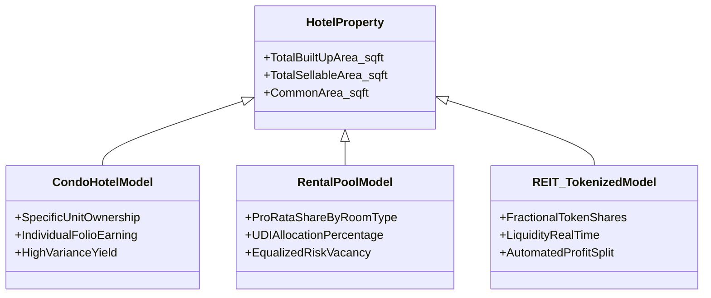

# Business Policy & Financial Blueprint: Co-Owner & Shareholder Accounting

An analytical blueprint detailing the classic and futuristic models of co-ownership, fractional allocation, asset square footage calculations, expense attributions, and yield disbursement in modern hotel-resort properties.

---

## 🏢 Part 1: Co-Ownership Taxonomy (Classic to Futuristic)

When a hotel property has 200 rooms and 1,000+ owners, it operates under one of three structural frameworks. These models determine how revenue from sellable rooms, common areas, and food & beverage (F&B) is distributed:



### 1. Condo-Hotel (Unit-Specific Ownership)
* **Definition**: An owner buys a deed to a specific room (e.g., Room 502). 
* **Revenue Mechanics**: The owner receives a share of revenue *only* when Room 502 is rented.
* **Drawback**: High yield volatility. If Room 502 has a maintenance issue or front desk agents randomly book other rooms, the owner's yield drops to zero.

### 2. The Rental Pool (Undivided Interest - UDI)
* **Definition**: Owners pool their rooms together. The hotel operator manages the entire inventory as a single fleet.
* **Revenue Mechanics**: Total room revenues are combined. After deducting operating costs, the net revenue is distributed to owners based on their fractional share of the pool, regardless of which specific room was occupied.
* **Benefit**: Risk and vacancy are equalized across all participants.

### 3. Tokenized Fractional Ownership (The Futuristic Standard)
* **Definition**: The entire property (sellable areas + common facilities + land) is tokenized into digital shares. Each token represents 1 square inch or 1 square foot of the global asset.
* **Revenue Mechanics**: F&B revenue, spa services, parking, and room rentals are captured in a single cash flow. Yield is distributed in real time via smart contracts straight to shareholders' wallets upon guest checkout.

---

## 📐 Part 2: The Square Footage (Sq Ft) Allocation Engine

To distribute earnings and expenses fairly, properties use the **Undivided Interest (UDI) Ratio**, calculated using the square footage of sellable rooms, built-up areas (BUA), and common spaces.

### 1. Mathematical Formulas for Earning Allocation
The UDI of an owner is based on the ratio of their owned private area to the total sellable area of the hotel:

\[\text{UDI}_i = \frac{\text{Unit Area}_i \ (\text{sq ft})}{\sum \text{Total Sellable Area of all Rooms} \ (\text{sq ft})}\]

#### Category Weighting Adjustment
Because a 500 sq ft Presidential Suite generates higher nightly rates than a 500 sq ft Standard Double, operators apply a **Value Weighting Factor (\(W\))**:

\[\text{Weighted Share}_i = \text{Unit Area}_i \times W_{\text{category}}\]

\[\text{Final Revenue Share}_i (\%) = \frac{\text{Weighted Share}_i}{\sum_{j=1}^{N} \text{Weighted Share}_j}\]

---

### 2. Common Area Maintenance (CAM) & Expense Allocations
Non-revenue generating spaces (e.g., lobby, corridors, pools, gardens, back-of-house) represent the **Common Area**. The costs of maintaining these spaces are distributed using two main methods:

* **Sovereign Net Lease (Direct chargeback)**:
  Operating expenses for common areas (electricity, staff, security, landscaping) are totaled monthly. Each owner pays a share proportional to their UDI:
  
  \[\text{Owner CAM Expense}_i = \text{Total Common Area Costs} \times \text{UDI}_i\]
  
* **GOP (Gross Operating Profit) Deduction**:
  Common area expenses are subtracted from the hotel's gross revenues *before* calculating the rental pool payout, simplifying the process for owners.

---

## 💸 Part 3: Profit & Loss Disbursement Mechanics (ACID Accounting)

To ensure transparency for hundreds of shareholders, hotel operators use a strict **Waterfall Payment Structure** for every dollar generated:

```
[Gross Room Revenue + Amenities Revenue]
                   │
                   ▼
       1. DIRECT TRANSACTION COSTS (Credit Card Fees, OTA Commissions)
                   │
                   ▼
       2. DEPOSIT TO FF&E RESERVE (Typically 4% for Furniture, Fixtures & Equipment)
                   │
                   ▼
       3. HOTEL OPERATING EXPENSES (Staffing, Housekeeping BOM, Laundry, Utilities)
                   │
                   ▼
       4. HOTEL MANAGEMENT FEE (Base fee 2-3% of Gross + Incentive fee 10% of GOP)
                   │
                   ▼
       5. NET DISTRIBUTABLE RENTAL POOL (Split among owners based on UDI %)
```

### 1. Direct Deductions (Before Owner Splits)
- **FF&E Reserve (Furniture, Fixtures & Equipment)**: A mandatory reserve (typically 4% of gross revenue) placed in an escrow account. It fund periodic room renovations (usually every 5–7 years) to maintain hotel brand standards.
- **Operating Costs (BOM)**: Direct costs associated with room turnover (cleaning supplies, guest amenities, linen washes).
- **OTA Commissions / Payment Processing**: Agoda/Booking.com commissions (15%–20%) and card gateway fees (2.5%) are charged back directly to the booking's specific revenue line.

---

### 2. Ledger Split Schema (The Triple-Entry Ledger)
When a checkout is settled, the accounting database performs an atomic split write. 

#### SQL/Ledger Transaction Example:
For a checkout bill of **$1,000 USD** on an `AFFILIATED` room (70% Owner / 30% Operator Split, with 4% FF&E Reserve):

| Account Code | Account Name | Debit | Credit | Description |
| :--- | :--- | :--- | :--- | :--- |
| **1000** | Cash / Operating Bank | $1,000.00 | | Total guest checkout settlement |
| **200500** | Escrow - FF&E Reserve (4%) | | $40.00 | Mandated room preservation reserve |
| **400000** | Revenue - Hotel Management Fee (30%) | | $300.00 | Operator commission |
| **200400** | Liability - Owner Accounts Payable (70%) | | $660.00 | Net earnings owed to Room Owner |

---

## 🚀 Part 4: The Futuristic Sovereign Ledger Approach

The next generation of PMS software replaces monthly manual reconciliations with real-time smart contract disbursements:

```
                  ┌────────────── Guest Checkout ($1,000) ─────────────┐
                  │                                                    │
                  ▼                                                    ▼
       Smart Contract Engine                               Smart Contract Engine
    (Split & Route Instantly)                            (Split & Route Instantly)
                  │                                                    │
        ┌─────────┴─────────┐                                ┌─────────┴─────────┐
        ▼                   ▼                                ▼                   ▼
   Owner Wallet      Reserve Escrow                     Operator Wallet      Tax Escrow
     ($660)               ($40)                             ($280)               ($20)
```

1. **Micro-Yield Settlement**:
   Instead of waiting for a monthly statement, the checkout transaction triggers a smart contract. Net earnings are sent directly to the owner's digital account, improving cash flow.
2. **IoT-Driven Utility Attribution**:
   Smart water and electricity meters in rooms track utility usage. Operating expenses are charged to the room owner based on actual consumption during guest stays, rather than flat-rate estimates.
3. **Automated Tax & Regulatory Withholding**:
   Local lodging taxes (VAT, Tourism Dirhams, City Taxes) are automatically calculated and routed to a government tax escrow account during checkout, simplifying compliance.
4. **Decentralized Governance (DAO for CAM Projects)**:
   When common areas require major renovations (e.g., resurfacing the pool), the proposal is voted on through the owner portal. Voting power is proportional to UDI (owned square footage). Approved projects are funded directly from the accrued FF&E escrow account.
