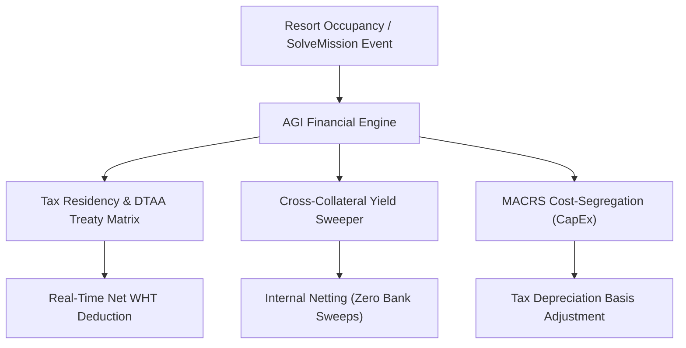

# Sovereign Wealth PMS: Elite Loopholes & Market Arbitrage (Rothschild-Grade)

An architectural and business analysis detailing the critical loopholes in top-tier property management systems (PMS) and how **Miracle OS** can solve them to capture the high-net-worth (HNW) real estate and co-ownership syndicate markets.

---

## 🔱 The Gaps Standard PMS Systems Cannot Solve

Standard hospitality systems (like Oracle Opera, Mews, or Cloudbeds) were designed for **hoteliers, not property owners**. 
Even advanced real estate tools (like Yardi or AppFolio) fail to bridge the gap when assets operate inside luxury resorts under fractional rental pools, cross-border corporate structures, and dynamic yield-backed financing.

Here are the 5 loopholes that elite property business owners are dying to have:

---

## 1. Multi-Jurisdictional Real-Time Tax Treaty Optimization (DTAA Engine)

### The Loophole
Elite resort properties are rarely owned by individuals; they are owned by Special Purpose Vehicles (SPVs) registered in offshore tax-optimized jurisdictions (e.g., Cyprus, Delaware, Dubai, Mauritius).
Standard PMS software pays out yield flatly. The owner's accountants must manually track local withholding taxes (WHT), cross-reference international Double Taxation Avoidance Agreements (DTAA), and file refund requests for over-withheld tax.

### The Miracle OS Solution
An integrated **Sovereign Tax Treaty Matrix**. The system maps the owner SPV's legal tax residency against the asset's local jurisdiction. Payouts dynamically apply the treaty-reduced WHT rate at the moment of ledger credit:

$$\text{WHT}_{\text{Applied}} = \max\left(0, \text{WHT}_{\text{Local}} - \Delta_{\text{Treaty}}\right)$$

The engine auto-allocates the withheld portion to the local tax authority's General Ledger liability account (`210000`) and generates a cryptographically signed tax certificate (PDF) instantly available in the Owner Portal.

---

## 2. Cross-Collateral Portfolio Pool Sweeps (Unified Credit Sweeper)

### The Loophole
HNW owners control portfolios of units (e.g., 5 villas, 10 suites). Currently, if Room 101 has a mortgage installment due but went offline for repairs (yielding $0), standard systems try to sweep the owner's bank account or credit card. If that bank sweep fails, a penalty is applied, causing friction.

### The Miracle OS Solution
**Self-Collateralizing Cross-Property Netting**. Before launching an external SEPA/ACH sweep, the AGI Mortgage Sweeper runs a search across all properties registered to the same NID/Passport. It aggregates yield surpluses from other active units:

$$\text{Net Sweep Amount} = \text{Installment}_{i} - \sum_{j \neq i} \text{Surplus Yield}_{j}$$

Only the remaining deficit is swept from the external bank account. This eliminates payment failures, transaction fees, and administrative burdens.

---

## 3. SolveMission-to-Depreciation MACRS Segregation (CapEx vs OpEx)

### The Loophole
When a luxury suite's AC system or marble floor is replaced via a `SolveMission` maintenance ticket, standard PMS bills the owner for the repair cost as a simple operational expense (OpEx). Under international tax guidelines (like IRS Section 179 / MACRS), major repairs represent Capital Expenditures (CapEx) that must adjust the asset's cost basis and depreciation schedules.

### The Miracle OS Solution
**BOM Cost-Segregation Engine**. When a maintenance ticket is resolved:
1. The system checks the Bill of Materials (BOM) code of the parts used.
2. If parts fall under capital improvements, the system automatically capitalizes the amount, updates the asset's tax cost basis, and recalculates the **MACRS Depreciation** schedule:

$$\text{Depreciation Charge}_{t} = \text{Adjusted Basis} \times \text{MACRS Rate}_{t}$$

3. The owner's dynamic tax ledger shows the increased future tax write-offs, converting a "negative" maintenance bill into a "positive" tax shielding asset.

---

## 4. Occupancy-Indexed Interest Rate Mortgages (Yield-Linked Financing)

### The Loophole
Mortgages are fixed or peg to central indices like SOFR. If a resort experiences a low-occupancy season, owners face fixed debt servicing payments while yield drops, leading to default risks.

### The Miracle OS Solution
**Occupancy-Indexed Debt Servicing**. Miracle OS integrates a yield-linked mortgage rate formula:

$$R_{\text{month}} = R_{\text{base}} + \alpha \cdot \left(\text{Occupancy}_{\text{Actual}} - \text{Occupancy}_{\text{Target}}\right)$$

Where $\alpha$ is a sensitivity coefficient. If global occupancy drops, the interest rate drops for that period, easing the cash flow burden. When occupancy spikes, the interest rate increases to catch up, aligning the debt service directly with the asset's earning capacity.

---

## 5. Real-Time Dynamic Rental Pool Dilution Reserves

### The Loophole
Rental pool yields are split based on Unit Density Index (UDI) shares. However, if an owner stays in their villa for a weekend, or if a room is locked for a private event, standard systems require manual accounting adjustments to calculate the exact dilution of the pool yield for the hours the room was offline.

### The Miracle OS Solution
**Hourly-Granular UDI Dilution**. Every hour, the system checks the occupancy status and locks on all pool units. If a room goes offline for non-pool usage, its UDI share is dynamically set to 0, and the pool's denominator is instantly reduced:

$$\text{UDI Share}_{i, t} = \frac{\text{Sq Ft}_{i} \cdot \mathbb{I}(\text{Active}_{i, t})}{\sum_{k} \text{Sq Ft}_{k} \cdot \mathbb{I}(\text{Active}_{k, t})} \times 100$$

Active rooms instantly receive a micro-boost in their yield share, ensuring that pool participants are never penalized by other owners taking their units offline.

---

## 6. Verification & Next Steps

To incorporate these features into the Miracle OS Core:
1. **Tax Treaty Matrix**: Register `TaxTreatyRule` models mapping country codes to withholding percentages.
2. **Cross-Collateral Sweeps**: Update `/api/mortgage/sweep` to query the total yield balance of all owner properties before debiting.
3. **SolveMission Segregation**: Map SolveMission completion categories (`REPLACE_ASSET` vs. `MAINTENANCE`) to capital asset accounts in the double-entry accounting engine.
